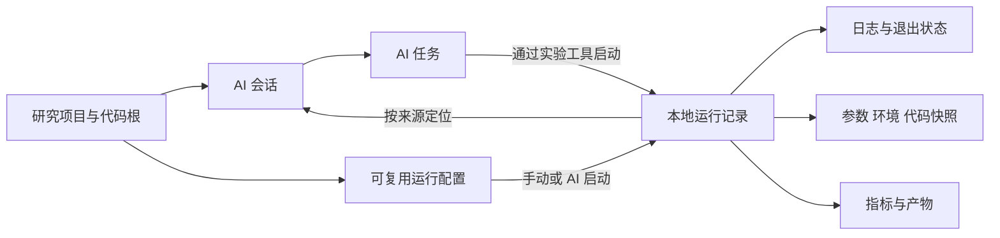
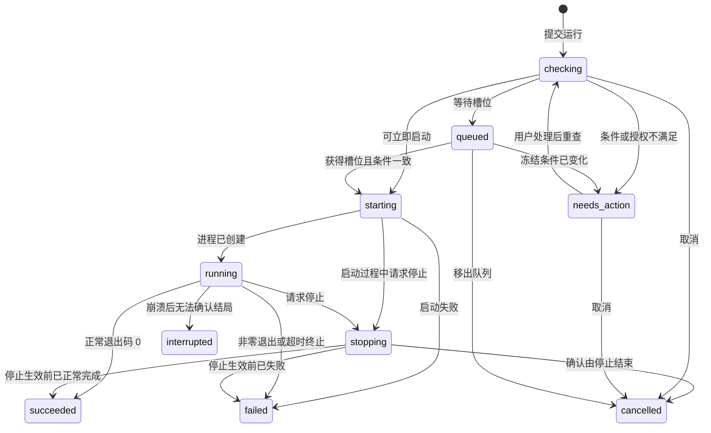

# Scientify 实验代码管理详细产品设计

设计日期：2026-10-01；进度核对：2026-10-02。状态：**目标规格，部分能力已落地，完整 E0/E1 尚未完成**。本文面向产品负责人、设计与开发人员，定义实验页面要解决的用户任务、页面入口、关键交互、状态与交付边界。当前交付以 [进度同步](../开发记录/实验工作区进度同步-2026-10-02.md) 和 [功能入口说明](产品功能入口说明.md) 为准；下文带 2026-10-01 基线的表格反映设计时状态，其余目标不因此视为全部实现。

建议把 Experiments 做成一个本地实验工作区：用户可以用自然语言或手动方式准备代码和环境，启动多个实验，在其他页面继续工作，回来查看日志、比较结果并再次运行。全局 AI 负责帮助用户完成任务；实验页面负责让实际执行过程和结果可以被找到、检查和管理。

本设计遵循用户已经确定的范围：**本地执行、全局 AI、用户自配模型、多个项目与会话并行**。本阶段不做文献语料库、证据到论文闭环、云端执行；这些也不是实验管理的前置条件。导航继续保持五个一级入口，不恢复 Files 页面。

阅读建议：先审阅“评审决策”和“页面结构”，再看“典型流程”“功能规格”及“交付与验收”。需求来源、竞品机制、公开用户问题和证据局限见 [需求调研](实验代码管理需求调研.md)。

快速定位：[评审决策](#一-需要评审的产品决策) · [页面线框](#四-页面结构) · [完整流程](#五-典型完整流程) · [并行与停止](#九-运行过程与任务管理) · [AI 集成](#十四-与全局-ai-的具体契约) · [分期与验收](#十八-交付范围与验收)。

## 本轮产品实现

2026-10-01：已按页面示例接入 Code / Runs / Changes 工作区，包含配置保存、本地进程启动、只读日志、独立停止、产物文本查看、显式 JSON 指标导入、手动记录与比较、Git 文本差异。入口及具体限制见 [产品功能入口说明](产品功能入口说明.md)。本设计中尚未交付的 Notebook、资源调度、完整环境探测、AI 正式运行工具等仍为目标规格，不能据本文视为已实现。

## 可交互页面示例

[打开离线 HTML 原型](实验代码页面示例.html)。直接用浏览器打开，不需要启动服务。截图：[Code](示例/实验代码-Code.png)、[Runs](示例/实验代码-Runs.png)、[比较](示例/实验代码-Compare.png)、[Changes](示例/实验代码-Changes.png)。构建与验证说明见 [示例说明](示例/README.md)。

这是供评审布局与操作顺序的目标设计，不是当前应用的功能交付。项目、文件、指标和日志均为虚构示例；运行是计时模拟，保存只改变当前页面的内存，不读写本地项目、不执行命令，也不连接 AI。刷新恢复初始数据。Changes 用于展示预设差异，不是完整 Git 客户端。

| 用户正在做什么 | 功能入口与具体呈现 | 布局取舍 |
| --- | --- | --- |
| 找到并修改脚本或参数 | Code 左侧文件树，中间文件标签与代码编辑器；保存状态可见 | 把空间留给代码，不用项目概览卡片挤占编辑区域 |
| 确认这次要运行什么 | 顶部常驻运行配置、环境入口和运行按钮；详细参数在配置对话框修改 | 高频操作就近，低频环境详情按需展开 |
| 等待运行或定位失败 | Code 底部只读日志，可收起；任务入口可查看并独立停止模拟运行 | 日志靠近代码，收起和切页不取消任务 |
| 判断哪组实验更好 | Runs 表格列出状态、来源、版本、时间与指标；侧栏看详情，勾选后并列比较 | 结果集中比较，不把每次运行做成占空间的大卡片 |
| 检查这次改了什么 | Changes 左侧修改文件，中间旧版本与工作区版本并列差异 | 让代码变化可检查，不假装提供完整 Git 提交与同步功能 |
| 请求帮助 | 全局 AI 入口按需打开，默认关闭 | AI 不替代文件导航、运行记录和可核对的执行状态 |

建议按“修改配置文件 → 确认环境 → 启动运行 → 切到 Runs → 比较已有结果 → 查看 Changes”的顺序评审。重点看完成任务是否少绕路，而不是页面是否堆满功能。窄屏将文件树收为抽屉；桌面仍是主要工作场景，移动布局只是可访问性示例。

## 一 需要评审的产品决策

以下为本方案的明确建议，可据评审修改；并不代表用户已经确认所有默认值。

| 决策 | 推荐方案 | 理由与取舍 |
| --- | --- | --- |
| 首批使用场景 | Python 科研计算与数据分析优先，AI 与手动编辑并重 | 覆盖环境、脚本、配置、日志和结果的完整流程；其他语言先支持已有可执行程序与自定义命令 |
| 页面组织 | 保留 Code / Runs / Changes；运行日志放 Code 底部，详细结果放 Runs | 延续现有认知；不新增终端、环境或 AI 一级页 |
| 正式实验的执行方式 | 内置 Codex 规划和改代码，Scientify 本地运行管理器启动、记录和停止正式实验 | 一次 AI 回答结束后，实验仍能独立运行；手动与 AI 入口获得同一条记录 |
| 首版代码隔离 | 默认从当前代码目录运行，记录启动时源码与参数，产物按运行分目录；明确共享文件边界 | 最兼容用户现有路径和脚本。独立代码副本执行放下一阶段，不宣称首版已经实现文件级隔离 |
| 后台范围 | 切页、切项目、切会话、收起助手后继续；完全退出应用前结束运行 | 首版无需本机守护服务。退出应用后持续运行属于另一个本地能力，不等于云端执行 |
| 首版结果管理 | 日志、退出状态、产物位置自动记录；指标支持手动和明确格式的文件导入；最多四条并列比较 | 先解决结果散落和不可比较，随后增加实时曲线与批量参数任务 |
| Notebook 和终端 | 首版提供外部打开与明确支持边界；不做完整 Notebook 内核或交互式终端 | 控制首版体量。若真实试用表明 Notebook 是多数首批任务的硬要求，需要提前调整 |

首版不承诺“任意科研项目点一下就自动成功”。它应让用户看得懂缺什么、正在执行什么、失败在哪里，并能接着处理，而不是反复复制错误去外部工具。

## 二 需求与当前实现

### 用户任务

| 编号 | 用户任务 | 应交付的结果 |
| --- | --- | --- |
| N1 | 把已有实验项目接进来 | 直接使用现有目录，找到入口和环境，不强制迁移或建立 Git 仓库 |
| N2 | 让 AI 从一个研究要求开始写代码 | 在明确根目录创建或修改文件，生成可检查的运行配置，随时手动接管 |
| N3 | 成功运行、观察和停止一个实验 | 有独立运行身份、真实状态、持续日志、输出位置和有效停止按钮 |
| N4 | 同时推进多个项目和方案 | 不锁住页面，不串会话，不覆盖结果；资源不足时说明排队原因 |
| N5 | 找到并解释某次结果 | 参数、代码状态、环境、日志、产物和人工结论在同一条记录中 |
| N6 | 修改参数后再次运行或比较 | 原记录保留，新运行独立；区别来自参数、代码还是数据清楚可见 |
| N7 | 失败或中断后继续工作 | 保留日志与输入，恢复记录而非自动重放命令；重试不会重复启动进程 |

需求优先级来自用户明确要求与 [调研中的工作流分析](实验代码管理需求调研.md#用户工作流与失败点)。Python 优先和首版容量值属于设计假设，需要真实项目验证。

### 当前实现与增量

| 能力 | 2026-10-01 工作树中可确认的基础 | 本设计需要新增 |
| --- | --- | --- |
| 代码目录与编辑 | 项目目录或应用托管目录、真实文件树、CodeMirror 编辑、保存、重读、冲突检查与另存副本 | 环境入口、运行配置、正式运行、运行相关文件定位、外部改动可见性 |
| 实验记录 | 名称、手动状态、实验方案、文本参数、手动指标和结论 | 独立进程状态、版本与环境快照、日志、产物、比较和再次运行 |
| Git | 实际 Git 状态列表 | 文件差异与运行代码来源；首版不要求完整 Git 客户端 |
| Agent | 全局入口；项目与会话独立线程、进程与审批；后台任务、流式事件、独立中止、历史恢复基础 | 正式实验工具、会话与运行双向关联、结构化运行结果 |
| 并行 | 多个 Agent 会话可并行，切页面不取消任务 | 实验进程队列、资源占用规则、输出冲突检查、运行恢复索引 |
| 数据 | schema 3 本地 JSON、文件会话、原生绑定索引 | 实验运行存储、增量日志和产物清单；保留旧手动记录 |

“Codex 可以执行命令”不表示“实验管理已经完成”。目前的 Agent 命令记录不能替代正式实验的环境、版本、完整日志和产物。当前同目录会话共享磁盘文件；本设计没有把独立聊天历史当成文件隔离。

源码依据见 [需求调研的本仓库核查入口](实验代码管理需求调研.md#本仓库核查入口)。本次为文档设计，没有重新执行桌面验收。

## 三 用户需要理解的对象

用户只需要理解“项目、会话、运行配置、运行记录”。其他对象在需要查看细节时呈现，不在首页堆一排管理入口。

| 对象 | 人话解释 | 关系与边界 |
| --- | --- | --- |
| 研究项目 | 当前在做的课题 | 拥有代码根、文献根、会话与运行；首版每项目一个代码根 |
| AI 会话 | 与 AI 持续讨论某项工作的对话 | 首次执行后绑定项目和域；切导航不改绑；可以关联多个运行 |
| AI 任务 | 一次发给 AI 的工作要求及执行过程 | 可以只改代码，也可以创建零个、一个或多个运行；不是实验状态来源 |
| 运行配置 | 可以重复使用的执行配方 | 定义入口、参数、环境、工作目录和输出约定；修改不改变旧运行 |
| 运行记录 Run | 某一次真实执行及当时条件 | 每次启动产生新 ID；失败和取消也保留；可以没有来源会话 |
| 手动记录 | 用户登记的外部实验或研究结论 | 不推测进程状态，不伪造命令或时间；可以参加比较但标注来源 |
| 实验分组 | 同一研究问题下的一组运行 | 可选标签式分组，首版不强制新建额外的“实验项目” |



例如“比较两个学习率”可以是一段会话、一个 AI 任务、两次独立运行。停止其中一条运行不停止另一条，也不删除会话；删除会话不删除实验文件。

## 四 页面结构

### 保留的入口

Experiments 下继续使用 **Code、Runs、Changes** 三个二级入口。默认首次进入 Code，此后恢复本项目上次视图、文件、选中运行与面板高度。Changes 对应现有内部 `versions` 视图，界面不向用户暴露内部路由名。

| 位置 | 常驻内容 | 按需出现 |
| --- | --- | --- |
| 左侧资源区 | Code 文件树；Runs 的筛选与实验分组；Changes 的变更文件 | 搜索、目录说明和资源区收起操作 |
| 中央顶部 | 当前视图操作，Code 中为运行配置、环境、运行按钮 | 不可执行原因、当前目录或环境问题 |
| 中央主体 | Code 的文件标签和编辑器；Runs 的运行表格与详情；Changes 的差异 | 文件预览、比较视图 |
| Code 底部运行面板 | 默认收起；启动后展示该运行日志 | 多条运行标签、停止、完整详情、返回末尾 |
| 全局右侧 AI | 继续使用现有助手、会话和模型配置 | 引用运行、启动卡片、结果分析 |
| 全局底栏 | 后台任务数量和需要处理的状态 | 展开所有项目的任务列表，不新增任务一级页 |

### Code 桌面线框

以下是目标布局示意，内容为虚构示例，不代表真实实验数据。

```text
┌ 全局顶栏：Scientify / 项目 A ─────────────────────────────────────┐
│ Rail │ Code  Runs  Changes │ 配置：小样本评估 ▾  Python 3.12 ▾  运行 ▾ │
│      │ 搜索文件            ├─────────────────────────┬──────────────┤
│      │ 项目 A / code       │ train.py  config.yaml   │ 全局 AI      │
│      │ src/                │                         │ 会话、消息   │
│      │ configs/            │       编辑器            │ 运行关联卡片 │
│      │ data/               │                         │              │
│      │ outputs/            ├─────────────────────────┤              │
│      │                     │ Run 17 运行中 00:42  停止│              │
│      │                     │ 日志…          查看详情 │ 输入框       │
├──────┴─────────────────────┴─────────────────────────┴──────────────┤
│ 已保存                         后台：2 个实验 · 1 个 AI 任务   AI/笔记 │
└────────────────────────────────────────────────────────────────────┘
```

运行面板是只读日志查看器，不假装提供尚未实现的终端输入。关闭面板只隐藏视图；运行中的标签关闭按钮提示“隐藏日志，实验继续运行”，停止使用独立有文字的按钮。

### Runs 桌面线框

```text
┌ 全局顶栏 ───────────────────────────────────────────────────────────┐
│ Rail │ Code Runs Changes │ 搜索运行   状态 ▾    新建运行 ▾   比较(2) │
│      │ 全部运行          ├─────────────────────────────────────────┤
│      │ 运行中 2          │ □ 名称      状态   用时   主指标   来源   │
│      │ 需要处理 1        │ ☑ baseline  成功   03:12  0.81     手动启动│
│      │ 已归档            │ ☑ lr-small  成功   04:06  0.83     AI任务 │
│      │ 分组：消融实验    ├─────────────────────────────────────────┤
│      │                   │ lr-small            再次运行 ▾    …    │
│      │                   │ 概览  参数与环境  日志  产物  结论       │
│      │                   │ 当时配置、代码来源、结果与相关会话       │
└──────┴───────────────────┴─────────────────────────────────────────┘
```

默认表格在上、详情在下，可调整高度；“展开详情”暂时用整个中央区显示详情并提供返回列表。比较在中央区替换详情，返回时保留勾选与滚动位置。全局 AI 仍可按需打开，不能为了展示详情再占用一条右侧栏。

### 小窗口与可访问性

沿用 [UI/UX 规范](../UI-UX/README.md) 的中性色、细边框、控件和尺寸。1000 × 680 下优先收起资源区、减少运行表默认列；Code 中央编辑区不足 520 CSS px 时，AI 改为可关闭的覆盖面板，不把代码挤成窄条。该断点是本次建议，需实施时验收。

运行面板默认约占中央高度的三分之一，可收起或展开；少于 220 px 时改为只显示标题与“展开日志”，避免几行内容仍出现多层滚动条。文字放大时工具栏允许收纳次要动作，运行、停止与保存不能被挤掉。

所有图标有 Tooltip 与可访问名称；列表和菜单支持键盘；状态使用文字加图形；焦点操作不随日志追加跳走。减少动态效果时用静态“运行中”标识。快捷键仅作用于当前焦点上下文，沿用 Ctrl+S，不占用编辑器 Ctrl+C 作为全局停止键。

## 五 典型完整流程

### 接入已有项目并手动运行

1. 用户进入项目的 Code，看到当前根目录。已有根直接读取；可选择“关联已有目录”或继续使用应用托管目录。
2. 后台只做环境发现，显示“找到 `.venv` / Python 3.12”；不在打开页面时安装包或运行项目脚本。
3. 用户打开 `evaluate.py`，点击“创建运行配置”，检查解释器、入口、参数、工作目录和输出位置。
4. 缺少依赖时，显示读取到的依赖文件及“准备环境”；点击后执行可见的安装任务，失败可看日志、换环境或重试。
5. 点击“保存并运行”。出现独立运行记录，Code 底部打开日志；切到文献或另一项目后继续执行。
6. 完成后任务入口标记结果未读。用户打开 Runs 查看退出状态、产物；再修改参数复制运行，旧结果保留。

无需模型密钥也能走完整个手动流程。没有 Git 仓库不妨碍运行，代码来源显示“本地源码快照”。

### 自然语言开发并开展实验

1. 用户在任意页面打开全局助手，说“在代码目录写一个 CSV 分类基线，先用小样本跑通，结果存到独立目录”。
2. 如果当前会话已绑定文献域，显示“此会话在文献目录工作”，提供“新建代码会话并带入这条要求”。只带入用户本次要求和显式选定材料，不搬运整个文献会话历史。
3. Agent 在代码根操作文件、选用已有环境，必要时请求环境安装授权。新增文件出现在 Code，未保存的人工草稿不会被静默覆盖。
4. Agent 通过实验工具提交运行配置，应用根据已有授权启动，或在当前 AI 窗口显示需要确认的命令与目录。用户已明确要求执行且仍在授权范围内时不重复确认。
5. 聊天显示“实验已启动”的关联卡片，进入后台运行。AI 完成本轮回复，用户可继续发消息；实验状态仍由本地运行管理器更新。
6. 失败时卡片显示“运行失败，退出码 1”；用户点“让 AI 排查”，明确带入日志和配置。AI 修复后启动新 Run，并链接原失败记录。

### 多项目并行

项目 A 的训练已经运行，用户切到项目 B，开启另一个会话分析数据。两个会话的历史、审批和实验来源不混用。底栏显示所有项目的活动数量，任务列表按项目分组；点 A 的任务才跳回 A 并定位运行。

如果 B 需要 A 已占用的同一 GPU 槽位，B 显示“排队，等待 GPU 0”，其他 CPU 任务和聊天继续。中止 B 的排队任务不触发进程启动，也不中止 A。改变并发设置不自动结束已经开始的任务。

### 对照实验与再次运行

用户复制成功的运行配置，将 `learning_rate` 从 `0.001` 改为 `0.0005`。新运行展示“基于 Run 17，参数改变 1 项，代码状态改变 2 个文件”；完成后选中两条记录，查看参数和指标差异。数据集或单位不一致时可并列查看，但不高亮最佳结果。

用户可以写结论并引用两次运行。结论保存为实验记录的一部分；本阶段不要求把它自动转入论文或建立证据知识图谱。

## 六 目录与代码管理

### 目录规则

- 每项目继续使用一个代码根；文献根独立。一个代码根可包含多个子项目，运行配置用工作目录区分。多根工作区不进入首版。
- 已有目录按原样使用，不自动移动源码、数据或模型权重；新建模板可建议 `src/`、`configs/`、`data/`、`outputs/`，创建前展示文件列表，同名文件不覆盖。
- 根目录行显示实际路径，提供复制路径、系统文件管理器打开、外部编辑器打开。重新关联目录前检查活动任务和草稿；仅阻止相关项目重绑，不阻止全局导航。
- 根离线、移动或失去权限时，运行按钮显示具体不可用原因；历史记录仍可查看，不自动绑定同名目录。用户重新关联后重新校验运行配置与旧会话绑定。

### 文件操作

| 入口 | 用户动作 | 产品行为 |
| --- | --- | --- |
| 文件树工具栏 | 新建文件、文件夹、刷新、搜索文件名 | 命名冲突内联提示；输入不因失败消失 |
| 文件右键与更多菜单 | 重命名、移动、复制、删除、复制相对路径 | 菜单行为一致；重命名保留缓冲，更新可识别的配置路径引用；字符串或代码内引用只提示核查，不盲目替换 |
| 删除 | 选择文件或目录 | 显示影响的打开文件、配置和活动运行；脏文件先处理，活动运行直接引用的入口或已登记输入不直接删；其他文件提示影响范围后回收 |
| 编辑器 | 保存、全部保存、重读、另存副本 | 延续版本冲突保护；未保存文本不会被当成已执行源码 |
| 文件或选区操作 | 交给 AI、解释、修改、作为运行入口 | 加入既有助手的本次材料；不创建第二个 AI 窗口，不默认发送整个根目录 |
| 外部修改 | AI 或外部编辑器改了已打开文件 | 无脏稿时刷新并保留位置；有脏稿时展示差异、重读或另存副本，不覆盖用户输入 |

代码根的删除与回收是拟新增的原生文件用例，不复用文献 PDF 配对事务去删除普通代码文件。首版有界支持，依赖文件监听和版本校验；Agent shell 的任意写入不能仅靠前端操作锁完全阻止。

UTF-8 文本编辑继续遵守当前 2 MiB 限制；大文件、二进制和不支持的格式显示大小、类型和外部打开入口。CSV 与图片作为产物按预览规则打开；`.ipynb` 首版说明“Notebook 单元执行尚未支持”，提供外部打开及显式源码查看，不能把 JSON 编辑称为 Notebook 编辑器。

### Changes

首期完善 Git 变更列表与文件差异，标注人工、AI 来源时只使用确实记录到的事件，不推断未知修改者。没有 Git 的项目展示本地版本记录入口，而不是报错阻断实验。暂存、提交、分支、合并、撤销整批修改放后续设计；不在运行时偷偷替用户 commit。

运行前后的源码变化可以从 Run 详情查看，即使没有 Git。这里的快照是历史证据，不是自动回滚授权。

## 七 环境与依赖

Code 工具栏显示紧凑环境胶囊，例如 `Python 3.12 · .venv`。点击展开“本项目环境”，显示解释器路径、发现来源、状态，以及选择已有、创建项目环境、查看依赖与安装日志。它属于实验工作区，不是模型配置，也不新增全局设置分类。

| 状态或动作 | 目标行为 |
| --- | --- |
| 自动发现 | 读取项目配置、`.venv`、可识别的 uv/Conda 环境与系统解释器；只探测，不执行仓库中的安装脚本。首次有多个候选时推荐并让用户选择 |
| 默认选择 | 优先采用本项目已确认的环境，其次项目虚拟环境；不会因为另一个项目切了环境就跟着改变 |
| 创建环境 | 有 Python 时默认使用项目 `.venv`；已有 uv 项目按其锁文件工作；展示将创建的路径和操作，不覆盖已有环境 |
| 无 Python 或工具缺失 | 可选择已有可执行文件；提供明确版本、下载来源与位置的安装引导。自动下载由用户发起，不在页面加载时触发，不要求用户手动配置 Codex 沙箱 |
| 安装依赖 | 检查 `pyproject.toml`、`uv.lock`、`requirements.txt` 等；展示所用方案；不无提示地改全局环境或更换 CUDA/驱动 |
| 已有 Conda | 允许选择并执行，记录具体环境；首版不承诺 Conda 的完整创建、克隆、驱动管理 UI |
| 安装失败或取消 | 保留安装日志，标为未就绪；不声称已经回滚第三方包管理器全部改动，可重新检查或重建环境 |
| 环境正被运行使用 | 可以为新运行选择另一环境；对同一环境的安装/升级进入等待，不能在活动运行中静默修改依赖 |
| 非 Python 项目 | 自定义程序、参数和工作目录；探测失败不阻断普通文件编辑；专属依赖管理后续逐语言支持 |

每次运行记录解释器/工具版本、依赖文件摘要、可取得的已安装包清单和采集时间。采集失败显示“环境信息不完整”，不虚构版本。GPU 型号和驱动在可检测时记录；无法探测时仍允许用户选择 CPU 或手动配置，不能把“未检测到”直接说成“没有 GPU”。

环境安装是后台维护任务，进度和停止复用任务入口；不混入科研结果的运行比较。第三方包安装可能执行安装脚本，应沿用对应授权与可见命令，不能绕过 Agent 的权限模型。

## 八 运行配置和启动

### 入口

Code 顶部的配置下拉包含当前配置、最近配置、创建、编辑、复制和删除。主按钮为“运行”，下拉提供“编辑配置后运行”。Runs 的“新建运行”打开同一配置编辑器；其菜单保留“新建手动记录”。

配置编辑采用中央弹窗，基本信息先展示，高级项折叠。不要求用户先填写研究假设、实验分组或指标名称才能运行。

| 字段 | 默认值与必填规则 | 行为 |
| --- | --- | --- |
| 名称 | 必填，可由入口文件生成 | 是显示名称，不作路径或进程身份 |
| 类型 | Python 脚本、Python 模块、自定义程序；Shell 命令为高级类型 | 普通运行用程序与参数分开传递；Shell 类型显示具体 Shell，不能把 Linux 示例直接当 Windows 命令执行 |
| 入口或程序 | 必填 | 从文件选择或已有环境带入；不可执行、缺失或域不匹配时解释原因 |
| 参数 | 可为空，支持键值视图和原始参数列表 | 两种视图只有可无损转换时切换；不把空格拆分当作可靠命令解析 |
| 工作目录 | 默认代码根，可选根内子目录 | 展示解析后的绝对路径；越界路径须走显式授权，不能用 `../` 绕过绑定 |
| 环境 | Python 类型必选，其他类型可沿用当前可执行程序 | 启动前固定解释器和必要环境，不依赖外部终端的激活状态 |
| 输入数据 | 可选文件/目录列表 | 记录引用与指纹等级；大数据默认不复制、不自动全量哈希，不开放整个磁盘给 AI |
| 输出位置 | 新模板建议 `outputs/<runId>/` | 实际路径在启动前显示；用环境变量或参数占位符传给程序，既有脚本需明确接入方式 |
| 参数与评价条件 | 可选结构化参数、数据集标识、划分、种子、指标方向 | 从明确配置读取或用户填写；无法解析的原始命令保留，不猜测成已确认参数 |
| 资源 | 默认 CPU；可选检测到的 GPU 槽位 | 是本应用调度约定，不是操作系统级资源限制 |
| 高级项 | 超时默认关闭；环境变量引用、输出匹配规则 | 凭据使用本机引用；预览隐藏敏感值，不写进可分享配置 |

可以保存不完整配置为草稿，但运行按钮必须列出未满足条件。配置修改自动或显式保存均须给出清晰状态；本方案建议编辑弹窗使用“保存”和“保存并运行”，取消保留已保存版本，未保存内容经过现有草稿保护。

### 启动检查

启动前完成目录、入口、解释器、授权、输出冲突与保存状态检查。相关打开文件有未保存内容时显示“保存并运行 / 使用磁盘版本 / 取消”；明确列出范围，不自动保存无关论文或笔记。

用户手动点击已配置的“运行”即表达本次执行意图，检查通过后直接启动。Agent 已得到相应执行授权时同样直接启动；新增授权范围、首次项目执行授权或有实质副作用需要确认时，沿用 AI 内联审批。页面配置预览和引擎审批必须合并语义，不让用户为同一命令连续点两次确认。

项目中的配置文件、README 或 Agent 生成文本本身不构成授权。运行权限未准备好时先由产品尝试现有自动准备流程，再显示可行动的错误和重试；不提供静默绕过沙箱的路径。新的原生运行器必须使用明确的权限策略，不能因为命令离开 Codex 进程就扩大可写范围。

### 启动结果与防重

配置校验错误留在表单，不生成失败实验。接受请求后分配 Run ID，持久化状态后才启动进程；双击、IPC 重试或重新订阅使用同一请求身份，不重复启动。进入实际启动阶段后的失败保留记录，包含尚未启动成功的原因。

运行配置是可变配方，Run 保存不可变的当时快照。排队时冻结配置和源码指纹；真正开始前若发现代码、环境或输入有变化，进入“需要处理”，提供“按当前条件创建新运行”或取消，不能悄悄用更新后的代码执行原排队记录。下一阶段独立代码副本模式可直接使用已冻结副本。

选择按当前条件创建时，旧排队记录终结为“已取消：被新运行替代”，保留新旧关联，避免两个记录随后都启动。静态表单校验在接受请求前完成；下方状态机的“检查中”表示已接受请求后的原生检查。

## 九 运行过程与任务管理

### 状态和反馈



以上英文是建议内部状态名，界面显示“检查中、需要处理、排队、启动中、运行中、正在停止、成功、失败、已取消、已中断”。应用崩溃后启动中或停止中的未终结记录也需要核验，不能只恢复运行中状态。

“结果整理中 / 结果保存失败”是独立保存状态，不改写已确认的进程退出状态。没有产物仍可能是成功退出；指标解析失败也不伪装成程序失败。科研结论单独由用户填写。

### 后台和并发

- 运行管理属于原生应用生命周期。切换 Code/Runs、导航到文献、切换项目或会话、收起 AI 只改变订阅，任务继续；列表与运行操作不存在全局禁用层。
- 复用全局任务入口，区分“AI 任务、实验运行、环境准备”，按项目分组。行上显示名称、状态、持续时间、来源和停止；点击可回到所属项目与运行。
- 首版建议实验进程默认全机同时 2 条，可在任务列表的“并发设置”调整；同项目不强制只能 1 条。该数值为待实测默认，不是硬件能力承诺。
- 被选择的同一 GPU 默认 1 个受管运行槽位；用户可调整。无 GPU 配置的任务不占该槽；系统不能据此保证显存足够或管住外部程序。
- 排队按创建时间选择最早可执行项；某项等待 GPU 不阻塞后续可执行的 CPU 项。显示等待原因，允许取消；首版不做复杂优先级、拖拽调度或 DAG。
- 队列只调度 Scientify 受管运行。Agent 诊断命令、系统外部进程并未因此被自动纳管或限额；资源界面要明确这一点。
- 同一已声明的写出目录正在使用时，不自动并行覆盖。默认创建独立目录；用户选择共享目录时显示冲突与排队选项。即使输出目录独立，硬编码的额外写入仍可能冲突。

目录和环境的占用判断使用本机规范化后的真实路径，不只按项目 ID 分组；两个项目关联同一路径也必须看到冲突。符号链接、目录联接和 Windows 路径大小写不能用于绕过检查。此规则防止本应用已知操作互相冲突，不是对任意外部程序的文件事务锁。

### 停止和退出

运行行、日志标题、Run 详情与 AI 关联卡片共用同一个“停止实验”动作。发送停止后立即显示“正在停止”，等待真实进程树结果；仍可浏览其他内容。Python 优先尝试可处理的中断，宽限期建议 5 秒；无响应时提供“强制结束”，说明未落盘数据可能丢失。

Windows 后端需要可靠的子进程归属与进程树清理；成功状态必须以核验结果为准，不能只杀启动 Shell。超时属于“失败：超过运行时限”；用户停止属于“已取消”。停止信号与自然退出发生竞争时保留实际结局与用户曾请求停止的事件。

**停止聊天与停止实验分别表达。** Composer 的停止键停止当前 AI 任务；已交给运行管理器的实验继续，其卡片保留“停止实验”，并提示“AI 已停止，1 个实验仍在运行”。任务菜单提供明确的“停止此 AI 任务及其关联的活动实验”，列出作用对象；其他会话和手动运行不受影响。

返回项目选择窗口仍应能看见后台任务摘要；后台执行不要求一个工作区 React 面板始终挂载。实现必须同步改造当前关闭保护与事件归属。关闭应用时有活动运行则提供“返回继续 / 停止任务并退出”，等待清理后退出；首版不出现“退出后继续运行”的假选项。最小化不停止，系统休眠不算任务完成。

### 崩溃与恢复

重启读取运行索引和落盘日志，优先采用持久化的完成事件。无法核验归属的进程不能仅凭 PID 重连或结束，避免误操作复用 PID。无法确认结局的记录显示“已中断”，保留最后心跳、日志、命令和已找到产物。

恢复只恢复查看与管理状态，不重放执行；“再次运行”生成新 Run，显示旧记录的中断原因。若发现可能遗留的进程，明确提示核验，不写成“已安全终止”。首版不支持断点续算；只有程序自身 checkpoint 已知且用户选择恢复参数时，才以新的运行记录继续。

## 十 日志与诊断

日志是实验的一等输出，不能只作为 AI 聊天中的一段截断文本。Code 底部和 Runs 详情读取同一份日志流，不各自保存不同副本。

| 功能 | 具体行为 |
| --- | --- |
| 实时输出 | 同时接收 stdout/stderr，标注来源与顺序；根据接收时间保序，不声称精确还原两个流在程序内部的先后 |
| 流式体验 | 原生连续落盘，前端按小批更新并虚拟滚动；不对日志做逐字打字动画，不每行重存工作区 JSON |
| 自动滚动 | 用户在底部时跟随；上滚后暂停，显示“有新输出”和返回底部，不抢回滚动位置 |
| 搜索 | Code 面板先搜已加载日志，明确范围；详情支持按需搜索完整本次日志，长搜索可取消 |
| 错误定位 | 已识别的项目内路径和行号可打开代码；无法识别时显示原文本，不把猜测当可靠跳转 |
| 日志缓冲 | Python 运行默认启用无缓冲输出选项；其他程序可能自行缓冲，提示“等待程序输出”，不伪造中间文本 |
| 进度 | 无结构化进度时只显示旋转标识、状态、用时与最后输出时间；长时间无日志不直接判死或显示虚假百分比 |
| 输出格式 | 支持常见 ANSI 颜色与回车进度行；移除控制序列带来的外部执行能力；普通日志以纯文本呈现 |
| 导出和交给 AI | 可选导出本次日志或带入选定范围；先显示材料范围。已知凭据值脱敏，不能保证第三方随意打印的所有秘密都能自动识别 |

建议首版默认本次日志预算 100 MiB，达到预算仍保留开头与滚动尾部、独立结束事件，并明确显示截断区间。阈值是设计值，需性能验收后确定；截断不能静默发生，也不能称为完整日志。用户可在运行高级设置提高预算；磁盘不足时告警并停止继续接纳新运行，活动运行按明确策略停止或继续但标注记录不完整。

stderr 不等同于失败，退出码和程序实际状态决定结果。“让 AI 排查”附带运行配置、环境摘要、失败附近日志和用户选择的文件；默认不上传完整数据集、全部源码或历史会话。联网模型会接收所选材料，仍沿用全局 AI 的可见材料机制。

## 十一 Runs 列表与详情

### 列表与操作

默认按启动或创建时间倒序；运行中的条目在有标题的活动分区集中展示，历史排序不随指标流持续跳动。支持名称搜索、状态、来源、分组和时间筛选；清空筛选后恢复完整列表。

默认列：选择框、名称、状态、开始时间或用时、主要指标、来源。代码版本、环境、设备等在列设置或详情查看。没有指标显示“未记录”；手动记录单独显示“手动”，其“进行中”不会增加后台进程数量。

右键和更多菜单均支持重命名、复制配置、再次运行、设为比较基准、归档和删除。运行中的条目只能重命名、查看和停止，不能直接删除或改写其配置。归档不删除文件，默认从日常列表隐藏，可从“已归档”找回。

删除对话框默认只删除运行记录索引，不删除代码、输入或外部目录；可单独选择清理本次受管日志和产物，先列路径、体积及仍被引用的对象。共享输出、来源不明或根外文件不自动递归删除。原始数据不随 Run 删除。重命名只改显示名称，不重命名已经执行过的路径。

### 详情标签

| 标签 | 默认展示 | 可做的动作 |
| --- | --- | --- |
| 概览 | 真实状态、起止时间、用时、来源会话/任务、主指标、简短人工描述、记录完整性 | 定位会话、停止、复制配置、再次运行 |
| 参数与环境 | 启动时参数、原始命令预览、工作目录、解释器/依赖、输入标识、代码状态 | 查看源码快照和差异、复制脱敏命令、与当前条件比较 |
| 日志 | 持久化日志、退出码、停止或中断原因 | 搜索、导出、定位文件、让 AI 排查 |
| 产物 | 文件名、类型、大小、来源路径、采集时间和当前完整性 | 中央预览、定位文件、外部打开、导出选定产物 |
| 结论 | 用户解释、限制、下一步；可附可比运行 | 编辑与保存；AI 生成的内容先作为候选，不自动认定实验有效 |

自动采集的命令、时间、退出码等不可被表单随意改写。用户可更正人工标签、补充指标和说明，更正保留来源与时间。旧手动记录仍允许编辑其既有字段，不要求补齐不存在的真实运行信息。

## 十二 参数 指标 产物与比较

### 参数和指标从哪里来

首版自动获得命令、时间、退出状态、环境和登记的产物；业务指标按以下明确路径接入，不从任意 stdout 猜成可靠事实：

1. 手动填写名称、有限数值、单位和备注，标记“手动”。
2. 导入用户选定的 CSV/JSON，预览字段映射、单位、来源文件与冲突，再确认入库。首版以末值为主，无法解析时保留文件和错误。
3. 下一阶段提供轻量结构化指标文件或工具接口，携带名称、值、step、时间及 train/validation 等上下文，逐步支持实时曲线和现有追踪工具适配。

Agent 可以协助修改脚本输出标准结果，但需要真实文件与解析结果作来源。AI 从日志推测的数值只显示“待确认候选”，不直接写入已采集指标。重复导入同一版本不产生重复指标；同名异值需选择替换人工记录或作为不同上下文保存，不能静默覆盖。

空值、解析失败、NaN、无穷值分别保留说明，不转换成 0。同名指标可以因单位、数据划分或统计方式不同而成为不同字段；原始值与来源可查。

### 产物的登记与预览

新脚本默认读取运行管理器提供的输出目录；既有脚本可配置 `--output` 等参数或选择实际结果路径。设置一个环境变量不会让任意程序自动改变写入路径，UI 必须检查和说明接入方式。

应用只自动收集本次声明的输出范围。目录中旧文件、未发生变化的文件不默认认定为新产物；共享目录下无法准确归属的文件标为“待确认”。不通过遍历整个项目把所有数据复制进实验记录。

PNG/JPEG 等图片中央预览，CSV 有界表格预览，JSON/文本只读查看；PDF 复用现有阅读能力。超限文件显示摘要与外部打开，HTML 默认源码查看、SVG 不执行脚本；模型权重只展示元信息，不尝试加载或执行。所有预览不自动运行附件代码。

独立输出目录保留原文件，清单记录相对路径、大小及可取得的指纹。小型关键结果可显式归档复制；大权重默认引用，不反复复制。文件被外部修改或删除后分别显示“内容已变化 / 文件缺失”，历史记录不能悄悄把新文件当原产物。

### 运行比较

选择 2–4 条记录后进入比较，支持设置一个基准、仅看差异、切换主要指标、导出脱敏比较表。超过四条时提示分批比较，不把表挤成不可读窄列；大规模比较后置。

行顺序固定为：状态和来源、数据与评价条件、代码与环境、参数差异、指标、结论。高亮最佳值前要求同名、同单位、同数据/划分、同评价协议且方向已知；不满足时只并列显示并说明差异。随机种子不同时允许比较，但单次结果不推导显著性；重复实验统计放下一阶段。

初次比较不要求人工填满全部元数据，信息不足就标为“可比性未确认”。图表只来自真实指标数据；曲线平滑、插值、缺点补值后续需要显式标记，首版不以模拟曲线填空态。

## 十三 代码版本与再次运行

运行开始前记录 Git commit（有则记录）、dirty 状态、已声明源文件/配置的实际内容或指纹、环境信息和输入描述。只保存 commit 不够；公开用户案例已经显示未提交修改会让两次实验看起来使用同一版本，见 [调研 R11](实验代码管理需求调研.md#来源)。

源码采集默认排除虚拟环境、依赖目录、大数据、权重、密钥和既有输出；提供实际采集清单与排除项。被 Git 忽略但实际需要的本地模块允许显式加入。采集前后校验文件版本，变化时重查而非生成自称一致的快照；任何因体积或权限被跳过的文件都体现在完整性提示里。

首版“当前目录运行”依然可能在运行中动态读取后来改变的代码、配置或数据。结束时再次比对，发生变化就标明“运行期间来源变化”，不能把开始时快照当成全部实际执行证据。监听与指纹也不等于识别了所有运行时依赖，因此首版使用“运行记录”和“条件快照”，不提供无条件的“完全可复现”标签。

| 操作 | 首版行为 | 后续能力 |
| --- | --- | --- |
| 再次运行 | 复制当时配置，比较当前代码/环境/数据差异，按当前条件创建新 Run；原 Run 保留 | 可从独立代码副本和已锁定环境启动 |
| 只改参数 | 在复制配置中修改，展示改动；输出新目录 | 批量参数组合、多个种子 |
| 查看当时代码 | 打开只读快照、缺失清单及与当前版本差异 | 从快照创建新的实验代码目录 |
| 使用旧代码 | 首版可导出已保存快照，不直接覆盖当前代码根 | 建新副本或 Git worktree 后运行，合并改动另行确认 |
| 从 checkpoint 继续 | 仅在用户提供受支持的入口和 checkpoint 参数后，新建关联运行 | 适配特定训练框架的恢复向导 |

下一阶段独立代码副本优先采用运行专属目录，Git 项目可评估 worktree；同时处理未提交文件、非 Git 项目和外部数据引用。代码副本隔离源码，不自动隔离共享数据、依赖、GPU、网络或任意绝对路径；权限边界仍由执行策略控制。

## 十四 与全局 AI 的具体契约

### 入口和上下文

Code 的“交给 AI”、Run 的“排查失败”和比较页的“分析差异”都打开同一个全局助手，并将对象作为可移除材料放入本次输入。材料显示项目、相对路径或 Run 名、版本和选定日志范围。页面没有自己的模型服务商表单。

当前会话与目标运行属于不同项目或域时，不静默迁移旧会话，提供明确的新会话操作。不同会话不自动共享完整历史；同一项目的用户文件和显式项目说明可以共享读取，但当前实现并未提供严格的按文件读取隔离。

### 工具能力

以下为建议的产品能力契约，名称不是当前已存在的 IPC 或 Codex API：

| 能力 | 输入 | 应返回的结果 |
| --- | --- | --- |
| 检查实验环境 | 绑定的项目、代码根、已有配置 | 环境候选、缺失项、只读检查结果 |
| 准备运行 | 运行配置、来源会话/任务、已声明输入输出 | 解析后的命令、前置检查、需要的授权和不可执行原因 |
| 启动运行 | 经校验的准备结果、请求身份 | 稳定 Run ID 与当前状态；不等长实验结束才返回 |
| 查看运行 | 本项目 Run ID、日志游标 | 真实状态、日志增量、已登记指标与产物 |
| 停止运行 | 明确的 Run ID | 请求已受理及后续真实结果；仅影响目标运行 |
| 分析或比较 | 用户选定 Run 与材料范围 | 带运行来源的候选分析，不改写真实退出状态 |

接入应使用受支持的工具桥接方式，例如经验证的本地 MCP 工具或对应版本可用的应用工具协议。具体方式需结合当前打包的 Codex app-server 验证；**仅改系统提示词、从回答中正则提取命令，不能算完成集成。** 前端按钮和 Agent 工具必须调用同一套运行用例与授权检查。

Agent 的短诊断命令仍留在任务时间线，不把 `ls`、读文件等动作都制造成实验 Run。正式实验应通过运行工具启动；Agent 自行用 shell 启动的命令如果未进入管理器，就标为“Agent 命令”，不能承诺它具有完整实验记录或队列约束。上线前必须验证正式实验路由，不能只靠模型自觉。

### 后续编排

产品预留“运行完成后分析结果”这类已授权后续任务。首版提供完成后的“分析结果”按钮；下一阶段再实现用户显式要求的自动后续分析，保存触发条件与来源会话，结束事件幂等消费。

同一会话正处理新消息时，后续任务等待并可取消，不抢占用户当前输入、不偷偷新建共享记忆的线程。未经用户请求的实验结束只更新结果和未读状态，不自动继续付费调用模型或开始新一轮调参。

## 十五 数据保存与兼容

### 存储职责

下列路径是本设计建议，**不是当前目录中已经存在的数据格式**。`<data>` 指应用数据根，`<codeRoot>` 指项目代码根。

| 数据 | 建议归属 | 原则 |
| --- | --- | --- |
| 可分享运行配置 | `<codeRoot>/.scientify/experiments/configs.json` | 只含相对路径、非敏感参数与引用；首次保存时创建，不覆盖 `.scientify/library.json` |
| 本机环境和凭据引用 | `<data>/experiments/<projectId>/local.json` | 绝对解释器路径等本机信息，不随项目配置提交 |
| 运行身份、状态、条件快照 | `<data>/experiments/<projectId>/runs/<runId>/` | 原生管理器持久化 manifest 与结束事件；不按日志片段整库写 JSON |
| 日志与选定源码快照 | 同一运行目录下的独立文件 | 有界追加、按游标读取，记录丢失或截断；不能放进聊天消息充当完整存档 |
| 实验输出 | 默认 `<codeRoot>/outputs/<runId>/`，可显式设置 | 运行详情展示真实目录；导出元数据不自动带上全部大文件 |
| AI 会话绑定 | 沿用现有 `<data>/agent/bindings/` | 不让导入运行配置指定任意原生线程、命令权限或绑定根 |

首次生成配置与输出目录后提示用户如何纳入 Git：配置可以提交，本机路径、日志、输出与凭据通常不提交。可提供明确的 `.gitignore` 建议，不静默改仓库规则或代替用户提交。

### 记录字段与迁移

运行至少有项目 ID、Run ID、来源类型、显示名称、配置快照、源码信息、输入、环境、状态和时间、退出原因、日志索引、产物清单及保存完整性。来源会话 ID、任务 ID、父运行 ID 可选；人工说明与系统采集事实分开存储。

schema 3 中既有 `runs` 保留原 ID、项目、名称、手动状态、参数文本、指标、结论和未知扩展字段，映射为“手动记录”。不把旧 `running` 自动恢复成真实后台任务，不伪造命令或开始时间；迁移可重入并备份。

状态提交与启动顺序、完成事件、日志游标都要支持重复请求与重启恢复。前端保存失败不能重复启动实验；结果落盘失败保留原生已知状态并提供“重试保存”。运行索引缺失与进程仍活动必须分别显示，不能为了 UI 一致而抹掉事实。

### 导出与删除边界

默认导出选定运行的脱敏清单、配置、指标与用户选择的日志/小产物，明确列出未包含的数据、模型权重和依赖。只有包含所需代码、数据、环境且经过实际验证的包，才可以描述其复现范围；普通 ZIP 不叫完整备份。

删除项目沿用保留用户磁盘文件的现有语义，新增受管运行数据必须明确列入删除范围；活动任务结束前不允许删除相应项目或替换其数据。删除一个会话不删除 Run，来源回链改显示“会话已删除”并保留当时名称快照。

## 十六 异常 空态与反馈

| 场景 | 用户看到什么 | 下一步 |
| --- | --- | --- |
| 初次进入，无文件 | 当前托管/关联路径，创建文件、关联已有目录、让 AI 起步三个轻量动作 | 不显示示例曲线，不强制配置模型 |
| 无运行 | “尚无运行记录”，新建运行、手动记录 | 有配置时可直接选择，不做额外向导页 |
| 目录或入口失效 | 原路径和具体原因，历史可读 | 重新关联/选择入口，重新检查 |
| 没有环境或依赖失败 | 缺失项、使用中的解释器、安装日志 | 选择/准备环境、重试；编辑和其他项目不受影响 |
| 首次权限准备失败 | 显示实际错误和重试，不笼统说只能只读 | 自动准备或明确环境修复，不让用户自行猜底层 Codex 设置 |
| 运行请求已接受但视图失联 | “连接恢复中”，最后确认状态和时间 | 按 Run ID 查询与补齐事件，不再启动一遍 |
| 日志长时间无变化 | “运行中，最后输出于…” | 查看状态或停止，不用“思考中”掩盖程序无输出 |
| 无指标或无产物 | “本次未登记指标/未发现声明范围内产物” | 导入结果或检查输出配置，不编造结果 |
| 外部文件变化或共享写冲突 | 显示具体文件与相关活动任务 | 重读、另存、重新检查或使用新输出位置 |
| 指标导入失败 | 具体行/字段和原因，原文件保留 | 修改映射或重新导入，进程状态保持原结果 |
| 停止超时 | “仍在停止”，已知子进程状态 | 强制结束或继续等待，不能提前亮成功图标 |
| 应用异常退出 | 已恢复历史日志，未确认结局标为已中断 | 检查产物、查看条件、显式再次运行 |
| 大文件或磁盘不足 | 显示当前容量、已保留范围和影响 | 清理选定旧记录或更改预算，不能悄悄丢弃全部历史 |
| AI 不可用 | 实验手动运行仍可用，AI 请求单独报错 | 在原侧栏修复模型；不锁实验页面 |

成功与失败通过状态行和底栏未读标记反馈，默认不弹出阻塞对话框。需要用户选择的冲突、删除或权限才使用弹层。后台任务完成不自动抢焦点或跳转项目。

## 十七 与当前代码架构的衔接

实现继续使用 Tauri 2/Rust、React 19/TypeScript、Zustand、CodeMirror 和现有组件，不迁移 UI 框架，不把程序运行放进 React 组件生命周期。

| 现有入口 | 建议职责 |
| --- | --- |
| [RunWorkspace](../../src/workspaces/experiments/RunWorkspace.tsx) | 演进为运行列表、详情、比较；保留手动表单作为一种记录来源 |
| [FileWorkspace](../../src/workspaces/files/FileWorkspace.tsx) | 复用文件树、标签与共享编辑会话；通过组合接入运行工具栏和底部面板，不复制 CodeMirror |
| [编辑会话](../../src/editor/sessions.ts) | 暴露运行前保存检查、版本与外部变化信息，延续草稿保护 |
| [ResearchBackend](../../src/platform/research.ts) | 保留文件能力；新增独立类型化实验平台接口，避免把所有执行塞进通用 `askAI` |
| [工作区领域模型](../../src/domain/workspace.ts) | 明确手动记录与真实运行索引；迁移保留扩展字段 |
| [AgentRuntime](../../src/features/assistant/agent-runtime.ts) | 复用会话、任务、审批与全局任务入口；关联 Run ID，不承担实验进程本体 |
| [原生 Agent 管理](../../src-tauri/src/agent/mod.rs) | 继续管理 Codex；通过已验证工具桥接调用实验用例，不为每个页面再启动另一套 harness |
| [应用装配](../../src/app/App.tsx) | 路由恢复、全局任务计数、窗口退出保护、跨项目定位 |
| [Rust 本机入口](../../src-tauri/src/research.rs) | 现有文件与系统接口基础；新运行管理器负责进程、授权、状态索引、日志和停止 |

建议实验前端契约覆盖：环境发现、配置校验、准备/启动、列表与单条查询、增量事件、日志分页、停止、产物访问、归档和删除。每次请求都带项目与原生核验后的运行身份；客户端传来的路径、状态或会话 ID 不能直接获得权限。

本方案不要求把大型日志、指标序列和产物塞进现有工作区 JSON。存储实现可先以独立文件与索引完成，是否引入 SQLite 根据查询量和事务需求决策；这不是产品必须依赖某个数据库的要求。

## 十八 交付范围与验收

### 分期

下列阶段按可交付行为划分，没有给未经工程估算的工期。E1 的并行执行与 Agent 接入属于首版验收条件，不能只交付几个静态页面。

| 阶段 | 包含内容 | 可以验收的结果 |
| --- | --- | --- |
| E0 契约与最小验证 | 环境与运行数据契约、旧记录迁移、Windows 进程树停止、权限边界、Codex 工具桥接和日志性能验证 | 证明原生运行可从按钮和 Agent 进入同一管理器；不可行之处先回到评审调整 |
| E1 可用的本地实验管理 | 目录/环境选择、Python 配置与准备、Code 日志、Runs 详情、后台并行与简单队列、有效停止、记录恢复、产物定位、指标导入、四条比较、基本 Git diff | 完成 N1–N7；手动和 AI 两条路径都能用，失败和重启可解释 |
| E2 更可靠的多方案迭代 | 独立代码副本运行、批量参数/随机种子、实时结构化指标与曲线、已授权完成后分析、从 checkpoint 创建后续运行 | 少量实验可以自动组织，同时减少共享代码和结果覆盖风险 |
| 按实际需求另立设计 | Notebook 单元执行、交互式终端、完整调试、更多语言环境、外部 MLflow/DVC/Aim 适配、本机退出后常驻 | 有真实任务验证后再确定范围 |

文献语料库、证据到论文闭环和云端执行不在上述阶段内。不以这些方向未完成为由阻塞实验管理。

### 功能验收

以下为未来实施的验收计划，不表示已经测试通过。使用独立临时项目与无敏感内容的测试脚本，不直接拿用户科研目录做破坏性用例。

| 编号 | 场景 | 通过条件 |
| --- | --- | --- |
| A01 | 已有 Python 项目，无模型密钥 | 选择环境、启动脚本、查看日志和产物成功；不弹独立控制台 |
| A02 | 自然语言新建小实验 | 文件与配置真实生成；通过工具生成 Run ID；聊天卡片与 Runs 指向同一记录 |
| A03 | 两项目各一运行、两会话同时工作 | 能切页、切项目、切会话与编辑；事件、日志、审批不串；任务不会因面板卸载而停止 |
| A04 | 同项目两条运行 | 独立参数快照、独立输出和日志；共享代码提示可见；同一输出冲突不能悄悄并行覆盖 |
| A05 | 停止一个带子进程的运行 | 先显示正在停止，确认所属进程树结束再终结；另一项目与运行继续 |
| A06 | GPU 槽或并发数不足 | 等待原因可见，CPU 可执行项不被无关 GPU 阻塞；取消队列项不启动进程 |
| A07 | 双击运行、掉线后重试、重复结束事件 | 一次启动请求只有一个进程和一条 Run；状态与指标不重复累计 |
| A08 | 脏文件、AI 外部修改、排队中代码改变 | 明确执行磁盘或保存后的版本；冲突不丢稿；条件变化不会静默执行旧队列请求 |
| A09 | 非零退出、依赖缺失、安装取消 | 状态真实，错误日志保留；修复后新建 Run，旧失败记录仍可查 |
| A10 | 收起面板、最小化、返回项目页 | 任务继续，能重新打开同一日志；后台完成不抢焦点 |
| A11 | 正常退出和强制关闭后重启 | 正常退出处理活动任务；异常记录按可核验事实恢复，不伪成功、不自动重跑 |
| A12 | 两次运行同一 commit，但未提交代码不同 | 代码状态/快照差异可见，不能显示为相同源码条件 |
| A13 | 手动记录与真实运行共存 | 旧字段保留、手动来源明确；手动“进行中”不算活跃进程 |
| A14 | 缺失指标、异单位、不同评价数据比较 | 不填零、不无条件突出最优；导入有来源和错误提示 |
| A15 | 产物被移动、篡改、删除以及大文件 | 历史记录不丢，完整性提示真实；预览限额与外部打开可用 |
| A16 | 删除会话、运行、项目 | 范围分别正确；无未授权连带删除源码、原始数据或其他运行产物 |
| A17 | 1000 × 680、中英文、深浅色、150% 文本 | 主操作不遮挡；日志不抢滚动；键盘可操作；AI 不挤坏中央编辑器 |
| A18 | 越界配置、符号链接、密钥和不可信日志 | 原生重新校验路径与授权；已知凭据不进入可分享配置；预览不会执行日志或产物脚本 |

### 性能与体验目标

建议在记录了 CPU、内存、磁盘和 Windows 版本的验收机上，以两个本地任务各持续约 500 行/秒输出、1,000 条历史运行作为初期压力场景。目标是导航点击反馈 P95 小于 200 ms、正常日志显示延迟 P95 小于 500 ms；长列表分页或虚拟化，不全量挂载。指标是设计目标，尚未测量，需要据实际设备调整容量。

日志从原生接收时间计算显示延迟，程序内部缓冲时间另计；不能用每帧加假字符的方式达标。持续输出、切项目和打开 AI 同时发生时，编辑输入和停止按钮仍应响应。重启后运行计数必须依据持久化状态重建，不显示测试用静态数字。

小规模试用关注四项结果：能否不靠聊天历史找到一次运行；能否知道实际运行条件；能否独立停止一个任务；能否正确解释两次结果的差异。具体招募与观察方案见 [需求调研](实验代码管理需求调研.md#尚待验证的需求)，不默认上传用户代码、日志或行为数据。

## 十九 评审后需要确定的事项

优先评审开头的七项产品决策，尤其是 Python/Notebook 的优先级、首版当前目录执行是否可接受，以及应用退出后的行为。这些会直接影响首期体量和用户预期。

工程设计前还需通过 E0 证明：当前内置 Codex 的工具桥接可用；实验进程与 Agent 使用一致且可解释的权限策略；Windows 多进程确实能停止；运行期间前端不会被日志或存储阻塞。不能以文档中画出了入口就认为这些问题已经解决。

评审通过后按 E0 → E1 → E2 拆分实现。本文是实验代码管理的最新专项规格；既有产品文档中与本次范围或实验行为冲突的建议以本文为准，其他页面的历史设想不因此自动进入开发计划。
