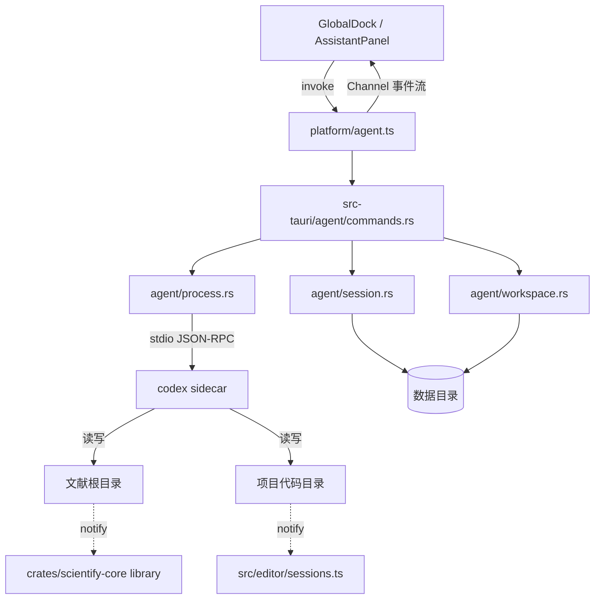

# Agent Harness 集成设计

本文规定 Scientify 从「单轮对话」升级为「本地可执行代理」的集成方案：内置 Codex 作为执行引擎，保留用户自配模型服务商，按工作区隔离记忆与操作边界。

文档状态：M1/M2 核心链路已落地并通过编译与单元测试。当前 AI 面板已经接入本地 Agent、内联审批、凭据回填和自动路由；真实服务商、域绑定、Windows 沙箱配置和打包后的桌面端行为仍需人工验收。第 0 节说明范围与当前事实，后续各节是实施依据。技术栈与长期架构以 [架构设计/技术方案.md](../架构设计/技术方案.md) 第 0 节为准；本文只补充 Agent 相关的边界与契约。逐项验收见 [Agent Harness 验收计划](Agent-Harness-验收计划.md)。

## 0. 目标与边界

### 0.1 当前事实

当前 AI 面板是单轮问答通道：前端在 [platform/research.ts](../../src/platform/research.ts) 通过 `askAI` 发出一次请求，材料以文本快照随消息发出，模型返回文本。AI 不能读写文件、不能执行命令、不能检索本地目录。

现有能力中与本文直接相关的是：

- 模型服务商与连接验证已实现，见 [模型服务商与自动发现](../开发记录/模型服务商与自动发现-2026-09-27.md)。
- 项目文件访问由 `crates/scientify-core/src/research.rs` 的 `ResearchFiles` 提供，含路径围栏、revision 校验与二进制拒绝。
- 文献库由 `crates/scientify-core/src/library.rs` 的 `LocalLibrary` 提供，含稳定绑定、相邻笔记配对与事务恢复清单。
- 文件会话与冲突保护在 `src/editor/sessions.ts`，正文所有权归 `FileSession`。
- 全局辅助栏在 `src/shell/GlobalDock.tsx`，AI 与笔记共用固定顶栏与重叠内容层。

### 0.2 本次目标

1. 用户仍在产品内配置模型服务商，密钥只保存在本机数据目录的明文凭据文件，不写入工作区 JSON、不随项目同步（见 §4.7）。
2. 本地操作（文件读写、代码撰写、目录检索、命令执行）由产品内置的 Agent 引擎完成，不依赖用户预装外部工具。
3. 文献与代码两个域的 Agent 在记忆、权限、审计上互相隔离。
4. AI 入口保持全局唯一，不按导航页拆分。

### 0.3 明确不做

- 不实现远程或云端执行；目标形态是纯本地。
- 不把 Agent 会话写进 `workspace.json`。
- 不让 Agent 绕过 `ResearchFiles` 与 `LocalLibrary` 已建立的路径与事务约束去直接操作受管数据。
- 不在本阶段实现多 Agent 并行协作。

## 1. 引擎选型与依据

### 1.1 采用内置 Codex

| 判据 | 结论 |
| --- | --- |
| 许可证 | Apache-2.0，可再分发，义务见 §3.3 |
| 分发形态 | 官方 release 提供原生 Windows 可执行文件，可直接作为 Tauri sidecar |
| 技术栈契合 | 引擎自身是 Rust；与本仓库 `src-tauri` 同栈 |
| 嵌入接口 | `codex app-server` 提供 stdio JSON-RPC，含线程、工作目录、权限、审批、命令执行 |
| 隔离模型 | 线程级工作目录 + 按域独立 `CODEX_HOME`，见 §4 |
| Windows 沙箱 | 上游已有独立实现，不需要自研 |

### 1.2 被否决的方案

| 方案 | 否决原因 |
| --- | --- |
| 要求用户自行安装外部 CLI | 首次使用摩擦大，且版本、权限、会话存储都不受控 |
| 自研 Agent 循环 | 工具协议、上下文压缩、沙箱与审批的工作量远超收益 |
| 使用其他开源 harness | 成熟度与 Windows 沙箱支持不及当前选择；保留为后续可替换 provider |

引擎必须做成可替换的 provider，而不是硬编码进业务逻辑。理由见 §5.1。

## 2. 总体架构



三条边界必须成立：

1. **进程边界**：Agent 引擎是独立进程，崩溃不带走应用。
2. **IPC 边界**：前端只经 `platform/agent.ts` 通信，不直接接触 sidecar。
3. **文件所有权**：磁盘由 Agent 直接写，应用侧靠监听与版本校验感知，见 §7。

## 3. 进程与分发

### 3.1 sidecar 配置

在 `src-tauri/tauri.conf.json` 的 `bundle` 下增加：

```json
{
  "bundle": {
    "externalBin": ["binaries/codex"]
  }
}
```

二进制按目标三元组命名放在 `src-tauri/binaries/`：

```text
src-tauri/binaries/codex-x86_64-pc-windows-msvc.exe
```

构建前准备脚本参照 `scripts/prepare-icons.mjs` 与 `scripts/prepare-pdf.mjs` 的既有做法新增 `scripts/prepare-agent.mjs`，从官方 release 产物解压到目标位置，并接入 `package.json` 的 `predev` / `prebuild`。

### 3.2 启动方式

由 Rust 侧启动，不在前端启动。理由是本仓库的分工约定是命令进 Rust、前端只经 `platform/` 调用，且协议解析需要持有 stdout 流。实际命令是 `codex app-server --listen stdio://`，长连接启动后先完成 `initialize` / `initialized` 握手，再发送 `thread/start`。漏掉 `app-server` 子命令会让 Codex 立即退出，前端随后只会看到 Windows 的“管道正在被关闭（os error 232）”。

### 3.3 许可证义务

分发 Codex 二进制属于再分发，必须随附其 `LICENSE` 与 `NOTICE`。NOTICE 声明版权归属并列出源自 Ratatui 的 MIT 代码。落地位置：仓库 `THIRD_PARTY_NOTICES` 与应用内「关于」页面。

## 4. 绑定与隔离模型

### 4.1 绑定单位：项目 × 域

现有实现的记忆单位已经是项目：`src/features/notes/model.ts` 的 `scopeFor` 返回 `context.projectId ?? '__inbox__'`，`AssistantPanel` 以它为条件过滤 `data.sessions`。切换一级导航不换对话，切换项目才换。这一点保留。

Agent 引入操作边界后，绑定需要同时描述三个相互独立的维度：

| 维度 | 决定什么 | 单位 |
| --- | --- | --- |
| 项目 | 数据归属与记忆归属 | `ui.projectId` |
| 导航 | 只决定视图 | `WorkspaceId` |
| 域 | 权限边界与审批语义 | 根目录 |

结论：**导航是视图单位，不是权限单位。绑定单位取「项目 × 域」；域由根目录定义，导航只提供默认绑定。**

```ts
type AgentDomain = 'literature' | 'code';

type AgentBinding = {
  projectId: string;
  domain: AgentDomain;
};
```

不按一级导航拆分，原因是 `src/components/navigation/workspaces.ts` 中的 `experiments`（Code）、`writing`（Manuscript）、`files`（All files）渲染的是同一个代码根的三种视图。拆成三段互不相通的记忆会导致「在 Code 中让 Agent 读过的文件，切到 Files 后不再记得」，且换不来任何边界收益。`overview` 与 `notes` 没有对应的根，独立成域会变成悬空作用域。

### 4.2 导航到域的映射

| 导航 | 域 | 说明 |
| --- | --- | --- |
| `literature` | `literature` | 根为该项目的文献根 |
| `experiments` | `code` | 根为项目文件根 |
| `writing` | `code` | 同根，绑定不变 |
| `files` | `code` | 同根，绑定不变 |
| `overview` | 保持上次 | 无根，不切换 |
| `notes` | 保持上次 | 无根，不切换 |

由此得到一个必要性质：在 `experiments`、`writing`、`files` 之间切换时绑定不变、对话延续。

### 4.3 域到根目录

| 域 | 根 |
| --- | --- |
| `literature` | `literature-roots.json` 中该项目对应的根 |
| `code` | `project.path` |

`code` 域的文件操作使用 `project.path`。`project.repo` 只用于 Git 状态查询，见 `src-tauri/src/research.rs` 的 `project_root_for(.., git)`；两者不一致时按 §4.5 的约定处理。

三种没有根的情况必须显式处理，不允许回退：

| 情况 | 表现 |
| --- | --- |
| 个人作用域 `__inbox__` | 不对应任何目录，只支持对话，Agent 不可用 |
| 文献根未挂载 | 该项目尚未打开文献文件夹，Agent 不可用并提示先打开 |
| `code` 域未配置 `project.path` | 回退到 `<data>/projects/<projectId>/`，与现有文件能力一致 |

### 4.4 存储分层

| 层 | 数量 | 位置 |
| --- | --- | --- |
| `CODEX_HOME` | 2 个，按域 | `<data>/agent/literature/`、`<data>/agent/code/` |
| thread | 按项目分 | 同一 home 内多个线程 |
| 项目与线程的映射索引 | 1 个 | `<data>/agent/threads.json` |
| 服务商 API 密钥 | 1 个 | `<data>/credentials.json`（明文），见 §4.7 |

`<data>` 指现有数据目录：debug 为仓库 `.tauri-data/workspace/`，release 为应用数据目录下的 `workspace/`。

每个 `CODEX_HOME` 下各自持有 `config.toml`、`auth.json` 与 `sessions/`。两个 home 即得到硬隔离：线程历史、配置、凭据互不可见。

不按「项目 × 域」再拆 home：项目数量增长会使目录与凭据副本成倍增加，而线程本身就是隔离单位；项目归属由索引表达。

`session.rs` 在恢复线程前必须校验该线程记录的 `projectId` 与当前请求一致。引擎的线程携带自己的工作目录配置，跨项目恢复会串味。

### 4.5 必须处理的三个坑

**Git 仓库检查。** 引擎默认要求工作目录是 Git 仓库。文献根通常不是。文献域必须显式关闭该检查，否则首个任务无法启动。

**Windows 沙箱状态。** `workspace-write` 依赖 Codex 的 Windows 沙箱。第一次建立线程前，Scientify 调用 `windowsSandbox/readiness`；若返回 `notConfigured` 或 `updateRequired`，自动尝试 Codex 的 `elevated` setup，并等待 `windowsSandbox/setupCompleted`，失败后再尝试 `unelevated`。两种实现都失败时仍允许阅读和分析，但线程必须明确显示 `readOnly`，并保留内联重试入口。不能默默改用 `danger-full-access`，因为那会破坏按工作区隔离的安全承诺。官方说明见 [Windows sandbox](https://developers.openai.com/codex/windows.md)。

**凭据重复。** 两个 home 需要各写一份服务商配置。由 Scientify 的模型设置作为唯一事实来源，写入时同步两个 home，用户只配置一次。

**`project.repo` 与 `project.path` 不一致。** 若两者指向不同目录，「一个域一个 cwd」的模型不再成立。约定二者必须一致，并在项目设置中选择仓库时一并校正文件根，避免出现「编辑器改的是 A，Git 状态看的是 B」。

### 4.6 模型设置的归属

现有 `src/features/assistant/providers.ts` 与 `ModelSettingsDialog` 继续作为唯一配置入口。Agent 配置是它的下游产物，不引入第二套模型设置界面。

### 4.7 服务商密钥的存放

密钥保存在数据目录下的一个明文 JSON 文件 `<data>/credentials.json`，与 `workspace.json` 同级，不加密、不进版本库、不随项目或导出文件同步。文件按「协议 + 端点」建档，同一服务商的每个端点各存一份，因此切换服务商再切回来不需要重新输入，两个端点的密钥也不会互相覆盖。

这样选择的原因：

1. 与同类工具（如 cc-switch 保存服务商配置）的做法一致，用户能自己打开、替换或删除这个文件，出问题时不必依赖应用。
2. 密钥不写进 `workspace.json`，`workspace.json` 仍可安全地分享或备份。
3. 不引入操作系统钥匙串依赖：本阶段目标是纯本地、单机可用，避免在没有凭据管理服务的环境下无法启动。

代价必须写清楚：任何能读取该文件的本地进程都能读到密钥。文件只存在于本机，应用自身不把它发往任何地方；引擎进程通过环境变量 `SCIENTIFY_AGENT_KEY` 拿到密钥，`config.toml` 只写变量名。若后续需要更强保护，可在此文件之上加系统钥匙串后端，而调用方接口（`secret_save` / `secret_load` / `secret_clear`）不变。

## 5. Rust 侧模块

### 5.1 目录与职责

新增 `src-tauri/src/agent/`，与现有 `browser.rs`、`library.rs` 平级：

```text
src-tauri/src/agent/
  mod.rs         AgentState，经 app.manage() 注册
  process.rs     sidecar 起停、重启策略、优雅关闭
  protocol.rs    JSON-RPC 分帧、请求配对、通知路由
  session.rs     线程注册表：项目 × 域 ↔ thread id，持久化到数据目录
  workspace.rs   域到根目录、权限与 CODEX_HOME 的解析
  approvals.rs   审批请求的挂起与应答
  audit.rs       工具调用与文件变更的审计记录
  events.rs      通知向前端转发
  commands.rs    #[tauri::command] 集合
```

`workspace.rs` 只负责把 Scientify 概念翻译成引擎参数，不承载引擎语义。将来替换引擎时，改动应收敛在 `process.rs`、`protocol.rs` 与 `commands.rs`，`session.rs` 与 `audit.rs` 保持不变。

### 5.2 三处同步登记

新增命令必须同时出现在：

1. `src-tauri/src/lib.rs` 的 `invoke_handler`
2. `src-tauri/build.rs` 的 `AppManifest::commands`
3. `src-tauri/capabilities/main.json` 的 `permissions`

遗漏第 2、3 项会在运行时得到「命令未被 ACL 允许」一类的失败。建议补一条对账测试：遍历 `invoke_handler` 中的命令名与 capability 中的 `allow-*`，不一致即失败。

### 5.3 命令清单（草案）

```text
agent_start_thread      建立或复用线程（projectId + domain）
agent_windows_sandbox_setup  启动 Codex 的 Windows 沙箱配置流程
agent_list_threads      列出某项目某域的线程
agent_start_turn        发起一轮，事件走 Channel
agent_interrupt         中断当前轮
agent_respond_approval  应答审批请求
agent_reset_scope       清空某项目某域的 Agent 状态
agent_status            查询引擎进程与线程状态
```

命令的鉴权沿用 `library.rs` 中 `trusted(&view)` 的既有做法，只允许 `main` 与 `workspace` 两个本地视图调用。

## 6. 前端接口设计

这是本次改造的主要接口面。新增 `src/platform/agent.ts`，写法与 `src/platform/research.ts`、`src/platform/library.ts` 保持一致：导出接口类型 + 一个 `nativeAgent` 实现对象，内部用 `invoke`。

### 6.1 类型与接口

```ts
import { Channel, invoke } from '@tauri-apps/api/core';

/** Agent 的操作域，由根目录定义，不对应一级导航。 */
export type AgentDomain = 'literature' | 'code';

export interface AgentThread {
  id: string;
  projectId: string;
  domain: AgentDomain;
  title: string;
  updatedAt: string;
}

export type AgentTurnEvent =
  | { type: 'turnStarted'; turnId: string }
  | { type: 'message'; text: string }
  | { type: 'toolCall'; id: string; name: string; summary: string; path?: string }
  | { type: 'toolResult'; id: string; status: 'ok' | 'failed'; summary: string }
  | {
      type: 'approvalRequest';
      approvalId: string;
      kind: 'fileWrite' | 'command' | 'network';
      detail: string;
    }
  | { type: 'approvalResolved'; approvalId: string; allowed: boolean }
  | { type: 'turnCompleted'; turnId: string }
  | { type: 'turnFailed'; turnId: string; message: string };

export interface AgentBackend {
  startThread(projectId: string, domain: AgentDomain): Promise<AgentThread>;
  listThreads(projectId: string, domain: AgentDomain): Promise<AgentThread[]>;
  startTurn(
    request: { threadId: string; text: string },
    onEvent: (event: AgentTurnEvent) => void,
  ): Promise<void>;
  interrupt(threadId: string): Promise<void>;
  respondApproval(approvalId: string, allowed: boolean): Promise<void>;
  resetScope(projectId: string, domain: AgentDomain): Promise<void>;
  status(): Promise<{ running: boolean; domain: AgentDomain | null }>;
}
```

`AgentTurnEvent` 是前端唯一需要理解的事件集合。引擎侧的协议细节不得泄漏到这一层；转发时必须做一次收敛映射。

接口按本仓库既有约定手写，与 `platform/research.ts`、`platform/library.ts` 一致。`scripts/prepare-agent.mjs` 会用锁定的引擎生成完整协议类型到 `src/generated/agent-protocol/`（不进入版本库），用于编写时对齐字段名并支撑后续对账测试；手写接口不 import 生成树，以免 `pnpm check` 依赖生成步骤。

### 6.2 事件流用 Tauri 唤醒事件 + 恢复队列

一轮任务的事件是高频流。Tauri 2 的 Channel 为该场景设计，优于现有的 `listen`。既有 `library-changed` 与 `scientify:browser` 属于低频粗粒度事件，继续使用 `@tauri-apps/api/event`。

Codex `app-server` 使用 stdio JSON-RPC，不是 HTTP SSE。Rust reader 线程把通知和审批放入按 session 保存的恢复队列，同时发出 `agent-event` Tauri 唤醒事件；前端收到事件后立即调用 `agent_events(projectId, domain)` 排空队列。面板保留低频轮询作为断线恢复，因此增量不会依赖固定的 1 秒延迟，也不会因为 webview 短暂丢事件而丢失审批。`agent_events` 仍是唯一的队列消费接口，推送只负责唤醒。

```ts
export const nativeAgent: AgentBackend = {
  startThread: (projectId, domain) => invoke('agent_start_thread', { projectId, domain }),
  listThreads: (projectId, domain) => invoke('agent_list_threads', { projectId, domain }),
  startTurn: (request, onEvent) =>
    invoke('agent_start_turn', { ...request, onEvent: new Channel(onEvent) }),
  interrupt: (threadId) => invoke('agent_interrupt', { threadId }),
  respondApproval: (approvalId, allowed) =>
    invoke('agent_respond_approval', { approvalId, allowed }),
  resetScope: (projectId, domain) => invoke('agent_reset_scope', { projectId, domain }),
  status: () => invoke('agent_status'),
};
```

浏览器预览环境没有桌面后端，`platform/agent.ts` 需要像 `platform/browser.ts` 那样提供不可用时的明确报错，而不是静默失败。

### 6.3 与应用状态的对接

**运行态与脏标记分离。** `setDirtySource` 只表示未发送草稿、未保存对话或文件编辑。Agent 运行态保存在对应 `AssistantPanel` 的 session 状态中，不能把它写入全局 dirty，否则切换项目和对话会被错误拦截。隐藏的项目面板继续订阅自己的 session，因此多个项目可以同时运行。

**关闭保护。** Agent 运行不再伪装成未保存草稿，也不阻塞页面导航；应用退出时 sidecar 会随应用进程结束。若产品后续需要“退出前确认仍在运行的 Agent”，应新增独立的退出确认状态，不要复用 workspace dirty。

**上下文。** `src/domain/context.ts` 的 `WorkContext` 已表达「当前在哪里」。Agent 面板的绑定默认由它经 §4.2 的映射派生，但绑定是独立状态：用户可手动锁定到另一域，锁定后不随导航变化。

### 6.4 UI 落点

改动集中在 `src/shell/GlobalDock.tsx` 与 `src/features/assistant/`。`GlobalDock` 已是固定顶栏 + 重叠内容层结构，新增一个上下文绑定选择器即可，不必拆入口。

交互约定：

- 顶部显示当前绑定，用户随时可见 Agent 能操作的范围。
- 切换绑定等于切换线程，对话不清空。
- 审批请求用 `src/components/Modal.tsx` 与 `prompts.tsx` 呈现，复用既有焦点与关闭保护。
- 消息渲染继续使用 `src/components/ai/ChatMessageView.tsx`；工具调用与结果作为独立卡片插入消息流，不改变既有消息样式。

默认绑定按 §4.2 的映射表派生，并在绑定选择器中显示域名称与根目录摘要，使用户随时可见 Agent 的操作范围。个人作用域与文献根未挂载时，选择器置灰并给出原因，而不是让入口看似可用。跨域任务由用户显式移交，不自动继承记忆。

AI 输入框不再要求用户在“对话 / Agent”之间切换。桌面端在存在项目工作区且服务商协议受内置引擎支持时统一走 Agent harness；模型根据用户任务自行决定是否调用工具。没有可绑定工作区、浏览器预览或不兼容协议时才回退到原有单轮聊天。

## 7. 文件所有权与冲突

Agent 直接写磁盘，不经过应用的文件会话层。理由是引擎的读后写检查与原子替换是一体的，插入中间层会破坏语义。

应用侧依赖两道既有保护：

1. **文件监听。** 文献侧已有 `notify` 递归监听与 `library-changed` 事件；实验侧需要对项目目录补一个同等监听，或在任务结束后触发一次重读。
2. **版本冲突。** `src/editor/sessions.ts` 的 `FileSession.save()` 已带 version 校验，外部改动会被拒绝并提示重新读取。

### 7.1 需要补的缺口

**执行前的草稿检查。** 若某文件在 `FileSession` 中存在未保存草稿，而 Agent 即将修改同一路径，版本校验只能防止覆盖，无法挽回用户已做的编辑。任务开始前应检查目标路径是否存在 dirty 会话，存在则要求用户先保存或放弃。

**文献配对。** `crates/scientify-core/src/library.rs` 中 PDF 与相邻 `.notes.md` 是配对管理的。外部改名已有指纹重关联，但「移动 PDF 未带走笔记」这一分支需要专门覆盖测试。

**受管元数据。** `.scientify/` 目录不应出现在 Agent 的可写范围内。

## 8. 审批与权限

三档模式，与域的默认值对应：

| 模式 | 适用 | 行为 |
| --- | --- | --- |
| 只读 | 文献分析 | 可读可检索，写入与执行需逐次审批 |
| 域内写入 | 默认 | 在绑定根目录内可写，命令执行需审批 |
| 完全访问 | 用户显式开启 | 不做逐次审批 |

审批应答必须在 Rust 侧与挂起的请求配对，晚到的应答丢弃，不允许跨域应答。

审计记录写入数据目录，内容至少包含：时间、域、线程、工具名、目标路径或命令摘要、结果。记录不写进 `workspace.json`。

## 9. 会话与持久化

Agent 会话正文不进入 `workspace.json`。现有工作区保存是全量克隆加 64 MiB 上限、版本递增校验，高频事件流会造成明显的性能与体积问题。

落在磁盘上的内容：

| 内容 | 位置 |
| --- | --- |
| 线程存储 | 各 `CODEX_HOME/sessions/` |
| 项目与线程的映射索引 | `<data>/agent/threads.json` |
| 审计记录 | `<data>/agent/audit/` |
| 审批挂起状态 | 内存，进程退出即失效 |

`<data>/agent/threads.json` 由 `session.rs` 串行写入并使用原子替换，参照 `crates/scientify-core/src/storage.rs` 的既有做法。

## 10. 实施阶段

**M1 打通链路。** sidecar 打包、单域、单轮任务、结果回显。已完成引擎分发、协议层与域绑定；线程、轮次与结果回显待实现。逐项状态见 [Agent Harness 验收计划](Agent-Harness-验收计划.md)。

**M2 双域与审批。** 两个 `CODEX_HOME`、绑定切换 UI、审批弹窗、审计记录、关闭保护接入。

**M3 会话与恢复。** 线程列表、恢复、`threads.json` 持久化、失败与中断的恢复路径。

每个阶段都要补对应的回归验证；行为改动需要有意义的测试，文档改动只检查链接与事实。

## 11. 待验证项与风险

| 项 | 说明 |
| --- | --- |
| 引擎在 Windows 原生路径的稳定性 | 上游安装文档仍以 WSL2 表述 Windows，原生可执行文件与沙箱实现均在活跃开发 |
| 协议演进 | app-server 协议仍在变化，实验性方法需要显式开启。必须锁定版本并写契约测试 |
| 非 OpenAI 系模型的实际表现 | 协议可适配不等于行为可适配。建议用真实任务验证后再决定是否对外承诺一致体验 |
| 分发体积 | sidecar 显著增加安装包体积，属于内置引擎的必然代价 |
| 引擎替换成本 | 通过 §5.1 的模块划分控制；`process.rs` 与 `protocol.rs` 是唯一的替换面 |

建议在设置中区分「已验证可执行 Agent 任务」与「仅支持对话」两类服务商，把模型差异变成明确的产品边界。

## 12. 变更检查清单

1. 新增命令是否已同步 `lib.rs`、`build.rs`、`capabilities/main.json` 三处。
2. 关闭保护是否已计入进行中的 Agent 轮次与审批挂起。
3. 任务开始前是否检查了目标路径的未保存草稿。
4. Agent 的会话数据是否完全位于 `workspace.json` 之外。
5. 两个域是否各自持有独立的 `CODEX_HOME`、线程存储与审计记录。
6. 文献域是否已关闭 Git 仓库检查。
7. `THIRD_PARTY_NOTICES` 与「关于」页面是否包含引擎的 `LICENSE` 与 `NOTICE`。
8. 引擎的协议细节是否只出现在 `platform/agent.ts` 之内。
9. 浏览器预览环境下 `platform/agent.ts` 是否给出明确不可用提示。
