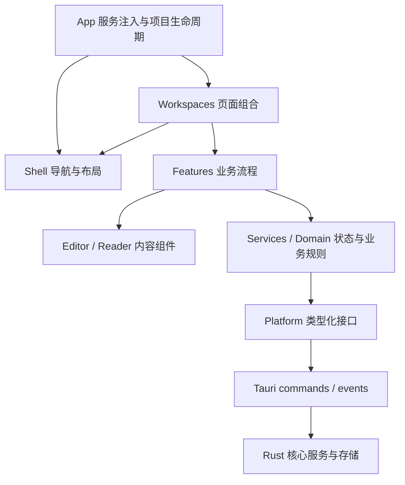

# Scientify 前端布局与系统结构

> 2026-09-24 更新：旧 `electron/`、`renderer/` 已退役删除，当前只维护 React/Tauri。本文中的旧实现清单仅供历史参考。

> 本文为历史合并调研稿。最新结构与技术基线见 [产品页面结构](../架构设计/01-产品页面结构.md)、[功能与导航框架](../架构设计/02-功能与导航框架.md)、[技术方案](../架构设计/技术方案.md)。导航、布局、文件组织和后续存储路线以这三份文档为准。

日期：2026-09-23。目标代码：`F:\Project\Scientify\Scientify`。

本文确定页面骨架、导航关系、组件边界与编辑系统，作为后续前端开发的结构基线。各功能页的字段、列表内容、按钮与完整二级菜单后续细化。下文中的布局和接口是设计方案，不代表当前已经实现。

## 1. 核心结构

Scientify 采用一个持续存在的项目工作台：**选择工作区 → 选择任务或资源 → 在中央区域连续操作**。

进入项目后，固定六个一级入口：**项目概览、研究工作台、文献库、论文订阅区、实验与代码管理、AI 助手**。切换入口只替换工作区内容和上下文，保留同一套应用框架。

产品有两个场景：

| 场景 | 用户任务 | 页面结构 |
| --- | --- | --- |
| 项目管理 | 选择个人或团队空间，创建、查找、打开项目 | 空间侧栏 + 项目集合 |
| 项目工作台 | 围绕当前项目开展研究 | 项目顶栏 + 两级导航 + 中央工作区 |

从项目管理进入工作台时，空间侧栏替换为工作区导航。空间和项目切换集中到顶部，不在编辑页面重复占用一列。

## 2. Oleafly 参考与当前代码差距

已核对用户截图，以及本机 `F:\Project\Oleafly` 的实际源码。

| 参考结构 | Scientify 采用方式 |
| --- | --- |
| 顶部项目上下文和紧凑工具栏 | 顶部明确当前项目；编辑、阅读操作靠近对应内容 |
| 左侧文件树、下方大纲 | 二级侧栏容纳资源选择和辅助索引 |
| 中间编辑、右侧预览 | 中央工作区支持单面板和双面板布局 |
| 可调整、可折叠面板 | 用户可改变分栏比例，按项目与工作区记忆布局 |
| 编辑、预览、助手分别加载 | 每个内容面板独立加载和处理错误 |
| 编辑器核心通过宿主接口获取能力 | 编辑器不直接依赖项目页面、全局 store 或 Tauri |

Oleafly 以文档编辑为主要组织中心；Scientify 在这一操作结构外增加六个研究工作区。其侧栏工具入口不直接等同于 Scientify 的一级导航。

当前 Scientify 的实际基线：

- `src/app/App.tsx` 同时承担空间导航、项目集合、概览、设置与窗口退出保护，尚无统一工作台框架。
- `src/styles.css` 的大标题、页面说明、大外边距和统计卡片主要适合项目浏览，编辑工作区需要独立的紧凑布局。
- `src/stores/workspace.ts` 已有持久化状态和 revision 保护，但单个 `dirty`、`busy` 状态不能直接承担多文档编辑。
- `src/platform/desktop.ts` 已封装工作区后端接口，应保留这一依赖边界。
- 当前新版本为 React/Tauri 的 M1 迁移切片；`renderer/` 与 `electron/` 是旧实现。

## 3. 页面布局

### 3.1 固定骨架

```text
┌───────────────────────────────────────────────────────────────────┐
│ 项目顶栏：返回项目集合 / 空间与项目切换       搜索 / 布局 / 设置     │
├──────────┬────────────────┬───────────────────────────────────────┤
│ 一级导航 │ 当前工作区名称 │ 中央工作区                            │
│          │ 二级功能导航   │ ┌───────────────────────────────────┐ │
│ 项目概览 │                │ │ 内容标签 / 当前对象路径           │ │
│ 研究工作 │ ────────────── │ ├──────────────────┬────────────────┤ │
│ 文献库   │ 资源栏         │ │ 主内容面板       │ 配套内容面板   │ │
│ 论文订阅 │ 文件树 / 集合  │ │ 编辑 / 阅读等    │ 预览 / 翻译等  │ │
│ 实验代码 │ / 会话列表等   │ │                  │ 按需打开       │ │
│ AI 助手  │                │ └──────────────────┴────────────────┘ │
│          │ 大纲等辅助索引 │ 底部输出：问题 / 日志（按需打开）     │
├──────────┴────────────────┴───────────────────────────────────────┤
│ 状态栏：保存状态 / 后台任务              当前内容的简短状态         │
└───────────────────────────────────────────────────────────────────┘
```

图中两个内容面板都属于中央工作区。中央工作区固定的是容器和操作位置，内部面板可分割、折叠和切换。

### 3.2 区域职责

| 区域 | 固定职责 | 布局规则 |
| --- | --- | --- |
| 项目顶栏 | 项目上下文、返回、全局工具 | 常驻；沿用原生窗口标题栏，不重复实现窗口控制 |
| 一级导航 | 切换六个工作区 | 固定顺序；图标配短名称；当前项明确高亮 |
| 二级导航 | 选择当前工作区中的任务视图 | 位于侧栏上部；只展示当前工作区的入口 |
| 资源栏 | 选择实际操作对象 | 位于二级导航下方；按任务显示树、集合或列表 |
| 中央工作区 | 显示、编辑和比较内容 | 占据主要空间；由内容面板组合，独立滚动 |
| 底部输出 | 显示问题、编译或运行日志 | 默认关闭；不遮住正文；终端作为后续可选能力 |
| 状态栏 | 反馈保存、任务和当前对象状态 | 简短常驻；数据路径等详情通过设置访问 |

二级导航与资源栏共用一列，分别承担“做什么”和“对哪个对象操作”。资源栏没有内容时收起，不保留空白框。

### 3.3 尺寸与空间优先级

以下为首版实现起点，单位均为 CSS px：

| 区域 | 初始尺寸 |
| --- | --- |
| 项目顶栏 | 高 40–44 |
| 一级导航 | 宽 80；图标与短名称上下排列，完整名称通过提示显示 |
| 二级导航与资源栏 | 默认宽 240，可在 200–320 间拖动 |
| 标签、局部工具栏 | 每行高 32–36，按实际需要显示 |
| 底部输出 | 默认高 200，可调整与折叠 |
| 状态栏 | 高 24 |
| 双面板 | 初始约 60:40；每个面板至少宽 360 |

现有窗口最小宽度为 1000。在可用宽度不足 720 时，中央区改为单面板，配套内容通过页签切换；用户也可主动收起侧栏后恢复双面板。全屏和专注模式记住原布局，退出后恢复。

页面根容器固定为可视高度，使用 `minmax(0, 1fr)`、`min-width: 0`、`min-height: 0` 约束可伸缩区域。滚动发生在资源列表、编辑器和阅读器内部，顶栏与导航不随正文滚走。

### 3.4 视觉约束

- 采用紧凑的工具界面：连续平面、细分隔线、统一行高，以内容和选中状态形成层次。
- 日常工作页使用局部标题和工具栏，移除重复的宣传语、欢迎横幅与大面积说明。
- 主内容直接铺满工作区；项目卡片仅用于适合浏览的集合页面。
- 中性色为主，沿用灰绿强调色；强调色用于选中项、主要操作和状态。
- 正文与导航约 13–14 px，编辑器约 14 px；编辑代码使用等宽字体，支持缩放。
- 分隔线支持鼠标拖动和键盘调整；焦点、选中、禁用、错误状态分别可辨认。

## 4. 导航与操作层级

### 4.1 四类控件

| 控件 | 回答的问题 | 示例 |
| --- | --- | --- |
| 一级导航 | 当前在哪个研究领域工作？ | 文献库 |
| 二级导航 | 当前进行什么任务？ | 阅读、翻译；名称后续细化 |
| 资源选择与内容标签 | 当前操作哪份材料？ | 某篇论文、某个文件、某次实验 |
| 工具栏操作 | 对当前内容执行什么动作？ | 搜索、保存、缩放、导出 |

保存、缩放、重新编译等动作属于工具栏，不新增导航层级。文件标签属于对象切换，不充当一级或二级导航。

### 4.2 切换规则

1. 首次进入工作区显示其默认视图；再次进入恢复上次视图与对象。
2. 切换二级视图时保留仍适用的当前对象。例如从阅读切换到翻译，沿用同一文献和页码。
3. 切换一级工作区保留原工作区的标签、选择、滚动位置和草稿；后台任务按原归属继续反馈。
4. 跨工作区跳转携带对象引用。例如实验关联代码可直接定位到研究工作台中的文件和行号。
5. 关闭内容标签不退出工作区；返回项目集合由顶栏负责。
6. 保存失败时保留草稿并提供重试。离开项目或关闭应用前统一处理尚未落盘的内容。

### 4.3 AI 的位置

一级 AI 助手用于跨资料任务。工作区内问答沿用同一会话服务，通过中央配套面板呈现，自动带入当前材料引用。

首版中央区最多两个主要内容面板。编辑与预览并排时打开 AI，配套面板切到 AI，保留预览状态；返回预览时继续原位置。更复杂的三栏和独立窗口暂缓。

## 5. 前端组件系统

### 5.1 组件树

```text
App                         启动、服务注入、应用级错误恢复
├─ ProjectLibrary           空间与项目集合
└─ ProjectShell             项目生命周期与固定框架
   ├─ ProjectBar
   ├─ PrimaryNavigation
   ├─ WorkspaceHost         按注册表加载一个工作区
   │  └─ WorkspaceFrame    共用布局组件
   │     ├─ ContextSidebar
   │     │  ├─ SecondaryNavigation
   │     │  └─ ResourceExplorer
   │     └─ Workbench
   │        ├─ ContentTabs
   │        ├─ PrimaryPane
   │        ├─ CompanionPane
   │        └─ OutputDock
   └─ StatusBar
```

`ProjectShell` 管位置、尺寸和项目上下文；具体工作区提供导航、资源与内容组件。`WorkspaceFrame` 使用显式子组件组合，不累积 `isLibrary`、`isEditor`、`showExperiment` 等业务开关。

资源栏只负责选中对象和发出打开请求；编辑器、PDF、会话、差异查看器通过内容注册表进入中央面板。各面板使用独立加载态和错误边界，局部失败保留导航和其他内容。

### 5.2 导航模型

导航使用稳定标识，显示名称独立配置。建议内部地址：`/project/:projectId/:workspaceId/:viewId`；对象和页码等定位信息作为可选参数。桌面初期由统一导航服务管理，后续路由库接入沿用同一模型。

```ts
type WorkspaceId =
  | 'overview' | 'research' | 'library'
  | 'subscriptions' | 'experiments' | 'assistant';

type ResourceRef =
  | { kind: 'file'; rootId: string; relativePath: string }
  | { kind: 'record' | 'paper' | 'experiment' | 'conversation'; id: string };

interface NavigationTarget {
  projectId: string;
  workspaceId: WorkspaceId;
  viewId: string;
  resource?: ResourceRef;
  location?: { line?: number; page?: number };
}
```

工作区注册表提供名称、图标、默认视图、允许的二级视图和懒加载入口。导航服务校验项目、视图及对象；无效地址回退到所属工作区，并说明原内容不可用。初期无需建设插件加载系统。

### 5.3 状态归属

| 状态 | 所有者 | 持久化策略 |
| --- | --- | --- |
| 项目、文献、记录、实验等已保存实体 | 领域 store + Rust 存储 | 沿用现有校验、备份和 revision 协议 |
| 当前一级/二级视图、当前对象 | navigation store | 按项目保存，统一导航服务修改 |
| 面板尺寸、折叠、标签顺序、阅读位置 | layout/session store | 以项目 + 工作区为键保存 UI 偏好 |
| 正文草稿、撤销历史、光标 | DocumentSession | 会话内保存；草稿恢复由单独存储负责 |
| 输入框、悬停、菜单开关 | 组件本地状态 | 不持久化 |
| 编译、翻译、AI、下载任务 | task service | 按 taskId、项目和对象记录状态与取消 |

领域数据仍只有一份权威来源。多个 store 按职责分层，不复制整份 workspace。组件订阅所需字段，避免输入一个字符导致整个应用刷新。

UI 偏好使用带版本的独立存储，不把拖动面板写成业务数据更新。旧 `navigation` 数据通过兼容读取迁移；不直接覆盖旧标签与未知字段。

## 6. 代码与文档编辑系统

### 6.1 系统分层

| 层 | 职责 |
| --- | --- |
| ResearchWorkspace | 研究任务入口、资源树、编辑布局组合 |
| DocumentSession | 打开对象、正文、修改版本、撤销、选择位置与保存状态 |
| EditorPane | 标签、局部工具栏、编辑器容器及焦点管理 |
| CodeMirrorAdapter | 挂载编辑器、分发事务、语言扩展、诊断与快捷键 |
| DocumentService | 打开、保存、重命名、外部变更与冲突处理 |
| Preview / LanguageService | 预览、编译、补全、诊断；独立异步服务 |
| Platform / Rust | 受控文件访问、持久化、进程和网络能力 |

沿用既定技术方案的 CodeMirror 6。其核心分离编辑状态、视图和事务，功能通过扩展组合；Scientify 的会话和保存边界在编辑器外自行实现。[CodeMirror 系统指南](https://codemirror.net/docs/guide/)

### 6.2 文档会话与唯一内容源

- 一份文档对应一个 `DocumentSession`；标签保存文档引用，面板保存显示会话的关系。
- 编辑中的正文以会话为唯一可变来源，已保存领域快照只在成功落盘后更新。
- 首版同一文档只有一个可编辑面板，配套预览只读，避免多编辑器互相覆盖。
- 切换标签保存各文档的编辑状态与撤销历史；切换工作区可卸载视图，保留会话。
- 已保存且闲置的会话可回收；未保存会话须先保存或写入恢复草稿。不要将所有隐藏编辑器永久挂载。
- 重启时恢复标签和持久化草稿；完整撤销历史只保证当前运行会话内保留。
- 重命名后更新资源引用、标签和相关任务，不生成第二份正文。

旧研究记录目前存于工作区数据中。首版通过 `record` 文档适配器编辑原记录；本地代码通过 `file` 适配器访问关联目录。二者共用编辑器，但各自保留唯一存储来源。将记录改成真实 Markdown 文件需另做数据迁移，不在布局改造中隐式实施。

### 6.3 输入与保存

```text
用户输入 → 编辑事务 → 更新会话版本 → 标记待保存
                                     ↓
                              保存队列获取快照
                                     ↓
                     DocumentService → Rust 校验并落盘
                                     ↓
                         确认已保存版本；仍有新修改则继续
```

1. 输入直接进入编辑会话；React 只接收标签状态、诊断等必要摘要。
2. 自动保存按文档防抖、同一文档串行执行。工作区 JSON 内的记录保存仍经现有全局事务队列，避免多个记录竞争同一 revision。
3. 保存请求携带目标、编辑版本与磁盘基线。保存旧版本成功不能把更新中的正文标成“已保存”。
4. 失败保留内容和待保存状态。外部文件变化时，干净会话可重载；有草稿则进入冲突处理。
5. 离开项目或退出应用前等待队列完成；失败继续保留窗口及草稿，允许重试或明确放弃。
6. 自动保存成功才更新已保存快照；编译或 Git 提交需要的文件先完成保存。

建议保存状态为 `clean / dirty / saving / error / conflict`，按文档维护。窗口关闭保护汇总所有文档和表单，不再由单个全局布尔值覆盖。

### 6.4 编辑能力与服务契约

以下为设计接口，落地时补齐错误类型和测试：

```ts
interface DocumentPort {
  open(ref: ResourceRef): Promise<{
    text: string; baseToken: string; readOnly: boolean;
  }>;
  save(input: {
    ref: ResourceRef;
    text: string;
    expectedBaseToken: string;
    editVersion: number;
  }): Promise<{ baseToken: string; savedEditVersion: number }>;
}
```

首版适配器仅接受 `file` 与 `record`；其他资源由对应阅读或详情组件打开。`baseToken` 对记录映射到受控的工作区版本，对文件映射到内容指纹。Rust 校验实际基线，不能只相信前端比较。

编辑器通过宿主接口获取保存、打开引用、诊断和 AI 操作。扩展模块不导入业务 store，也不自行调用 `invoke`。菜单、按钮、快捷键使用同一命令入口，并按当前焦点判定；聊天框中的编辑快捷键不应修改代码正文。

### 6.5 预览、语言服务与 AI

| 能力 | 系统关系 |
| --- | --- |
| Markdown 预览 | 消费当前会话快照，异步更新中央配套面板 |
| LaTeX 编译/PDF | 保存相关文档后编译；结果绑定入口文件、来源版本与任务标识 |
| 补全与诊断 | 按语言加载扩展；语言服务器经独立适配器接入 |
| AI 修改 | 基于某个文档版本生成建议；差异预览后通过编辑事务应用，支持撤销 |
| 实验执行 | 由实验服务管理运行与结果，编辑器提供文件和版本引用 |

每个异步结果都携带项目、文档、来源版本和任务标识。已取消、旧版本或其他项目的结果不得覆盖当前内容；旧编译结果可保留，但明确显示与当前正文版本不同。

语法高亮和基础补全先落地；跨文件定义跳转、完整语言服务器和终端属于后续能力。编辑器依赖本身不等于已经具备完整 IDE 功能。

## 7. 工程目录与依赖规则

保持当前 React 19、TypeScript、Vite、Zustand、Tailwind CSS、Tauri 2 与 Rust 路线，先在单个前端工程内划分边界。

```text
Scientify/
├─ src/
│  ├─ app/                       启动、依赖注入、ProjectLibrary/ProjectShell
│  ├─ shell/                     导航、侧栏、面板、标签、状态栏、布局状态
│  ├─ workspaces/                六个入口的页面组合与工作区注册表
│  │  ├─ overview/  research/  library/
│  │  └─ subscriptions/  experiments/  assistant/
│  ├─ features/                  可复用业务流程和功能组件
│  │  ├─ projects/  documents/  literature/
│  │  └─ subscriptions/  experiments/  assistant/
│  ├─ editor/                    CodeMirror 适配、语言扩展、编辑命令
│  ├─ domain/                    领域类型、规则、资源引用
│  ├─ stores/                    领域快照与查询，不保存每次击键
│  ├─ services/                  文档会话、保存队列、任务与预览协调
│  ├─ platform/                  接口、Tauri 适配、窗口生命周期
│  ├─ components/ui/             Button、Tabs、Menu、Dialog 等基础组件
│  └─ styles/                    tokens、全局基线、shell、editor 样式
├─ src-tauri/                    命令、事件、权限、桌面生命周期
├─ crates/scientify-core/        数据校验、存储与领域服务
└─ electron/、renderer/          迁移期旧实现
```

目录按实际开发创建，不预先堆放空文件。`workspaces` 负责组装，`features` 负责业务，`shell` 负责布局；同一业务逻辑不在三处各实现一遍。



- 工作区之间通过资源引用、导航命令和公共服务协作，不互相导入对方的页面组件。
- UI 基础组件不依赖领域数据；Shell 不知道论文元数据或实验参数。
- WebView 的桌面调用集中在 platform；窗口关闭监听也从 App 的业务页面中抽离。Tauri 通过消息调用衔接 WebView 与 Rust。[Tauri 架构说明](https://v2.tauri.app/concept/architecture/)
- 后端根据已关联根目录与资源身份校验文件访问；前端不取得任意文件系统或通用 shell 能力。
- 所有监听器、编辑器视图、PDF worker 与长任务明确清理；开发模式重复挂载不得产生重复保存或事件。

## 8. 实施顺序与结构验收

### 第一步：统一页面骨架

拆分 App，建立项目管理页、ProjectShell、六个入口、二级导航插槽及中央容器。现有项目管理与概览接入新壳；未迁移模块明确显示状态。

**验收**：六个入口切换时顶栏和一级导航稳定；中央容器不跳动；在 1440 和 1000 宽度下可操作；面板内部滚动。

### 第二步：导航与布局状态

实现工作区注册表、统一导航、资源定位、面板尺寸和每项目状态恢复。

**验收**：项目之间状态隔离；阅读与翻译切换保留对象；跨模块打开引用可返回原任务；无效对象有明确处理。

### 第三步：编辑系统纵向切片

先完成“打开一份研究记录 → 编辑 → 保存 → 切换工作区 → 返回 → 重启恢复”，再接入本地文件与预览。

**验收**：连续输入与保存并发无丢失；保存失败保留草稿；退出保护有效；切换保留撤销历史；外部变更不会静默覆盖。

### 第四步：逐步接入其他工作区

文献阅读、订阅、实验与助手复用统一的面板、任务、导航和资源引用规则，再按产品功能说明细化各页面。

**验收**：局部故障不破坏框架；旧任务不串入新项目；每新增一个工作区无需修改其他工作区的业务代码。

本次只建立结构文档。具体页面内容、二级菜单最终名称、字体图标细节及扩展能力实现时间后续确定。

## 9. 本地核对依据与文档关系

### 本地代码依据

- [Scientify 当前 App](../../src/app/App.tsx)、[workspace store](../../src/stores/workspace.ts)、[后端适配](../../src/platform/desktop.ts)、[当前样式](../../src/styles.css)。
- [Oleafly App 布局](/F:/Project/Oleafly/src/App.tsx:858)：嵌套面板、编辑/预览/助手、输出区域与独立错误边界。
- [Oleafly Sidebar](/F:/Project/Oleafly/src/components/layout/Sidebar.tsx:403)：活动侧栏切换；文件树与大纲组合。
- [Oleafly Editor](/F:/Project/Oleafly/src/components/editor/Editor.tsx)：文件与差异标签、焦点范围内的编辑命令。
- [Oleafly 编辑器宿主接口](/F:/Project/Oleafly/packages/editor/src/CodeMirrorEditor.tsx:80)、[后端契约](/F:/Project/Oleafly/packages/backend-port/src/index.ts)：核心组件与平台能力分离。

### 文档分工

- [产品功能说明](../产品功能文档/产品功能说明.md)：描述能力范围；已有二级条目作为候选功能分组。
- 本文：确定页面结构与前端实现边界；布局问题以本文为准。
- [Tauri/React 迁移方案](Scientify-Tauri-React迁移技术方案.md)：继续约束技术栈、数据兼容和迁移范围；其中“单一状态源”指领域数据，不排斥本文的会话与布局分层。
- 原 UI 信息架构随 Electron 退役删除；当前开发规则见 [UI/UX 标准](../UI-UX/README.md)。

截图用于理解布局，源码用于核对实现。本文借鉴组织方式，Scientify 的业务和组件独立设计。
