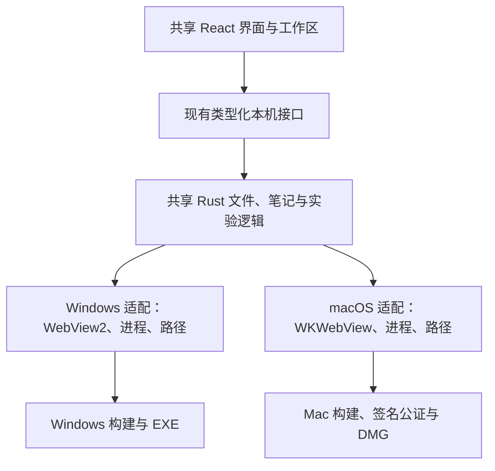

# Scientify Windows 与 macOS 适配方案

状态：2026-10-03，基于本仓库 `b40fe1d` 的源码核查与上游项目调研。本文是待实施方案；本次没有修改应用代码，也没有在 Mac 上执行构建或功能验证。

**结论：Scientify 已有跨平台架构基础，但目前可交付的平台仍只有 Windows x64。继续使用 Tauri 2、React 和 Rust，补齐平台适配，即可推进 Mac 版，无需重写产品。**

本次目标是同一个产品分别在 Windows 和 Mac 上安装、使用，各自管理本机数据。账户、云存储、多端同步、实时协作以及 Linux、Web、移动端不属于本次范围。Mac 支持不以同步功能为前提。

## 1. 当前能力与阻塞

React / TypeScript、CodeMirror、PDF.js，以及大部分 Rust 业务逻辑可以复用。项目使用 Tauri 2.11.6，已按平台声明 Windows 原生依赖；终端使用 portable-pty，部分进程、Python 与 Git 逻辑已有非 Windows 分支。

但框架支持 macOS，不代表 Scientify 已支持 macOS。当前没有经过验证的 Mac 安装包，不能只把打包后缀改成 `.dmg` 就发布。

| 模块 | 当前源码事实 | Mac 适配要求 |
| --- | --- | --- |
| 数据目录 | [data_location.rs](../../src-tauri/src/data_location.rs) 的正式环境入口无条件读取 `APPDATA`、`LOCALAPPDATA`，默认策略围绕 Windows 安装位置设计 | 使用平台数据目录，保留 Windows 原有数据和迁移行为 |
| Agent 引擎 | [prepare-agent.mjs](../../scripts/prepare-agent.mjs) 默认 Windows target，下载命名固定 `.exe`；[process.rs](../../src-tauri/src/agent/process.rs) 的开发态定位也固定 Windows target | 按系统和 CPU 准备、定位、授权并打包对应引擎 |
| 内嵌浏览器 | [browser.rs](../../src-tauri/src/browser.rs) 已有通用网页创建和部分事件；导航控制包含 WebView2 专用接口，非 Windows 分支明确返回不支持 | 增加 WKWebView 导航、会话存储与事件适配，验证下载和网页交互 |
| 本地命令与实验 | [local_process.rs](../../src-tauri/src/local_process.rs)、[runner.rs](../../src-tauri/src/experiments/runner.rs) 在 Windows 使用 Job Object；非 Windows 部分终止路径只调用 `child.kill()` | 处理所属进程组、退出清理与管道回收，避免实验停止后遗留进程 |
| Python 与终端 | [python.rs](../../src-tauri/src/experiments/python.rs) 已处理部分 Unix Python 路径，但 Conda 定位仍有 `.exe`、`Scripts` 假设；[terminal.rs](../../src-tauri/src/experiments/terminal.rs) 的非 Windows 默认偏向 Bash | 适配 zsh、Conda，以及 Finder 启动时的工具发现 |
| 原生窗口 | [windows.rs](../../src-tauri/src/windows.rs)、[lib.rs](../../src-tauri/src/lib.rs) 包含窗口和 WebView 配置 | 适配 Mac 标题栏、菜单、快捷键、关闭与退出语义；文件名 `windows.rs` 本身不代表仅支持 Windows |
| 发布 | [Tauri 配置](../../src-tauri/tauri.conf.json) 只有 NSIS 和 `.ico`；[CI](../../.github/workflows/ci.yml)、[发布流程](../../.github/workflows/release.yml) 与[产物脚本](../../scripts/stage-release.mjs) 以 Windows 为目标 | 增加 macOS 构建、图标、DMG、签名、公证和安装验证 |

这些是已发现的明确问题，并不代表已穷尽 Mac 编译错误。首次 macOS 构建仍需检查原生依赖、条件编译和测试夹具。

## 2. 开源项目采用什么方法

调研采用项目源码、构建配置和官方文档。下列实现链接固定到本次查看的上游版本，便于后续对照。

| 项目 | 观察到的方法 | Scientify 可以借鉴什么 |
| --- | --- | --- |
| [Yaak](https://github.com/mountain-loop/yaak) | Tauri + React + Rust；[窗口实现](https://github.com/mountain-loop/yaak/blob/7f302536168585be4603aea09491a78b75c57070/crates-tauri/yaak-window/src/window.rs) 按平台配置标题栏、浏览器存储；[发布工作流](https://github.com/mountain-loop/yaak/blob/7f302536168585be4603aea09491a78b75c57070/.github/workflows/release-app.yml) 使用显式系统与架构矩阵 | 技术栈最接近：共享业务代码，在原生窗口和构建层处理差异 |
| [Clash Verge Rev](https://github.com/clash-verge-rev/clash-verge-rev) | [预构建脚本](https://github.com/clash-verge-rev/clash-verge-rev/blob/14770df157068e21ecf97d43c6ad4349fff28c1c/scripts/prebuild.mjs) 映射 target、系统和架构，准备附带程序；[Mac 专用配置](https://github.com/clash-verge-rev/clash-verge-rev/blob/14770df157068e21ecf97d43c6ad4349fff28c1c/src-tauri/tauri.macos.conf.json) 独立声明 app / dmg、entitlements 与最低系统版本 | Agent 需要独立的架构映射、资源准备和打包检查，不能随主程序自动变成 Mac 版 |
| [Cherry Studio](https://github.com/CherryHQ/cherry-studio) | Electron 应用在 [electron-builder 配置](https://github.com/CherryHQ/cherry-studio/blob/0b51b59f8f4acbc7768b860fab3276b6e13f9e48/electron-builder.yml) 中分别声明 Windows、macOS、原生资源和安装格式 | 即使统一使用 Chromium，原生依赖与分发仍需分平台处理。迁移 Electron 会额外引入现有 Rust、IPC 和窗口逻辑的迁移成本 |

共同方法是：**共享界面和业务逻辑，平台差异集中适配，构建和验收分别进行。** 本方案借鉴结构，不复制其产品功能或源码；以后若复制代码，需单独核对文件许可证和归属要求。

## 3. 固定技术选择与支持目标

唯一实施路线：**保留 Tauri 2 + React / TypeScript + Rust，在现有原生模块中增加 macOS 实现，通过 GitHub Actions 分平台构建，在 GitHub Releases 分发。**

| 平台 | 目标架构 | 安装产物 | 本次定位 |
| --- | --- | --- | --- |
| Windows 10 / 11 x64 | `x86_64-pc-windows-msvc` | NSIS `.exe` | 保持现有交付和回归验证 |
| macOS 14+，Apple Silicon | `aarch64-apple-darwin` | `.dmg`，包含 `.app` | 优先完成开发和实机验收 |
| macOS 14+，Intel | `x86_64-apple-darwin` | 独立 `.dmg`，包含 `.app` | 使用同一源码，通过对应运行验证后再声明支持 |

建议首版支持 macOS 14+，因为当前 Tauri 的 WKWebView 独立持久数据存储标识接口要求 macOS 14+，适合保留应用界面与外部网页的存储隔离。这是 Scientify 的方案取舍，并非 Tauri 本身只能运行于 macOS 14+。更早系统需要另行设计浏览器存储策略。

首版分别发布 Apple Silicon 和 Intel 安装包，暂不做 Universal 合包，避免主程序合并后，Agent 等内置可执行文件仍只有单架构的问题。

界面继续通过 `src/platform/` 调用本机能力。Rust 按平台报告可用 shell、浏览器能力等信息，前端据此呈现，避免在各组件内分散判断平台字符串。

## 4. 具体实现方案

### 4.1 数据路径与本地文件

- 使用 Tauri 平台路径接口。Mac 持久数据放在 `~/Library/Application Support/com.scientify.desktop/` 下，缓存使用平台 cache 目录。安装后的 `.app` 只存放应用资源，不写入论文、笔记或运行记录。
- 保留开发与正式数据的区分、用户选择外部数据根的能力，以及 Windows 已有默认位置和迁移行为。
- PDF、相邻 Markdown 笔记和项目代码保留现有组织方式，无需为跨平台更换文件格式或数据库。
- 数据根、Python 和 Git 路径属于本机配置。用户手工复制项目到另一台电脑后，原有绝对路径需要重新关联；跨平台安装不会使路径自动可用。
- 用临时项目验证大小写敏感卷、中文和空格路径、Unicode 文件名、符号链接、外部盘权限、回收站，以及论文与笔记配对移动、重命名和恢复。

### 4.2 Agent 可执行文件

- 在 `prepare-agent.mjs` 集中维护三个 target 的映射。CI 显式传入目标，开发环境按本机系统与架构解析；区分构建主机架构和安装包目标架构。
- Windows 使用 `.exe`；macOS 解包对应 Darwin 归档并设置可执行权限。缓存标记包含引擎版本、目标架构和校验信息，避免误用其他平台文件。
- 构建前校验固定版本与下载内容，准备 Tauri sidecar 要求的文件名；运行时从包内定位引擎，开发态按实际 target 定位。
- 当前锁定的上游 [Codex 0.158.0](https://github.com/openai/codex/releases/tag/rust-v0.158.0) 已提供 `codex-aarch64-apple-darwin.tar.gz` 与 `codex-x86_64-apple-darwin.tar.gz`。本次核实了资源存在，尚未验证它们在 Scientify 中的 Mac 运行行为。
- 当前脚本会执行引擎来生成协议。改为使用同版本、可在构建主机运行的工具生成协议，目标引擎用于打包；不能在 ARM 构建机上未经处理就执行 Intel 文件。优先采用原生架构构建和测试，交叉编译产物仍需对应运行验证。
- 单独验收 Mac 上的会话恢复、目录权限、审批、中止与沙箱拒绝，不能通过放宽权限掩盖适配问题。

### 4.3 内嵌浏览器

保留现有页面与标签交互。Windows 使用 WebView2，macOS 使用 Tauri / Wry 的 WKWebView。以公共接口为先，公共接口缺失的导航控制使用 `objc2` / `objc2-web-kit` 补齐；原生调用在 UI 线程进行，遵循现有 WebView 生命周期管理。

不能沿用 Windows 的 `.data_directory(...)`。为应用界面与外部网页分配独立、稳定的存储标识；同一浏览器资料范围内共享标识，以恢复登录状态。Mac 使用 `data_store_identifier([u8; 16])`，标识持久保存，不能每次启动随机生成，也不能使用不保证跨版本稳定的默认哈希。

同时检查 browser、Projects 和 Workspace 的 WebView 创建入口。存储隔离与 IPC 权限是不同机制，外部网页仍不获得应用读写文件、执行命令等业务权限。

验收覆盖地址和关键词输入、前进后退、刷新停止、重定向、标题与加载状态、新窗口请求、登录保持、下载到文献库，以及窗口缩放后的网页尺寸和焦点。WKWebView 与 WebView2 的兼容性不同，使用真实网站和受控页面分别验证。

不使用 iframe 替代原生浏览器。内部预览若临时仅提供系统浏览器入口，需明确限制；完成版仍要求现有内嵌浏览器工作流可用。

### 4.4 终端、Python、Git 与进程

- 继续使用 portable-pty。Mac 默认 zsh，保留 Bash，按平台和实际安装情况显示可用 shell，不默认列出 PowerShell / CMD。
- Finder 启动的 GUI 应用不能假定继承终端 PATH。工具发现使用受控候选位置、用户选择与实际可执行检查，覆盖系统工具、`/opt/homebrew/bin`、`/usr/local/bin` 和已安装 Conda 环境，不强制用户安装 Homebrew。
- Python 与 Conda 命令按平台定位，验证已有环境、venv、包管理和实验运行。工具路径可解析合法符号链接，但不放宽项目文件边界校验。
- 对应用启动的可信本地命令建立所属进程组和生命周期管理：先温和终止，超时后强制终止并回收；验证后代进程、PTY、输出管道与窗口关闭清理。只终止 Scientify 拥有的任务。
- Agent 发起的实验继续沿用其执行与权限通道，验证 Mac 行为，不为统一终止逻辑而绕开引擎沙箱。
- 将依赖 `SystemRoot`、PowerShell 和 Windows 路径的测试改为各平台有效夹具，保留行为断言，不通过整体跳过 Mac 测试制造通过状态。

### 4.5 原生体验

共享工作区与组件，适配 Mac 标题栏与交通灯按钮、原生菜单和剪贴板、Cmd 快捷键、Option 拖拽复制、关闭窗口与退出应用、Dock 重开、全屏、多窗口、中文输入法、触控板和 Retina 显示。

很多快捷键已接受 `ctrlKey || metaKey`，可直接复用；检查只使用 Ctrl 的拖拽和菜单显示。改动不能重置草稿、选区、编辑会话或正在运行的任务。

### 4.6 构建、签名与分发

- 拆分公共 Tauri 配置与 Windows / macOS 配置。Mac 增加 `.icns`、应用元数据和必要的最小 entitlements，保留统一 bundle identifier。
- GitHub Actions 保留 Windows 检查，增加两个 Darwin target。实施时确认 runner 的真实 CPU 与可用性，Rust 编译目标不等于运行验证平台。
- 扩展 `stage-release.mjs`，按平台收集安装包、第三方许可和 SHA-256 清单；本次计划发布的平台构建全部通过后，由单一任务发布到同一版本，避免并行任务覆盖发布状态。
- Windows 在 Windows runner 构建，Mac 在 macOS runner 构建和签名。Windows 开发者可以借 CI 生成 Mac 包，但仍需 Mac 环境完成 GUI 与安装验收。
- GitHub 公开分发采用 Developer ID Application 签名、Hardened Runtime、公证与 stapling。按嵌套关系处理 Agent 等附带程序及外层应用，并验证签名；entitlements 以实际必要权限为限。
- 公证认证使用 App Store Connect API key。签名证书和私钥放入 GitHub Actions Secrets，只在受信任发布任务中使用，不提供给外部 PR。开发构建可先做本地测试签名，但不能据此认定已完成顺畅的公开分发。
- 不要求上架 Mac App Store。公开发行需要有效 Apple Developer 资格与分发证书，账号开通和证书准备可能影响日历工期。

## 5. 开发顺序、用例与工作量

按下表拆分可独立审阅的 PR，目标统一为 `main`，每阶段同时回归 Windows，遵循[分支与发布规则](版本发布与分支管理.md)。

| 阶段 | 交付内容 | 验收用例 | 预计工作量 |
| --- | --- | --- | --- |
| P0：构建可行性 | 平台路径、Agent 准备、Mac 配置，首次 Apple Silicon 打包启动 | 打开应用，创建临时项目，退出再开仍有数据，应用包内不产生研究数据 | 2–4 人日 |
| P1：阅读与笔记 | 文献目录、PDF、Markdown、基础窗口与菜单 | 关联目录，打开 PDF 和配对笔记，编辑后重启恢复；重命名与回收保持配对，取消保存不丢草稿 | 3–5 人日 |
| P2：科研执行 | zsh / PTY、Python / Conda、Git、Agent、进程与权限 | Finder 启动后选择 Python 并运行脚本；交互输入、日志、产物、Git 与 Agent 可用，停止后无所属残留进程 | 5–8 人日 |
| P3：内嵌浏览器 | WKWebView 导航、会话、事件、下载与窗口联动 | 应用内浏览，登录后重启符合资料保留策略；下载 PDF 进入文献库，外部页不能调用业务 IPC | 4–7 人日 |
| P4：公开发行 | Intel 目标验证、签名公证、DMG、发布和文档 | 两类 Mac 分别完成下载、拖入 Applications、Finder 启动、升级与数据保留；Windows 安装与主要流程仍通过 | 3–5 人日 |

**基础阅读与笔记预览约 5–10 个工作日；覆盖当前完整工作流的 Mac 公开版本约 4–6 周。** 上表合计约 17–29 人日，以一名熟悉 Tauri / Rust 的全职开发者、可用 Mac 测试环境和稳定的现有功能基线为前提，属于规划估算。原生浏览器缺口、签名后 Agent 权限行为、Intel 测试资源和证书开通可能延长工期。

最高难度是内嵌浏览器和进程 / Agent 行为，目录与打包配置相对直接。基础预览不能标为完整跨平台交付；若 Intel 尚未通过运行验证，先明确发布 Apple Silicon 预览，不宣称兼容所有 Mac。

## 6. 验证范围与官方依据

验证安装后的应用，不能只验证 `pnpm dev` 或前端网页。至少覆盖一台真实 Apple Silicon Mac，并为 Intel 产物取得对应架构运行证据。首次启动、离线阅读、权限拒绝、外部目录断开、长任务停止、多窗口和升级恢复均使用临时项目，不使用真实研究资料。

共享代码检查在适用平台执行；浏览器、文件权限、沙箱、菜单和 Gatekeeper 需要桌面验证。发布说明按平台列出已验证能力和限制，验收前保持 README 的 Mac“尚未交付”状态。

官方参考：

- [Tauri 进程与 WebView 模型](https://v2.tauri.app/concept/process-model/)：Windows 使用 WebView2，macOS 使用 WKWebView，共享前端不代表浏览器内核一致。
- [Tauri 2.11.6 WebviewWindowBuilder API](https://docs.rs/tauri/2.11.6/tauri/webview/struct.WebviewWindowBuilder.html#method.data_store_identifier)：`data_directory` 不适用于 macOS，独立持久存储标识要求 macOS 14+；本次也核对了本地锁定版本源码。
- [Tauri sidecar 指南](https://v2.tauri.app/develop/sidecar/)：随包二进制按目标平台准备。
- [Tauri macOS 签名与公证](https://v2.tauri.app/distribute/sign/macos/)：证书、公证认证和分发流程。
- [Tauri 前置依赖](https://v2.tauri.app/start/prerequisites/)与[分发指南](https://v2.tauri.app/distribute/)：实施时核对构建环境和安装格式。

本次完成了仓库代码审查、三个开源项目实现对照、上游 Mac 引擎资源核实及适配路线设计。未在 Mac 上安装 Scientify，未测量性能、安装成功率和兼容性覆盖率；这些证据需在实施阶段补齐。
