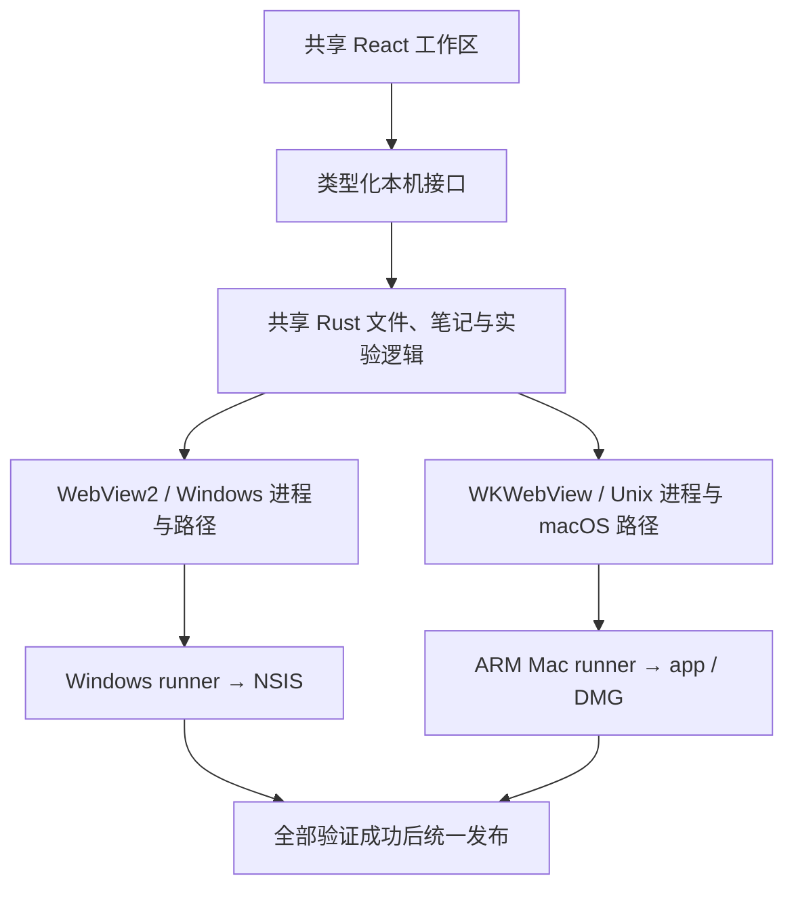

# Scientify Windows 与 Apple Silicon 实现说明

状态：2026-10-03，`0.3.0-alpha.2` 预发布实现。安装包是否已发布、最终校验结果以 [GitHub Release](https://github.com/2214331539/Scientify/releases/tag/v0.3.0-alpha.2) 和对应 Actions 为准。

本次在同一套 Tauri 2 + React / TypeScript + Rust 代码上补齐 macOS 适配，通过 GitHub Actions 原生构建并分发。两台电脑分别管理本机数据，不包含账户、多端同步或在线协作。用户明确排除 Intel，本轮不构建、不验证 Intel 或 Universal 包。

## 1. 唯一技术路线与交付范围

| 平台 | 编译目标 | 安装产物 | 范围 |
| --- | --- | --- | --- |
| Windows 10 / 11 x64 | `x86_64-pc-windows-msvc` | NSIS `.exe` | 保持原有应用与数据行为 |
| macOS 14+ Apple Silicon（M 系列） | `aarch64-apple-darwin` | `.dmg` 内含 `.app` | 新增预览版 |

不迁移 Electron，不发布独立 Web 或移动端应用。最低 macOS 14 是稳定、独立的 WKWebView 持久资料存储接口要求；CI 使用原生 ARM 的 `macos-15`，并校验实际 CPU。最低系统版本尚未在 macOS 14 设备上单独验收。

## 2. 开源项目采用什么方法

调研采用项目源码、构建配置和官方文档。下列实现链接固定到本次查看的上游版本，便于后续对照。

| 项目 | 观察到的方法 | Scientify 可以借鉴什么 |
| --- | --- | --- |
| [Yaak](https://github.com/mountain-loop/yaak) | Tauri + React + Rust；[窗口实现](https://github.com/mountain-loop/yaak/blob/7f302536168585be4603aea09491a78b75c57070/crates-tauri/yaak-window/src/window.rs) 按平台配置标题栏、浏览器存储；[发布工作流](https://github.com/mountain-loop/yaak/blob/7f302536168585be4603aea09491a78b75c57070/.github/workflows/release-app.yml) 使用显式系统与架构矩阵 | 技术栈最接近：共享业务代码，在原生窗口和构建层处理差异 |
| [Clash Verge Rev](https://github.com/clash-verge-rev/clash-verge-rev) | [预构建脚本](https://github.com/clash-verge-rev/clash-verge-rev/blob/14770df157068e21ecf97d43c6ad4349fff28c1c/scripts/prebuild.mjs) 映射 target、系统和架构，准备附带程序；[Mac 专用配置](https://github.com/clash-verge-rev/clash-verge-rev/blob/14770df157068e21ecf97d43c6ad4349fff28c1c/src-tauri/tauri.macos.conf.json) 独立声明 app / dmg、entitlements 与最低系统版本 | Agent 需要独立的架构映射、资源准备和打包检查，不能随主程序自动变成 Mac 版 |
| [Cherry Studio](https://github.com/CherryHQ/cherry-studio) | Electron 应用在 [electron-builder 配置](https://github.com/CherryHQ/cherry-studio/blob/0b51b59f8f4acbc7768b860fab3276b6e13f9e48/electron-builder.yml) 中分别声明 Windows、macOS、原生资源和安装格式 | 即使统一使用 Chromium，原生依赖与分发仍需分平台处理。迁移 Electron 会额外引入现有 Rust、IPC 和窗口逻辑的迁移成本 |

共同方法是：**共享界面和业务逻辑，平台差异集中适配，构建和验收分别进行。** 本方案借鉴结构，不复制其产品功能或源码；以后若复制代码，需单独核对文件许可证和归属要求。

## 3. 已实施的原生适配

| 模块 | 实现 | 用户用例 |
| --- | --- | --- |
| 应用数据 | [data_location.rs](../../src-tauri/src/data_location.rs) 使用平台 data/cache 目录。Mac 的清单与数据放在用户目录，应用包只保存资源 | 拖入 Applications、覆盖更新后，原有研究数据保留 |
| Agent | [platform.mjs](../../scripts/platform.mjs) 仅接受两个原生 target；[prepare-agent.mjs](../../scripts/prepare-agent.mjs) 按架构下载 Codex 0.158.0、校验固定 SHA-256、解包并设置权限，Rust 从实际编译 target 定位 | Mac 安装包自带 arm64 引擎，无需用户另装 Codex |
| 浏览器 | [browser.rs](../../src-tauri/src/browser.rs) 在 UI 线程调用 WKWebView 的返回、前进、刷新与停止；轮询标题、历史和加载状态，并保留 Wry 导航代理 | 工作区中打开网页、导航、隐藏和重新显示，远程页无法调用科研 IPC |
| 浏览器资料 | [webview_profile.rs](../../src-tauri/src/webview_profile.rs) 为 Projects、Workspace、远程页保存不同的稳定 UUID，使用 `data_store_identifier` | 应用 UI 与远程网页资料隔离，不随每次启动随机变化 |
| Python / Conda | 检查 Unix 可执行权限，覆盖系统、Homebrew 与常见 Conda 位置；合法解释器软链接解析后校验 | Finder 启动也可发现常见解释器，或由用户选择路径 |
| 终端与停止 | portable-pty；Mac 默认 zsh；隐藏 Windows 专用选项。可信命令与实验使用所属进程组，PTY 清理所属前台组和 shell 组 | 交互输入、停止实验或关闭终端时回收应用所属进程与输出管道 |
| 沙箱 | AI 正式运行仍通过 Agent 的工作区沙箱；新增 Mac 实际写入允许/拒绝测试 | 产物目录允许写入，工作区外写入被拒绝，不以放宽权限换取通过 |
| 原生资源与许可 | [Mac 配置](../../src-tauri/tauri.macos.conf.json) 声明 app / dmg、icns、最低系统；按目标生成依赖声明，补齐 Apple 依赖上游许可 | 发行包包含对应架构资源与第三方许可 |

Mac 默认数据容器为 `~/Library/Application Support/com.scientify.desktop/ScientifyData/`，实际工作区在其 `workspace/` 子目录。位置清单位于父目录；开发构建仍使用 `.tauri-data/`。Windows 的安装目录策略不变。

WKWebView 的实际网站数据由 macOS / WebKit 管理；应用保存的是存储 UUID。移动 Scientify 数据目录不代表把所有 WebKit 网站数据复制到新位置或另一台电脑。外部 PDF、笔记和代码目录仍须单独备份；跨设备复制后须重新关联本机路径。

继续使用现有自绘窗口控件。本版 Mac 的 Cmd+Q 在工作区打开时先进入现有保存/后台任务保护并返回 Projects，再次退出才能结束应用；不绕过草稿保护。原生交通灯布局、完整 Dock 行为、Option 拖拽复制等仍属后续体验改进。

## 4. 构建与发布

- [Windows CI](../../.github/workflows/ci.yml) 与 [Mac CI](../../.github/workflows/macos.yml) 分别验证原生平台。Mac 在本机 ARM 环境生成协议，禁止把交叉编译冒充运行验证。
- [Desktop release](../../.github/workflows/release.yml) 校验标签、版本与 main 祖先关系；Windows、Mac 均通过后收集安装包、SHA-256 和分平台许可，一次性发布到同一个 Pre-release。
- 无 Apple 凭据时使用 ad-hoc 签名，明确标注未公证。已接入可选 Developer ID + App Store Connect API key 流程，但该路径未经本次真实凭据验证。
- 签名凭据仅用于受信任发布任务，不提供给外部 PR。部分凭据缺失时失败，不隐式降低签名模式。
- 后续正式分发应完成 Developer ID、Apple 公证与 stapling；目前不要求用户关闭 Gatekeeper。

Mac 开发前置条件为 macOS 14+、原生 arm64 Node 24 / Rust stable、pnpm 10.11.0、Xcode Command Line Tools、Git 和 Python 3。执行 `pnpm install --frozen-lockfile`、`pnpm start`。打包使用 `node node_modules/@tauri-apps/cli/tauri.js build --bundles app,dmg -- --locked`。

## 5. 验证门槛与实际边界

CI 必须通过以下检查才允许发布；执行日志与原生报告保存在对应 Actions：

1. 两个平台的前端构建、类型检查、前端测试、Rust 测试、格式与严格 Clippy。
2. Mac 原生程序中的受控浏览器历史/标题、HTTP 错误页保留与恢复、远程 IPC 拒绝、论文笔记保存、视图生命周期。
3. Mac DMG 校验与挂载、app / Agent 均为 arm64、严格签名完整性验证、Agent 实际执行、外置数据目录、覆盖安装后数据保留、LaunchServices 启动。
4. Windows 隔离安装、重复安装、Agent 执行与卸载后数据保留。

只操作 GitHub 临时 runner 和隔离夹具，不使用开发者的真实研究目录。Mac CI 的系统版本为 macOS 15 系列；DMG 启动检查不是完整人工功能验收。ad-hoc 包不声称已通过 Apple 公证或 Gatekeeper 公开分发认证。

尚需真实设备反馈：macOS 14、真实网站登录/下载、中文输入法与触控板、长任务、外部盘/权限变化、完整科研操作与远程模型效果。WKWebView 的 HTTP 状态错误提示与 Windows 尚不完全一致。Intel、Linux、同步和自动更新均不属于交付范围。

官方参考：

- [Tauri 进程与 WebView 模型](https://v2.tauri.app/concept/process-model/)：Windows 使用 WebView2，macOS 使用 WKWebView，共享前端不代表浏览器内核一致。
- [Tauri 2.11.6 WebviewWindowBuilder API](https://docs.rs/tauri/2.11.6/tauri/webview/struct.WebviewWindowBuilder.html#method.data_store_identifier)：`data_directory` 不适用于 macOS，独立持久存储标识要求 macOS 14+；本次也核对了本地锁定版本源码。
- [Tauri sidecar 指南](https://v2.tauri.app/develop/sidecar/)：随包二进制按目标平台准备。
- [Tauri macOS 签名与公证](https://v2.tauri.app/distribute/sign/macos/)：证书、公证认证和分发流程。
- [Tauri 前置依赖](https://v2.tauri.app/start/prerequisites/)与[分发指南](https://v2.tauri.app/distribute/)：实施时核对构建环境和安装格式。
