# Scientify 产品页面结构

> 历史线稿说明：本 V2 的四入口和单窗口方案已被后续开发调整。当前双窗口、六入口和顶栏规则见 [UI/UX 标准](../UI-UX/README.md)；下方图稿保留作过程参考，不要求按旧图回退实现。

版本：V2。本文确定页面布局与交互位置，线稿中的内容为示意，具体字段和视觉样式后续细化。

本版与 [功能与导航框架](02-功能与导航框架.md) 共同替代旧版六工作区布局。技术栈、代码组织与实施路径见 [技术方案](技术方案.md)。

## 1. 总体结构：左侧导航、中央内容、右侧辅助

除顶栏和状态栏外，页面固定为三个区域：

```text
┌────────────────────────────────────────────────────────────────────┐
│ Scientify / 空间 / 项目          全局搜索       AI 助手   研究笔记   │
├──────────────┬───────────────────────────────────┬───────────────────┤
│ 左侧导航区   │ 中央呈现区                        │ 右侧全局辅助栏    │
│              │                                   │                   │
│ 四个一级入口 │ 内容标签 + 当前内容工具栏         │ AI 助手 | 研究笔记│
│ 二级视图切换 │                                   │                   │
│              │ 列表 / 阅读 / 编辑 / 运行结果     │ 当前上下文        │
│ 当前视图的   │                                   │ 对话或笔记正文    │
│ 文件树、集合 │ 可在内部并排：                    │                   │
│ 或资源列表   │ 源码 + 预览 / 原文 + 译文         │ 输入或编辑        │
│              │                                   │                   │
│ 大纲等索引   │ 输出 / 问题 / 日志（按需展开）     │ 可切换、可收起    │
├──────────────┴───────────────────────────────────┴───────────────────┤
│ 保存状态 / 后台任务                           当前对象状态          │
└────────────────────────────────────────────────────────────────────┘
```

- **左侧导航区**是一个完整侧栏。一级入口放在侧栏上沿，二级视图在其下方，文件树或集合列表继续向下排列。
- **中央呈现区**承载主要工作。编辑器、PDF、论文渲染和译文都属于中央区，可在内部拆分。
- **右侧全局辅助栏**承载 AI 助手和研究笔记，所有工作区共用。打开助手不会替换中央预览。
- 右侧收起后中央区扩展，不保留空白占位；侧栏展开、收起和宽度调整可被记住。

## 2. 一级与二级导航的呈现

| 一级入口 | 侧栏短名称 | 二级视图 | 侧栏主要内容 |
| --- | --- | --- | --- |
| 项目概览 | 概览 | 不设固定二级菜单 | 当前项目、少量项目入口 |
| 文献区 | 文献 | 本地文献 / 订阅 | 文献集合、订阅源、当前文献大纲 |
| 实验管理 | 实验 | 文件 / 运行 / 版本 | 文件树、运行列表或 Git 变更 |
| 论文撰写 | 论文 | 文件 / 引用 | 稿件文件树、大纲或引用条目 |

一级短名称配图标，悬停显示全称；选中项通过下划线和文字状态明确标识。一级切换回答“在哪个工作区”，二级切换回答“当前看哪一类资源”。

导入、翻译、提问、缩放、编译等放在工具栏或选区菜单。PDF 阅读、运行详情与文件编辑通过内容标签打开，不再各占一个二级入口。

## 3. 为什么这版更接近 Oleafly 的操作逻辑

上一版把功能分类逐项画成菜单，又用重复边框占位，造成“导航很多、工作内容很少”。本版改为：

- **一条紧凑侧栏**：一级切换、二级切换和资源树共用一列，减少横向占用。
- **连续内容平面**：列表用行，文件用树，正文直接编辑；边框只表达面板边界和必要输入控件。
- **工具跟随对象**：阅读工具贴着 PDF，编译工具贴着稿件，运行输出位于代码下方。
- **稳定的内容标签**：从列表打开材料后，用户直接阅读或编辑，而非进入新的功能介绍页。
- **独立辅助栏**：中央内容与全局助手并行，不因提问而丢掉预览或原文。

本机 Oleafly 的 [App 面板组合](/F:/Project/Oleafly/src/App.tsx:858) 将编辑、预览和助手分别组织为面板；[全局工具入口](/F:/Project/Oleafly/src/components/layout/WorkspaceControls.tsx:219) 提供助手显示切换。本版沿用这类内容与辅助分区关系，并适配 Scientify 的四个领域。

## 4. 登录后的项目管理页

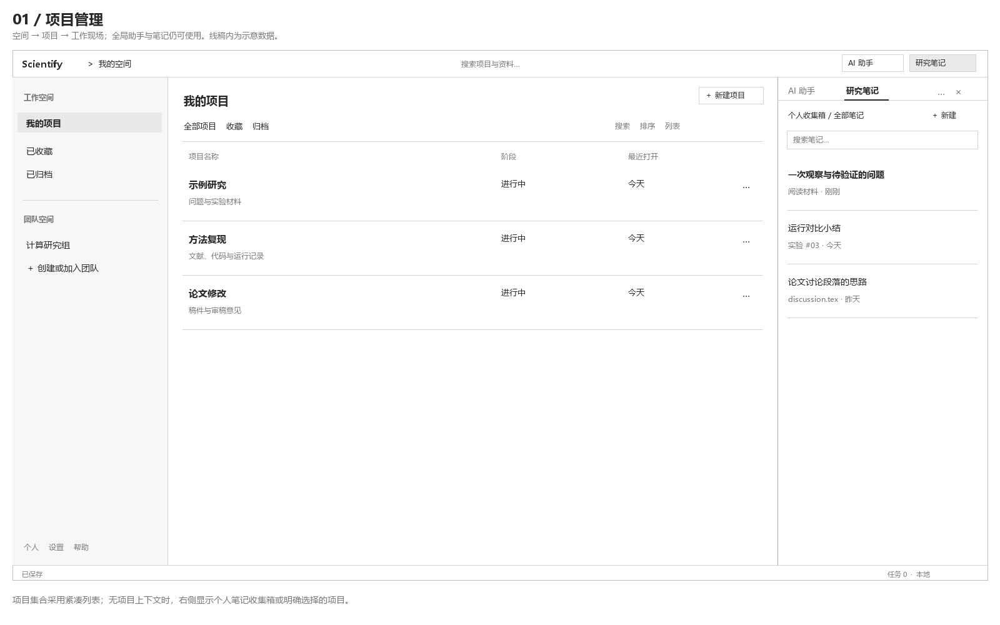

- 左侧显示个人、团队空间及集合筛选；进入项目后，原侧栏原位切换为四个一级入口。
- 中央使用紧凑项目列表，提供查找、新建与打开操作；后续可增加网格视图。
- 顶部保留 AI 与笔记入口。没有打开项目时，笔记使用个人收集箱；AI 显示“未选择项目”，由用户明确选择材料。
- 当前本地版可直接进入此页；未来登录成功后落到同一位置。

图中的项目和笔记仅为布局示意，不代表已有数据。

## 5. 项目概览：信息汇总与入口

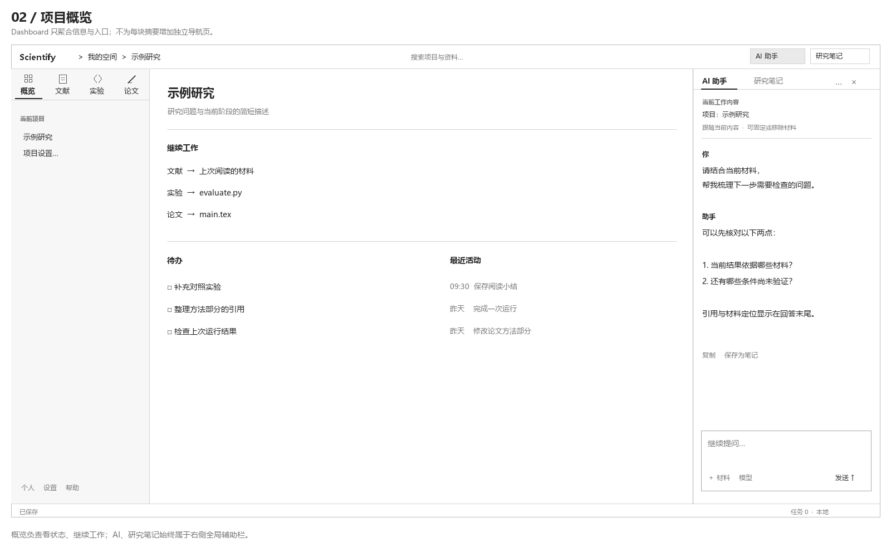

中央展示项目摘要、继续工作入口、待办和近期活动。Dashboard 以连续分区汇总信息，点击文献、文件、运行或笔记后定位到对应工作现场。

概览不再展开总览、动态、成员等一长列二级菜单。项目设置从项目名称菜单进入；概览中的任务支持轻量更新，需要深入操作时进入所属工作区。

## 6. 文献区：收录、订阅、阅读

### 6.1 本地文献

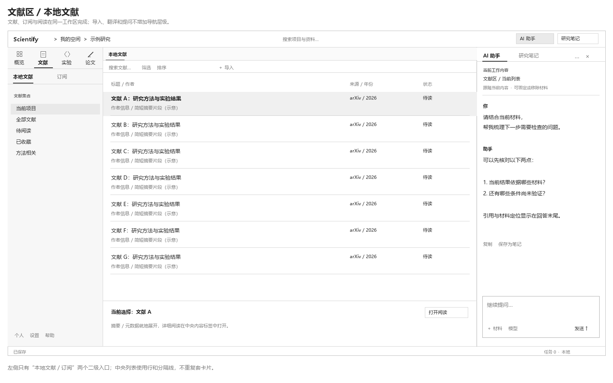

左侧选择集合，中央浏览文献列表，详情可在列表中就地展开。导入、筛选、排序和引用导出是列表工具；打开文献后进入中央阅读标签。

### 6.2 订阅

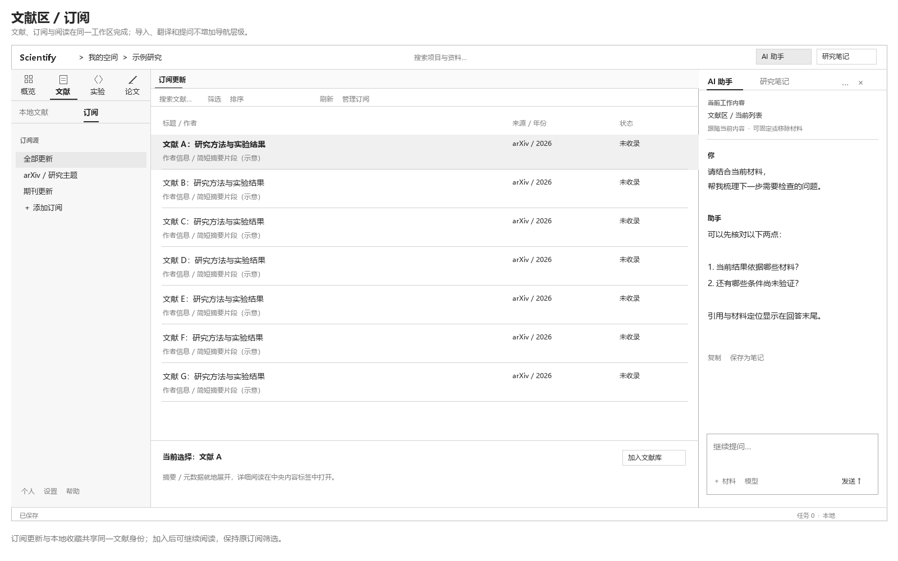

只切换左侧二级视图与资源列表，中央沿用文献列表结构。更新内容可筛选、预览、加入本地文献；订阅配置在订阅源的管理操作中完成。

订阅是文献区的材料发现方式，不再独立占据一级导航。

### 6.3 阅读与 AI

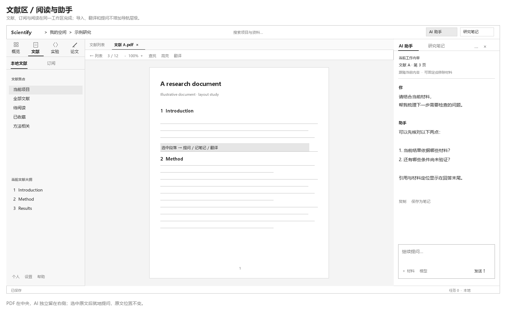

PDF 在中央，阅读工具位于其上方。选中文字后可提问、记笔记或翻译：提问打开右侧 AI，原文和阅读位置保持不变。

翻译的短结果就地显示；需要持续对照时，中央分为原文与译文。右侧 AI 仍保持独立。页码、语言、缩放都属于阅读工具，不改变左侧导航。

### 6.4 阅读与研究笔记

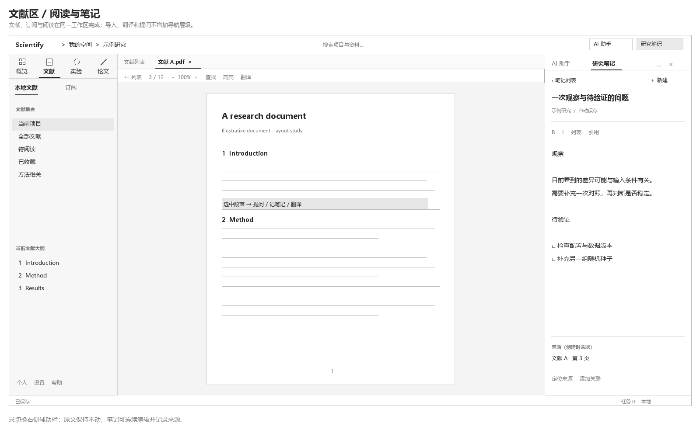

右侧由 AI 切到笔记，中央 PDF 不变。可将选中段落摘录到新笔记，并保留文献、页码和定位引用；自由写下的观察与待验证问题属于笔记正文。

笔记与 PDF 高亮各自保留含义：高亮标记原文，笔记记录自己的理解，二者可关联。

## 7. 实验管理：代码、运行、版本

### 7.1 文件与代码

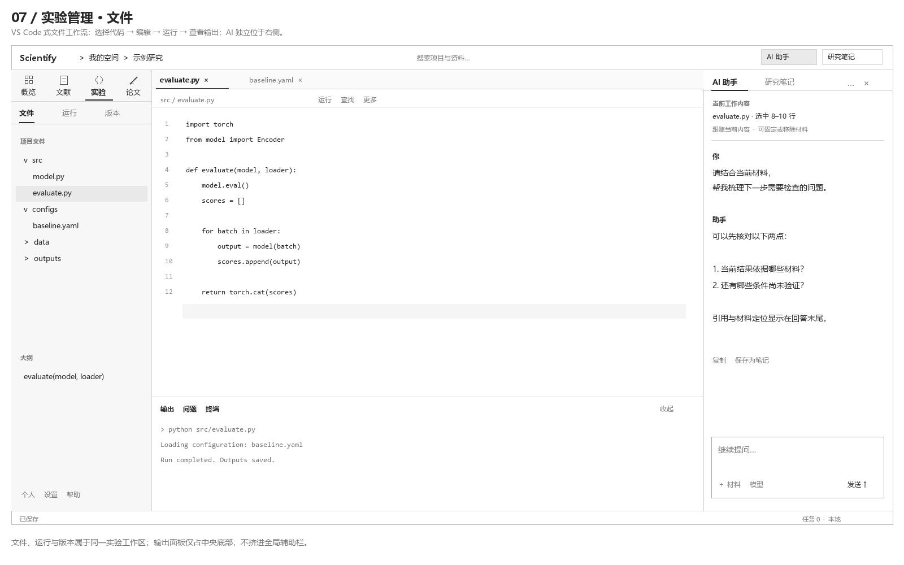

左侧文件树、中央编辑器、底部输出和右侧助手形成完整开发现场。代码文件、配置文件和实验相关文档可打开多个标签；运行操作位于编辑工具栏。

“版本”二级视图将左侧换为 Git 变更和历史，中央打开差异或版本详情；“文件”与“版本”引用同一套文件，不建立第二个代码区。终端是后续能力，图中仅预留底部位置。

### 7.2 运行与小结

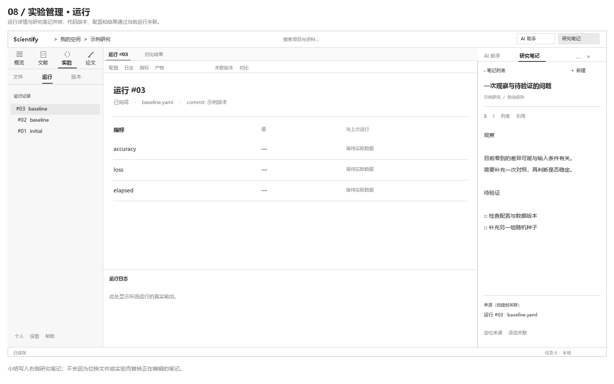

左侧选择运行，中央呈现配置、日志、指标和产物。运行详情内部可切换这些内容，不继续扩张一级或侧栏二级导航。

分析产生的小结直接写入右侧笔记，关联当前运行与代码版本。回到文件视图继续修改时，已打开的笔记保留。

## 8. 论文撰写：源码与渲染

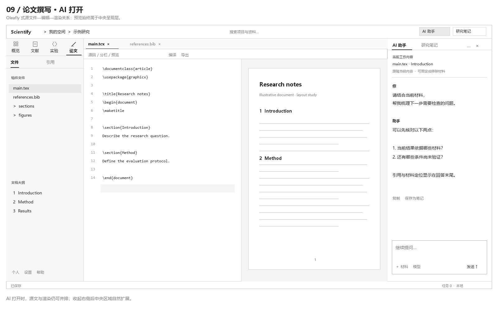

参照 Oleafly：左侧稿件文件与大纲，中央源码编辑和渲染预览并排，右侧 AI 提供写作、引用和编译问题辅助。编译、导出、源码/分栏/预览模式属于工具栏操作。

“引用”二级视图用于选择项目文献并插入引用，使用文献区的同一份文献数据。编译日志位于中央底部。

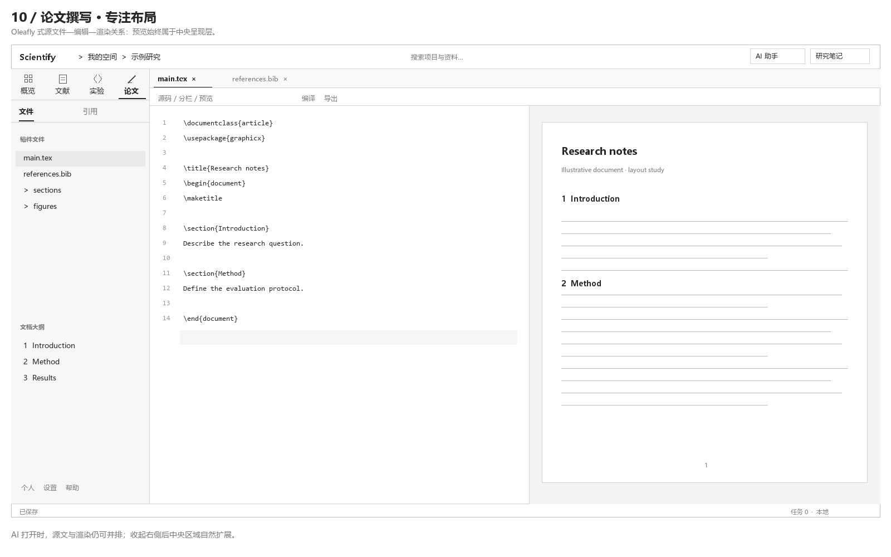

收起全局辅助栏后，源码与预览获得更多宽度。再次打开 AI 或笔记时恢复原侧栏状态，不替换任何正文内容。

## 9. AI 与研究笔记的入口决策

### 9.1 产品参考与取舍

| 参考 | 已有布局方式 | Scientify 采用的部分 |
| --- | --- | --- |
| VS Code / Copilot | Chat 默认位于编辑区旁的辅助侧栏，可从顶栏打开 | 全局入口、右侧固定位置、与中央编辑并行 |
| Zotero | 支持关联条目的笔记与独立笔记；笔记可在右侧编辑并自动保存 | 记录自己的结论，保留来源，可无特定文献关联 |
| Oleafly | 顶部助手按钮控制独立助手面板 | 助手可收起，中央编辑和预览各自保留 |

参考依据：[VS Code Chat 布局](https://code.visualstudio.com/docs/agents/run/chat-view)、[Zotero 笔记](https://www.zotero.org/support/notes)。下述入口与切换规则是本项目的设计决策。

| 入口方案 | 取舍 |
| --- | --- |
| 顶栏右端两个文字按钮 | **采用**。与右侧面板空间对应，关闭面板后仍可发现入口 |
| 最右再增加一条图标轨道 | 暂不采用。两个辅助工具不需要再占一列 |
| 只放在底部状态栏 | 暂不采用。入口容易与被动状态混淆 |

### 9.2 打开与切换

- 顶栏常驻“AI 助手”“研究笔记”；点未激活按钮打开对应工具，点已激活按钮收起右栏。
- 右栏顶部也可切换两个工具，保留各自会话、输入草稿、笔记和滚动位置。
- 首次进入可收起右栏；之后恢复用户上次的显示状态，不因切换工作区自动弹出。
- 首版同一时刻显示一个辅助工具。AI 回答可“保存为笔记”，随后切到该笔记；AI 会话继续保留。
- 从原文、代码或日志选区执行“提问 / 记笔记”，直接打开右栏并带入明确的来源。

### 9.3 笔记的查找与编辑

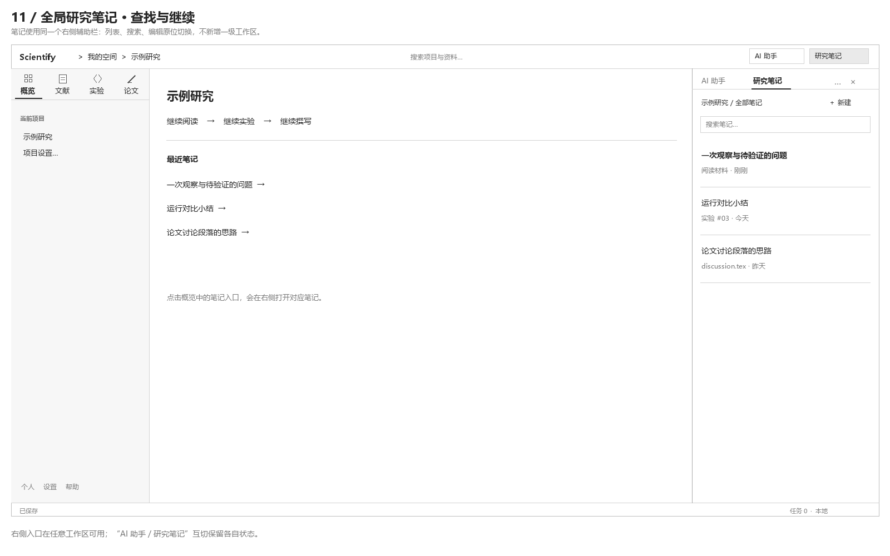

右栏内部在“笔记列表 / 笔记编辑”之间切换，提供搜索、当前内容关联筛选和新建操作。项目概览可提供最近笔记入口；无需新增笔记工作区。

正在编辑的笔记始终保持固定。切换中央对象只更新可关联来源，不替换正文，也不自动把新对象关联到旧笔记。

## 10. 尺寸、收起与窄窗口

| 区域 | 首版起点 | 行为 |
| --- | --- | --- |
| 左侧导航 | 约 240 px，可调整 | 一级、二级与资源共用一列；可收起资源区 |
| 中央内容 | 占用剩余宽度 | 内部分栏；列表、编辑器、阅读器分别滚动 |
| 右侧辅助栏 | 默认 320–360 px，可调整 | 收起后释放空间；AI 与笔记共用宽度 |
| 顶栏 / 状态栏 | 约 40–44 / 24 px | 始终可达，保持简短 |

宽度不足时优先把中央双栏切为“源码 / 预览”或“原文 / 译文”切换，保留用户主动打开的右侧工具；可进一步收起左侧资源区。恢复宽度后可恢复原分栏比例。整页不出现横向滚动条。

设置、个人中心、帮助的位置尚未定稿，线稿暂置于左下角；顶栏与底栏保留调整空间。四个工作区、三大区域及 AI/笔记右侧共用结构作为本版基线。

本版 11 张 PNG 和可编辑 SVG 位于 [assets/v2](assets/v2)，旧图保留作历史参考。新图的生成源为 [generate_wireframes.py](assets/v2/generate_wireframes.py)。
