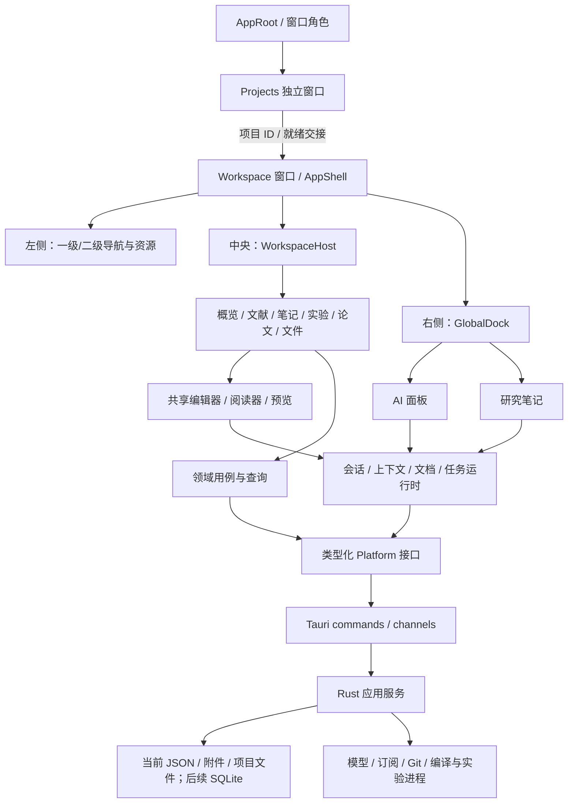

# Scientify 技术方案

设计基线（2026-09-25 更新）：Projects / Workspace 双窗口、六入口、连续工作区、全局 AI 与研究笔记。文档现在与源码同处仓库根目录。

本文规定技术决策、代码边界和实施路径。第 0 节为当前开发基线；后文 SQLite、Query、任务服务等仍为分阶段目标。早期 [页面结构 V2](01-产品页面结构.md)、[功能框架 V2](02-功能与导航框架.md) 保留作功能及线稿参考，四入口和单窗口描述不再约束当前产品。

## 0. 当前基线与 UI/UX 固定准则

### 0.1 当前已实现与未来目标

| 方面 | 当前实现 | 后续目标，不能假定已存在 |
| --- | --- | --- |
| 窗口 | Projects 管理窗口 + 最大化 Workspace；共享 Rust 存储服务 | 同时打开多个独立项目工作区 |
| 导航 | overview / literature / notes / experiments / writing / files | 按功能需要扩展资源组织，不新增重复大入口 |
| UI 库 | 本地 Button/Input/Dropdown/Tooltip/Badge、Panel、List、Tree 等 | 开发专用样例页；按明确需求补 Menu 等共享行为 |
| 数据 | schema 3 JSON、revision、原子写入；文件会话保护正文 | SQLite、细粒度查询失效、后台任务服务 |
| 主题与语言 | 顶栏直接切换亮暗；语言在设置“通用”，系统主题在“外观”；跨窗口同步 | 依同一语义变量和文案目录扩展 |
| 动效 | 少量 100ms 颜色反馈，已支持 reduced motion | 统一变量、浮层/辅助栏和异步状态规范化 |

### 0.2 必须遵循的设计决策

1. **工作内容优先**：用导航、面板、列表、树、编辑器组合页面；不新增卡片式功能首页。
2. **共享组件优先**：以 `src/components/primitives` 和 `workspace` 为组件标准库。现有 HTML dialog、原生 select 与本地 Tooltip 继续使用；不因统一 UI 而整体更换库。
3. **变量集中**：颜色、尺寸和后续 motion token 由 `src/styles` 维护；页面只补布局和业务内容。
4. **状态先于动画**：每个操作定义焦点、按下、选中、pending、错误和恢复；业务完成由真实结果决定。
5. **动效克制**：控件反馈 100ms、局部内容 120ms、浮层 160ms、面板 200ms；不做整页滑动、按钮弹跳或研究内容缩放。
6. **保留现场**：导航、主题、语言和动画不能重建文件会话、丢弃草稿或重置阅读位置；原生窗口仍走关闭保护。
7. **可取消与可退化**：快速操作只保留最新目标；支持 reduced motion，不能依靠动画结束事件提交数据或完成关闭。
8. **默认技术选择**：沿用 CSS transition/keyframes。必要的命令式效果用 Web Animations API；当前不引入动画框架。Radix、面板库等须由实际缺口驱动，不是此次规范的安装要求。

### 0.3 标准库与验收依据

- [UI/UX 总览](../UI-UX/README.md)：项目需要建立哪些标准、当前完成度。
- [视觉与布局](../UI-UX/01-视觉与布局.md)：外壳、密度、明暗、中英与语义变量。
- [组件标准库](../UI-UX/02-组件标准库.md)：组件目录、接口、状态、键盘、焦点。
- [交互与动效](../UI-UX/03-交互与动效.md)：各类点击/切换的固定行为和参数。
- [开发与验收](../UI-UX/04-开发与验收.md)：实施顺序和完成标准。

本轮完成文档迁移与规范建立，没有安装组件/动效依赖，也没有把上述目标动画写入运行代码。后续增量开发按 A 控件 → B 浮层/辅助栏 → C 内容/异步 → D 样例收敛推进。

## 1. 架构结论

采用 **本地优先的模块化桌面应用**：React 负责工作台交互，Rust 负责数据和执行能力，Tauri 连接两者。单个安装包、两个交接的原生窗口、一个本地数据目录；按模块分工，先不拆服务或建设插件平台。

| 决策 | 采用方案 | 目的 |
| --- | --- | --- |
| 产品外壳 | 常驻 AppShell：左导航 / 中央内容 / 右侧工具 | 页面切换不重建助手、笔记和工作现场 |
| 一级工作区 | overview / literature / notes / experiments / writing / files | 六个入口；笔记和文件复用既有编辑能力 |
| 共享能力 | 编辑器、阅读器、任务、AI、笔记独立于工作区 | 两个编辑场景共用系统，全局工具不依附页面 |
| 主技术栈 | React 19、TypeScript、Vite、Tauri 2、Rust | 延续已迁移基线 |
| 前端状态（演进目标） | 当前 Zustand/store + 文件会话；后续 TanStack Query 管查询 | 每类数据只有明确的所有者 |
| 内容存储（演进目标） | 当前 JSON + 文件；后续 SQLite 管元数据和笔记 | 支撑细粒度并发更新，同时保留文件互操作性 |
| 后台任务（演进目标） | 后续 Rust 任务管理器；类型化 IPC + Channel | 长任务不依赖某个页面是否挂载 |
| 未来扩展 | 领域接口、提供方适配器、版本化契约 | 后续接模型、文献源、执行器而不改工作台骨架 |

### 1.1 当前事实与目标差距

当前 0.3.0 已包含项目管理、文件编辑、PDF 阅读、实验记录、笔记、AI 面板、双窗口及主题/语言设置。持久化继续使用 schema 3 JSON、原子写入、进程锁和 revision 校验。Electron 已退役，旧数据迁移独立保留在 Rust。具体可用边界见 [项目说明](../../README.md)。

当前 `App.tsx` 集中了页面与生命周期，`workspace.ts` 每次保存克隆整份工作区，并使用全局 `busy/dirty`。这适用于现有表单，不能直接扩展成多文档、笔记与 AI 同时更新的状态模型。

本方案保留现有数据保护能力，但将下一阶段目标存储改为 SQLite。旧 [Tauri/React 迁移方案](../技术方案/Scientify-Tauri-React迁移技术方案.md) 中“本轮不改 SQLite”属于旧 M1 范围；本方案中的数据迁移是单独里程碑，完成前继续使用原 JSON，禁止两套存储同时充当权威来源。

## 2. 技术栈与取舍

### 2.1 技术基线与后续选型

以下包含当前技术和长期目标。Query、SQLite、资源监控、生成式 DTO 等只在对应里程碑实施；UI 开发不顺带迁移这些基础设施。

| 层 | 技术 | 使用边界与理由 |
| --- | --- | --- |
| 桌面运行 | Tauri 2 + Rust，Windows/WebView2 优先 | 复用现有生命周期与 IPC；发布版不依赖 Electron/Node 服务 |
| 界面 | React 19 + TypeScript strict + Vite | 桌面 SPA，无 SSR 需求；组件按工作区懒加载 |
| 样式 | Tailwind CSS 4 + CSS variables | 统一尺寸、颜色、字体和密度；业务样式按模块隔离 |
| UI 原语 | 现有本地组件 + 原生语义控件 | 以 UI/UX 标准库为准；复杂共享行为确有缺口时再评估 Radix，不批量替换现有实现 |
| 面板 | 当前 WorkspaceFrame / GlobalDock / ResizeHandle | 多重嵌套需求出现后再评估 react-resizable-panels；保持业务 API 稳定 |
| 图标 | Lucide React | 一级入口使用 48px 纯图标导航栏，名称由悬停提示和可访问标签提供 |
| UI 状态 | Zustand 5 | 导航、布局、选中资源、辅助栏显示状态 |
| 异步查询 | TanStack Query 5 | 查询缓存、分页和定向失效；数据源可以是 Tauri command |
| 文本编辑 | CodeMirror 6 | 代码、LaTeX、Markdown 与笔记共用编辑内核，按场景加载扩展 |
| Markdown | react-markdown + remark-gfm，按需加入数学公式支持 | 安全渲染、默认不执行原始 HTML；笔记首版使用轻量编辑与预览 |
| PDF | PDF.js + 本地 worker | 文献阅读和编译 PDF 共用渲染能力，业务会话分离 |
| 结构化存储 | SQLite + rusqlite，启用 bundled/backup 能力 | 单机事务、关系查询和可控迁移；不从 WebView 直接执行 SQL |
| 网络与进程 | tokio、reqwest/rustls、tokio::process | 模型、订阅、下载、编译、运行统一由后端管理 |
| 文件监控 | notify + 变更合并队列 | 外部修改、重命名与目录变动；监控提示不替代保存冲突校验 |
| 跨语言契约 | serde DTO + ts-rs 生成 TS 类型 | 一份协议定义，配套运行时校验与契约测试 |
| 工程验证 | Vitest、Testing Library、Playwright；Cargo 测试；Windows 原生验收 | 组件、浏览器布局、后端与真实桌面链路分层验证 |

现有 JS 基线为 React 19.2.8、TypeScript 5.9.3、Vite 6.4.3、Zustand 5.0.14、Tailwind 4.3.3、Tauri JS/CLI 2.11.x，属于当前仓库声明，不代表最新推荐版本。实施时沿用 lockfile；新增依赖单独验证兼容性后锁定，不为写本方案升级依赖。

若后续引入面板库，仅通过布局层封装，便于保持拖动、键盘和状态契约。[react-resizable-panels 官方仓库](https://github.com/bvaughn/react-resizable-panels)

### 2.2 关键取舍

- **CodeMirror 优先**：两类正文编辑与 Markdown 笔记可以共用事务、历史与语言扩展。先满足科研编辑场景，不同时引入 Monaco 和另一套富文本编辑内核。
- **SQLite 作为目标**：笔记自动保存、会话追加、文献关联与后台任务各自事务化，避免反复保存整份 JSON；迁移成本由独立阶段承担。
- **一个 Rust 核心 crate 起步**：按目录区分领域、用例与基础设施，有明确复用或编译瓶颈后再拆 crate。
- **不增加常驻 HTTP 后端**：桌面内部走 IPC；后续云服务使用独立远程适配器。
- **不提前引入协同编辑、向量数据库或通用插件沙箱**：先建立稳定接口和真实本地工作链路，按需求增量引入。

## 3. 运行结构与生命周期



上图中的运行时服务、查询和执行模块是长期演进边界；双窗口交接已落地，其余完成度按第 0 节判断。

### 3.1 常驻与可卸载部分（目标约束）

- AppShell、全局辅助栏控制器、DocumentManager、TaskManager 与查询客户端在应用运行期间常驻。
- 中央工作区和资源列表可懒加载、卸载；文档、会话、笔记草稿不绑定其 React 生命周期。
- GlobalDock 位于 WorkspaceHost 之外；改变一级入口不得销毁或重建全局 AI/笔记服务。
- PDF worker、编辑器 DOM、图表按可见性和内存预算回收；先保存会话位置，再销毁视图。
- 错误边界按工作区与内容面板建立；一个 PDF 损坏不导致整个窗口失效。

### 3.2 三个不同的身份

1. **导航位置**：用户在哪个工作区、资源视图和内容标签。
2. **内容身份**：实际文件、论文、笔记或运行，与显示位置无关。
3. **执行身份**：保存、编译、模型请求等具体操作，有自己的 taskId/operationId。

同一份文件在实验与论文场景中打开时，共用内容会话；不同工作区可以保留各自的标签引用。切换项目时保存原现场并恢复目标现场，后台任务仍归原项目，不因当前导航改变身份。

## 4. 源码组织

文档已迁入应用仓库。下图为长期模块组织，未实现的服务按里程碑建立；当前公共组件使用 components 下的现有目录，不创建并行的 `components/ui`。

```text
F:/Project/Scientify/Scientify/           应用仓库根目录
   ├─ docs/                            项目文档
   │  ├─ 架构设计/                     产品参考、技术方案
   │  └─ UI-UX/                        视觉、组件、交互、动效、验收标准
   ├─ src/
   │  ├─ app/                           应用入口与装配层
   │  │  ├─ App.tsx
   │  │  ├─ AppProviders.tsx            注入 QueryClient、服务、适配器
   │  │  ├─ bootstrap.ts                加载配置、检测协议与恢复状态
   │  │  └─ lifecycle.ts                切换项目、保存、退出协调
   │  ├─ shell/                         布局能力，不放科研业务
   │  │  ├─ AppShell.tsx
   │  │  ├─ ProjectBar.tsx
   │  │  ├─ NavigationSidebar.tsx
   │  │  ├─ WorkspaceHost.tsx
   │  │  ├─ GlobalDock.tsx              AI / 笔记，共用右侧位置
   │  │  ├─ StatusBar.tsx
   │  │  ├─ panels/                    外层面板、中央分栏、底部输出
   │  │  └─ navigation/                类型化目标、导航服务、历史与校验
   │  ├─ workspaces/                    四个领域的页面组合
   │  │  ├─ registry.ts
   │  │  ├─ overview/
   │  │  ├─ literature/                本地文献 / 订阅
   │  │  ├─ experiments/               文件 / 运行 / 版本
   │  │  └─ writing/                   文件 / 引用
   │  ├─ features/                      可复用业务流程和 UI
   │  │  ├─ projects/                  项目集合、空间、表单、概览聚合
   │  │  ├─ literature/                书目、导入、批注、引用
   │  │  ├─ subscriptions/             订阅源、候选论文、收录
   │  │  ├─ files/                     文件树、文件操作
   │  │  ├─ experiments/               配置、运行、指标、产物
   │  │  ├─ source-control/            Git 状态、差异、提交
   │  │  ├─ manuscripts/               稿件、入口文件、编译、引用插入
   │  │  ├─ assistant/                 会话 UI、来源与修改建议
   │  │  ├─ notes/                     笔记列表、编辑、关联来源
   │  │  ├─ search/
   │  │  └─ settings/
   │  ├─ editor/                        CodeMirror 内核适配与语言扩展
   │  │  ├─ EditorPane.tsx
   │  │  ├─ buffer.ts                  TextBuffer 的 CodeMirror 实现
   │  │  ├─ host.ts                    保存、定位、诊断等宿主接口
   │  │  ├─ extensions/
   │  │  └─ languages/
   │  ├─ reader/                        PDF 渲染、文本层、选区与 worker
   │  ├─ preview/                       Markdown / 编译 PDF 呈现
   │  ├─ runtime/                       跨页面的运行时协调
   │  │  ├─ documents/                 DocumentSession、保存队列、恢复
   │  │  ├─ context/                   当前工作内容、固定材料、来源快照
   │  │  ├─ conversations/             会话状态、流式组装、草稿
   │  │  ├─ tasks/                     后端任务镜像、订阅和重新连接
   │  │  ├─ commands/                  工具栏/菜单/快捷键共用命令
   │  │  └─ ui-session/                导航、面板、标签的序列化
   │  ├─ state/                         仅 UI 的 Zustand stores
   │  │  ├─ navigation.ts
   │  │  ├─ layout.ts
   │  │  ├─ dock.ts
   │  │  └─ selections.ts
   │  ├─ queries/                       Query keys、查询与定向失效
   │  ├─ domain/                        前端纯规则、资源引用与领域类型
   │  ├─ contracts/generated/           Rust 生成的 DTO，禁止手改
   │  ├─ platform/
   │  │  ├─ ports/                     查询、保存、任务、文件、窗口接口
   │  │  ├─ tauri/                     invoke/channel/native API 实现
   │  │  └─ desktop.ts                 生产适配器装配
   │  ├─ components/                    本地标准组件库
   │  │  ├─ primitives/                 Button/Input/Dropdown/Tooltip/Badge
   │  │  ├─ layout/                     AppShell/TopBar/Panel/Sidebar
   │  │  ├─ navigation/                 Rail 和工作区配置
   │  │  ├─ workspace/                  Section/List/Tree/WorkspaceFrame
   │  │  └─ ai/                         ContextPanel/AssistantComposer
   │  ├─ styles/                        tokens、global、shell、editor
   │  └─ test/                          测试入口、fixture、测试适配器
   ├─ src-tauri/
   │  ├─ src/
   │  │  ├─ lib.rs                     Tauri 初始化、命令注册
   │  │  ├─ state.rs                   共享服务句柄
   │  │  ├─ commands/                  按领域拆分的 IPC 入口
   │  │  ├─ streams.rs                 核心任务到 Channel 的适配
   │  │  └─ lifecycle.rs               窗口、单实例、退出
   │  ├─ capabilities/                 最小桌面授权
   │  └─ tauri.conf.json
   ├─ crates/scientify-core/
   │  ├─ src/
   │  │  ├─ domain/                    project、paper、note、run 等模型
   │  │  ├─ application/               导入、保存、提问、编译等用例
   │  │  ├─ ports/                     仓储、模型、文件、进程能力接口
   │  │  ├─ infrastructure/
   │  │  │  ├─ sqlite/                 连接、事务与各领域仓储
   │  │  │  ├─ filesystem/             文件、附件、草稿与备份
   │  │  │  ├─ providers/              模型、文献源、翻译适配器
   │  │  │  ├─ git/                    Git CLI 适配
   │  │  │  └─ execution/              编译、运行与进程回收
   │  │  ├─ tasks/                     任务注册、调度、状态与日志
   │  │  ├─ contracts/                 IPC DTO、错误码、事件版本
   │  │  └─ migration/                 schema 3 导入与迁移校验
   │  ├─ migrations/                   编号 SQL，发布后不改旧脚本
   │  └─ tests/                        领域、存储、迁移、进程测试
   ├─ tests/                           跨模块、浏览器和原生端到端测试
   ├─ scripts/                         类型生成、检查、构建
   ├─ public/                          应用静态资源
   ├─ package.json / pnpm-lock.yaml
   └─ Cargo.toml / Cargo.lock
```

目录按实际需求建立，单元测试贴近实现。文件增长由职责驱动，不为了填满目录预建空壳。AI 是全局能力；笔记和文件虽有一级入口，但应复用 feature/editor 会话，不复制另一套实现。

### 4.1 依赖约束

- app 是装配层，可以知道具体实现；业务用例依赖 port，不自行创建后端连接。
- workspaces 组合 Shell 插槽与 feature；feature 不导入其他工作区页面。
- shell 只理解导航、布局和内容宿主，不解释论文、实验或模型业务。
- runtime 不依赖 React 视图；通过注入的 TextBuffer、DocumentPort、TaskPort 工作。
- editor/reader 接收宿主能力，不直接读取全局项目 store 或调用 Tauri。
- Rust domain 不依赖 Tauri 或数据库连接；application 通过 ports 调用 infrastructure。
- 一个领域对外通过 `index.ts` 或明确接口导出，禁止跨模块深层导入。CI 使用导入约束规则检查。

## 5. 导航、布局与全局辅助栏

### 5.1 类型化导航

```ts
type Scope = { kind: 'inbox' } | { kind: 'project'; projectId: string };

type WorkspaceTarget =
  | { workspace: 'overview'; view: 'dashboard' }
  | { workspace: 'literature'; view: 'local' | 'subscriptions' }
  | { workspace: 'notes'; view: 'notes' }
  | { workspace: 'files'; view: 'files' }
  | { workspace: 'experiments'; view: 'files' | 'runs' | 'versions' }
  | { workspace: 'writing'; view: 'files' | 'references' };

type ResourceRef =
  | { kind: 'file'; resourceId: string }
  | { kind: 'paper'; paperId: string; attachmentId?: string }
  | { kind: 'note'; noteId: string }
  | { kind: 'run'; runId: string }
  | { kind: 'revision'; resourceId: string; commit: string };

type ProjectTarget = WorkspaceTarget & {
  projectId: string;
  resource?: ResourceRef;
  location?: { page?: number; line?: number; selectionId?: string };
};
```

`ResourceRef` 不以显示名称或绝对路径作为身份。文件绝对路径仅由后端通过已登记根目录和资源索引解析；文献和版本引用分别保留其来源身份。

NavigationService 是唯一入口，负责目标校验、打开资源、历史和恢复。首版使用内部内存导航历史，序列化为 UI session；后续深链接只负责解析为同一 ProjectTarget，不建立第二套状态。当前产品无需再引入 Web 路由框架。

### 5.2 状态分离

```ts
interface DockState {
  visible: boolean;
  activeTool: 'assistant' | 'notes';
  width: number;
  sessionsByScope: Record<string, {
    conversationId?: string;
    noteId?: string;
    noteView: 'list' | 'editor';
  }>;
}
```

面板布局、会话标识和正文分别由不同层维护。DockState 不保存聊天全文或笔记正文。中央内部分栏与右栏可见性互不替代；窄窗口改变中央呈现模式，不静默关闭用户打开的助手。

项目切换分为“保存原项目会话 → 切换 scope → 恢复新项目 UI/辅助栏”。进行中的后台任务继续归原 scope，可通过任务通知返回。设置窗口作为全局浮层，不成为第五个工作区。

## 6. 状态所有权与查询

| 数据 | 唯一运行时所有者 | 持久化或恢复方式 |
| --- | --- | --- |
| 已保存的项目、文献、运行、笔记元数据 | Rust 仓储；前端 Query 缓存是可失效副本 | SQLite 事务 |
| 正在编辑的正文与撤销历史 | DocumentSession/TextBuffer | 防抖保存；恢复草稿另存 |
| 导航、面板宽度、选中项、标签关系 | 对应 UI store | 带版本 UI session |
| 当前中央对象与选区 | ActiveContextService | 不持久化瞬时焦点，来源快照随消息保存 |
| 会话当前输入及流式消息 | ConversationSession | 消息分段落盘；输入草稿可恢复 |
| 任务实际状态与进程句柄 | Rust TaskManager | 任务记录、日志；前端只保存镜像 |
| 菜单、悬停、未提交短表单 | 组件本地状态 | 按需保留 |

Query key 必须包含 scope 和资源标识，例如 `['papers', scopeKey, filter]`、`['note', noteId]`。本地数据库查询以明确失效和重新连接刷新为主，不依赖频繁轮询；首次统一设置 staleTime、重试与窗口聚焦策略。查询结果到达时不覆盖 dirty 文档会话。

普通失败查询可有限重试；保存、运行、模型请求等有副作用操作默认不自动重试，除非具有可验证的幂等语义。旧 workspace store 在数据迁移期充当 legacy adapter，迁移后不与 Query 再维护同一份完整实体集合。

## 7. 数据模型与存储

### 7.1 元数据、内容与缓存

```text
app_data/scientify/
├─ metadata.sqlite                      业务记录与关系，目标权威存储
├─ assets/                              导入 PDF、图片、实验附件，按内部 ID 存储
├─ recovery/                            文件与未提交编辑的恢复快照
├─ task-logs/                           大型日志分段存储
├─ cache/
│  ├─ pdf/                              可重建文本与缩略图
│  ├─ builds/                           按任务隔离的编译目录
│  └─ search/                           可重建的补充索引
├─ backups/                             有清单、校验信息的备份集
├─ ui-session.json                      布局与导航，不含正文或密钥
└─ migrations/                          旧数据快照、迁移清单与校验报告

用户关联的项目目录/
├─ 代码、配置、数据引用
└─ 论文源码、章节、图表、引用文件
```

实际根目录通过 Tauri app_data_dir 决定；开发环境继续使用隔离的数据目录。上图是目标内部结构，不在本次文档修改时移动现有数据。

- 代码与论文源码以项目目录内文件为权威内容，数据库只登记身份、归属和索引。
- 研究笔记首版以 SQLite 中 Markdown 正文为权威内容，支持显式导出 `.md`；导出副本不是第二个自动同步源。
- PDF 原文件与论文书目分离；相同论文可有不同附件版本，批注定位到具体附件版本。
- 缓存可删除重建，不能用于恢复唯一用户内容。
- 外部项目目录不随应用备份自动变成完整副本，导出时必须明确“元数据与附件”或“包含项目文件的完整包”。

### 7.2 核心实体

| 领域 | 主要实体/关系 | 关键约束 |
| --- | --- | --- |
| 组织 | spaces、projects、project_roots | 当前本地身份不等于云端权限；根目录必须经用户关联 |
| 文献 | papers、paper_projects、attachments、annotations | 文献跨项目共享；附件哈希去重；批注保留页码与文本锚点 |
| 订阅 | feeds、feed_items、collection_links | 候选项可关联已收录 paper，不复制阅读记录 |
| 文件 | resources、resource_locations | 稳定资源 ID + 后端真实路径；同一实际文件不建立重复可写会话 |
| 实验 | experiments、runs、run_metrics、run_artifacts | 一次实验可多次运行；指标缺失与 0 区分；运行关联版本和配置快照 |
| 稿件 | manuscripts、manuscript_roots、builds | 入口文件和引擎明确；编译结果关联输入版本 |
| 笔记 | notes、note_sources、note_revisions | scope 为项目或个人收集箱；正文与来源分别维护 |
| AI | conversations、messages、context_snapshots、proposals | 消息绑定发送时上下文；修改建议绑定来源版本 |
| 任务 | jobs、job_events、operation_receipts | 任务归属不随导航变化；变更操作可识别重复请求 |
| 兼容与恢复 | legacy_payloads、migration_runs、recovery_entries | 未识别旧字段保留，迁移可核对 |

关系表使用外键和明确删除策略。项目归档不删除共享文献；删除来源后，笔记保留摘录和“来源不可用”的信息。书目身份优先规范化 DOI/arXiv 等外部 ID，无法可靠确认时允许人工合并，不仅凭标题强行去重。

### 7.3 事务和版本

- 每个可编辑实体具有独立 `revision`，写入使用 `expectedRevision` 条件更新，影响行数为 0 时返回冲突。
- 前端将版本标识视为不透明字符串；Rust 的 64 位整数不直接暴露为可能溢出的 JS number。
- 单写入队列负责 SQLite 写事务；读取使用受控连接。开启 foreign_keys、WAL 与 busy_timeout，耐久策略先使用保守配置，再由基准测试调整。
- SQLite 调用放到专用阻塞工作线程，网络和子进程在 Tokio 运行；不得持有数据库事务等待网络、模型或用户操作。
- JSON 过渡期仍使用原全局 revision，通过统一保存协调器串行处理；不允许每个模块自行竞争整份 workspace_save。

数据库事务不能原子覆盖文件系统。附件导入采用“暂存并校验文件 → 记录 pending 操作 → 移入正式目录 → 事务确认”的可恢复流程。启动时对 pending 操作进行完成或回滚；文件不存在前不把附件标成可读。文件保存成功而索引更新失败时，以文件为权威，通过操作日志重建索引。

### 7.4 搜索

元数据和笔记正文使用 FTS5；PDF 文本抽取与索引由后台任务构建。查询返回 ResourceRef 和可定位片段，不直接返回整份文档。

中文短语不假定默认英文分词能正确处理：首版评估 trigram 子串索引，短于三个字符的查询使用受限字段检索，后续按准确率需求增加中文分词。索引有版本并可重建。[SQLite FTS5 文档](https://www.sqlite.org/fts5.html)

### 7.5 备份与回退

- SQLite 使用 Online Backup API 获取一致快照，不能在 WAL 活跃时只复制主数据库文件。[SQLite Backup API](https://www.sqlite.org/backup.html)
- 备份先暂停应用写入和附件清理，完成数据库快照及其引用附件清单，再复制附件并核对哈希；成功后发布备份 manifest，失败保留原库。
- 每个备份记录应用版本、数据库版本、文件列表和完整性校验。恢复在独立目录校验后切换，旧目录保留。
- 数据库升级前备份；旧应用遇到更高 schema 应拒绝写入。降级通过明确备份恢复，不伪装可无损反向迁移。
- 草稿恢复与业务备份分开：自动保存失败仍保留恢复快照，恢复成功并确认版本后才清除。

## 8. IPC、错误与后台任务

### 8.1 请求与响应

一个业务用例一个 command，例如 `paper_import`、`note_save`、`document_save`、`run_start`、`compile_start`、`assistant_start`。禁止万能 SQL、任意路径读写或通用 shell 执行器。

```ts
interface SaveDocumentRequest {
  operationId: string;
  resource: ResourceRef;
  sessionId: string;
  expectedVersion: string;
  editVersion: number;
  content: string;
}
interface SaveDocumentResult {
  resource: ResourceRef;
  sessionId: string;
  acceptedEditVersion: number;
  version: string;
}
interface AppError {
  code: 'CONFLICT' | 'NOT_FOUND' | 'VALIDATION' | 'IO'
      | 'UNAVAILABLE' | 'CANCELLED' | 'PERMISSION';
  message: string;
  retryable: boolean;
  operationId?: string;
}
```

接口示例表达契约意图；完整 DTO 在 Rust contracts 中定义并生成 TypeScript，双方通过实际 JSON fixture 验证。生成类型不代替 Rust 输入校验、外部接口解析和旧版本兼容。

相同 operationId 的重试必须校验请求摘要并返回同一结果；只给请求加 ID 而没有后端收据，不算幂等。文件保存将 operationId、预期指纹和结果写入恢复日志，处理“已落盘但回复丢失”的情况。

### 8.2 长任务协议

```ts
interface TaskEnvelope<T> {
  protocolVersion: number;
  taskId: string;
  scopeKey: string;
  resource?: ResourceRef;
  sourceVersion?: string;
  seq: number;
  kind: 'started' | 'progress' | 'chunk' | 'completed'
      | 'failed' | 'cancelled';
  payload: T;
}
```

普通查询使用 invoke。模型流、下载进度和日志使用任务专属 Channel；全局 events 仅通知低频失效或状态变化。Channel 适合顺序、高吞吐数据传递，但不等于持久消息队列。[Tauri 调用与 Channel](https://v2.tauri.app/develop/calling-rust/)

任务状态机：`queued → running → succeeded / failed / cancelled`；应用异常退出后未终结任务进入 `interrupted`。请求取消与进程实际结束分开，只有执行器确认资源回收后才标为 cancelled。

- 启动请求建立接收 Channel 后再进入任务调度，避免丢失最早的事件。
- Rust 保存任务状态、必要结果与事件序号；前端丢连接后查询 snapshot，按 lastSeq 补齐可保留的结果。
- 任务渲染前检查 taskId、scope 和 sourceVersion；导航到新项目不能让旧任务覆盖新内容。
- UI 更新按帧或短时间批量合并，日志写入磁盘、前端保留有界窗口；不能让日志和 token 无限增长到内存。
- 取消传递到网络请求、worker 或进程树；关闭面板仅停止展示，不默认取消任务。
- 重启后不自动重跑实验或模型请求；对已完成的部分结果提供恢复入口。

## 9. 共享编辑、保存和恢复

### 9.1 文档会话

`DocumentManager` 通过后端规范化的 ResourceRef 复用会话；`DocumentSession` 持有 TextBuffer、sessionId、当前 editVersion、已确认版本、保存状态与来源基线。

TextBuffer 由 CodeMirror 的 state/transaction 适配实现。React 订阅文件名、dirty 和诊断摘要；正文变化在 buffer 内完成，不把全文按每次击键写进全局 Zustand 或 Query。CodeMirror 本身将状态与视图分离，并通过事务更新状态。[CodeMirror 系统指南](https://codemirror.net/docs/guide/)

中央代码、稿件和右侧 Markdown 笔记共用会话与保存机制，通过编辑器配置区分工具和语言。笔记不加载代码语言服务器，论文编辑不加载实验运行能力。

### 9.2 保存流程

```text
输入事务 → buffer 新版本 → dirty → 合并待保存快照
                                        ↓
                         按资源串行保存 + 预期版本校验
                                        ↓
                           成功 ack / 冲突 / 失败
                                        ↓
               校验 sessionId 和 editVersion，再更新状态
```

- 自动保存以约 500–1000 ms 防抖为起点；持续输入仍定期写恢复草稿，具体频率通过性能验收校准。
- 每资源只有一个保存执行者；合并中间快照但不丢最新编辑，队列失败后保留内容可重试。
- 保存 editVersion=8 成功时，如果会话已到 9，仍保持 dirty；不得回写旧正文。
- 笔记通过 SQLite 条件事务保存；文件使用同目录临时文件、刷新、原子替换，并保留覆盖前恢复快照。
- 文件监控发现外部变化后：干净会话重载，dirty 会话进入比较/合并。应用内保存按资源加锁，并在写入前重新核对实际文件版本。
- 文件系统不能对不遵守协议的所有外部程序保证数据库式条件写入；缩小检查与替换窗口，必要时使用可行的系统锁，并保留前后指纹及恢复快照处理竞态。
- 未保存草稿存储其基线版本；重启时不能直接覆盖已被外部修改的文件。

### 9.3 标签、分栏与生命周期

首版同一资源最多一个可编辑视图，中央预览只读。多个标签或工作区引用同一会话；跨工作区显示时切换编辑视图而非克隆正文。

保持当前运行中的撤销历史、光标和滚动位置。休眠会话可以释放 DOM，恢复时重新挂载 buffer；已保存且长期闲置的会话可回收。dirty 会话回收前必须完成保存或持久化恢复快照。重启保证恢复持久化草稿，不承诺完整撤销历史跨进程保存。

退出协调器统一处理中央文档、右侧笔记、表单和运行任务：flush 成功后关闭；失败继续保留窗口。编译和运行先确定使用的保存版本，不能把未保存屏幕内容标成已执行版本。

## 10. 全局上下文、AI 与研究笔记

### 10.1 当前上下文与消息快照

`ActiveContextService` 维护中央活动资源、选区、页码、运行和稿件版本，提供给右侧工具。普通 DOM 焦点不直接决定上下文：焦点进入聊天输入框或笔记编辑器时，不把它们自动变成中央研究材料。

```ts
interface ContextSnapshot {
  id: string;
  scope: Scope;
  createdAt: string;
  items: Array<{
    resource: ResourceRef;
    version: string;
    locator?: { page?: number; lineStart?: number; lineEnd?: number };
    excerpt: string;
    origin: 'following' | 'pinned' | 'explicit';
  }>;
}
```

快照按预算只保存实际提交的摘录、身份与版本；材料较大时用受控快照文件存储，消息引用 snapshotId。页面切换只更新下一次请求候选上下文，不改写历史消息依据。

### 10.2 AI 请求流程

1. 从“跟随当前内容”、固定材料和用户显式添加的材料构建候选集合。
2. ContextBuilder 去重、裁剪并展示范围；包含未保存选区时绑定 draft session/editVersion。
3. 冻结 ContextSnapshot，后端校验资源 scope，创建消息和任务。
4. ModelProvider 通过 Rust HTTP 请求模型，按任务流式返回；界面不依赖具体供应商协议。
5. 引用结果只解析为快照内存在的来源标识，无法验证时标记无可定位来源。
6. 修改建议保存为带 baseVersion 的 Proposal。用户接受时重新检查目标版本，再以可撤销编辑事务应用。

首批提供方为已有 Ollama 和按需接入的云端模型适配器；模型能力通过配置描述，如流式、上下文预算、图片输入。缺少能力时明确禁用对应操作，不让界面猜测。

文献和文件正文属于材料，不作为系统指令执行；模型工具请求通过受控用例处理。凭据只由后端读取；错误与日志不包含密钥。当前范围切换不静默扩大到整个磁盘或其他项目。

### 10.3 会话与笔记的不同跟随规则

- AI 的候选上下文默认跟随中央对象；已发送消息的快照固定，会话 scope 固定。
- 正在编辑的笔记保持 noteId 固定；中央对象变化只改变“可添加来源”，不修改笔记或自动换篇。
- 从选区记笔记时，明确“新建”或“加入当前笔记”，写入 note_sources 与摘录。
- AI 回答转笔记记录 messageId、来源快照和创建类型；用户可编辑正文，来源记录保留。
- 个人收集箱笔记可归入项目，归属变更使用独立命令；跨项目移动不通过 UI 状态推断。
- AI 与笔记都不需要独立一级页面。关闭右栏、切换工具与重建视图不终止运行时会话。

## 11. 业务领域的实现边界

以下四节描述核心业务领域。实际导航另有 Notes 和 Files，两者复用笔记/文件能力；不据此删去现有入口。

### 11.1 项目概览

通过聚合查询获取阶段、待办、近期对象与继续工作入口，不克隆各领域数据。点击摘要产出 NavigationTarget 或打开全局笔记。概览查询失败可分区重试，不阻塞其他工作区。

### 11.2 文献区

当前界面采用 `LiteratureWorkspace` 自有双栏布局，绕过通用 WorkspaceFrame 的标题/折叠栏。左侧文献库/订阅切换、TreeView、搜索和导入；右侧 DocumentTabs 与 PDF/文献信息呈现。标签会话按项目保存在 UI session，不进入研究数据 JSON。订阅当前为空白边栏，已有数据与后端接口保留。下列识别、去重、批注及完整订阅链路仍是后续目标。

- **导入链路**：选择文件/标识 → 暂存 → 类型、大小和哈希校验 → 书目识别/去重 → 数据与附件事务确认 → 更新查询。
- **订阅链路**：Provider 拉取候选 → feed_items 规范化 → 收录时关联 paper。订阅项、书目与 PDF 附件各有身份。
- **PDF 阅读**：PDF.js worker 本地打包；canvas、文本层与批注层分开；只渲染可视页附近，缩放取消过期任务。PDF.js 的 worker 与页面渲染按官方接口集成。[PDF.js 文档](https://mozilla.github.io/pdf.js/getting_started/)
- **附件访问**：小文件可受控读取；大 PDF 通过受限资源协议/分块端口加载，由后端将附件 ID 映射为已授权文件，不在普通 JSON IPC 中整本 Base64 传输。
- **批注锚点**：attachmentId、内容指纹、页码、标准化页面坐标和文本摘录；附件被替换时提示重新关联，不能默默漂移。
- **翻译**：独立任务消费选区或页面文本，译文与 AI 使用同一模型提供方能力但不同任务和结果；译文在中央，不占 GlobalDock。

### 11.3 实验管理

文件树按目录懒加载；Git 与运行复用资源根目录登记。Git 首版调用系统 Git CLI，参数使用数组和明确路径，不拼 shell 字符串；选定文件提交必须验证无关暂存内容不会被带入。

RunSpec 包含程序、参数数组、工作目录、环境引用、资源快照、关联实验、Git commit 和 dirty 状态。首次执行前完成保存并记录配置指纹；脏工作树不能只用 commit 声称可复现，需要保留变更快照或明确标记不可完整复现。

本地执行器管理进程树、stdout/stderr、退出码、超时、取消与产物清单。用户配置的执行环境与应用运行时分离。交互式终端后续采用 xterm.js + PTY；文本日志面板不能冒充终端。

### 11.4 论文撰写

Manuscript 定义 rootId、入口文件、引擎和输出策略。复用文本编辑与 PDF 阅读能力，SourcePreviewLayout 只管中央布局，AI 不进入其子面板树。

首版编译适配现有 XeLaTeX；Markdown 使用本地预览。编译读取已保存来源快照，在每任务独立输出目录运行，记录所有输入指纹、日志和产物。编译产物不写入用户源码路径，旧任务结果不可替换新版本预览。

首版禁用 TeX shell escape，但不将其描述为完整沙箱；对不可信项目的编译与代码运行通过统一执行入口管理。SyncTeX、更多引擎和富文本模式作为后续能力接入，先保证源码—结果版本关系。

引用选择复用 paperId；BibTeX 生成器显式处理 citation key 冲突及人工修改文件，不无条件覆盖用户已有 references.bib。

## 12. 安全、权限与故障隔离

- **文件边界**：后端按 rootId/resourceId 解析真实路径，验证规范化路径、大小写、符号链接与 Windows reparse point；写入和执行时重新校验，不仅检查前端字符串。
- **IPC 边界**：只给本地主窗口必要命令权限；流式通道在任务启动和订阅时校验归属。事件通知不代替访问控制。
- **内容呈现**：React 默认转义；Markdown 关闭任意 HTML 执行；外部链接经统一打开入口；PDF 与编译输出走受控资源加载。
- **凭据**：后端使用系统凭据存储适配器，首发 Windows 使用系统保护能力；模型密钥不落到 UI session、消息快照或导出 JSON。
- **网络**：模型/订阅适配器负责超时、重定向、响应大小、取消和错误归类；本地模型与用户配置的远端地址使用不同连接策略。
- **运行隔离**：编译、模型、下载和实验有各自并发限制；一个任务失败不阻塞数据保存。执行器负责进程树回收，不把窗口关闭等同于进程已退出。
- **退出与崩溃**：保存失败保留内容；崩溃后恢复草稿与任务状态，未确认的模型请求/实验运行不自动重放。

团队空间在当前阶段只是本机组织范围。未来登录、共享和协作需要真实后端身份校验与 ACL，不能把本地 spaceId/projectId 过滤当成权限实现。

## 13. 性能与可观测性

### 13.1 首版工程目标

以下是验收目标而非当前测量结果；在 Windows WebView2、固定测试机和数据集上记录基线后校准。

| 场景 | 目标与约束 |
| --- | --- |
| 已加载工作区切换 | P95 小于 150 ms，不重新载入整个项目 |
| 编辑输入 | 常规文件输入处理不跨多个帧阻塞；50 KB/1 MB 文件分别建基准 |
| 大列表 | 10,000 条文献分页与虚拟化；不一次生成全部 DOM |
| PDF | 200 页样本仅保留当前及邻近页面渲染，滚动后回收离屏资源 |
| 日志/模型流 | UI 批量更新，存在明确缓存上限；原始长日志落盘 |
| 恢复 | 布局恢复不等待所有 PDF、模型和外部服务启动 |

代码语言包、PDF、Markdown 预览和图表分块加载。避免给每次键盘输入绑定全局 React 更新；保存不复制无关文献与运行集合。工作区资源缓存与任务并发都有上限，可在设置中暴露有实际意义的选项。

### 13.2 诊断能力

使用 Rust tracing 和前端结构化日志，以 operationId/taskId 串联一次操作。记录启动、查询、保存、编译耗时和错误码；默认不记录正文、提示词、附件内容或凭据。

提供本地诊断导出：版本、能力检测、错误摘要、脱敏日志和存储健康状态。遥测作为未来明确选择的能力，不成为本地工作必需条件。

## 14. 测试、构建与交付

### 14.1 必须覆盖的风险

| 测试层 | 核心场景 |
| --- | --- |
| 纯逻辑 | 导航目标校验、资源身份、上下文裁剪、来源定位、任务状态机 |
| React 组件 | 四个入口、二级切换、右侧互切、焦点返回、错误与空状态 |
| 编辑集成 | 跨标签保存、旧 ack、新输入、笔记/中央同时编辑、撤销、退出 flush |
| Rust 存储 | 条件更新冲突、事务失败、附件中断、草稿恢复、数据库损坏与备份恢复 |
| 契约 | DTO 生成差异、序列化 fixture、错误码、事件版本、重复 operationId |
| 跨模块 | 订阅收录到阅读；实验日志到文件；AI 回答转笔记；论文引用到来源 |
| 异步竞争 | 取消、重复事件、乱序/过期结果、窗口重建后重连、切换项目后旧任务完成 |
| 数据迁移 | schema 3 各集合、未知字段、空项目、共享文献、附件缺失、恢复与重新执行 |
| 原生桌面 | 实际 IPC、对话框、文件权限、窗口关闭、进程树、中文路径、安装包 |

Playwright 负责带测试适配器的浏览器 UI 测试；mock 不能代替原生 IPC 验收。Windows 原生自动化使用 Tauri 对应的 WebDriver 路径，并配合实际打包 smoke test。[Tauri 测试文档](https://v2.tauri.app/develop/tests/)

### 14.2 工程门禁

- 现有 `pnpm check/test/build`、Cargo fmt/check/test/clippy 继续执行，新增导入边界检查和契约生成检查。
- 依赖通过 pnpm-lock/Cargo.lock 锁定，CI 使用冻结依赖；Rust toolchain 版本在实施时记录。
- 每次数据库升级都有迁移测试与升级前备份；每次正式发布执行恢复演练。
- 正式安装包只包含实际需要的资源；PDF worker、字体、编辑器扩展离线可用。
- 签名、更新清单校验和回滚策略在发布阶段建立；不复用参考项目的更新服务器或密钥。
- 依赖升级与业务改动分开审查；新库需检查维护状态、平台兼容、体积及许可记录。

## 15. 当前代码到目标架构的实施顺序

### S0：建立可恢复基线

当前仓库大量文件未跟踪，先建立源码快照和版本基线，记录现有测试及生产/开发数据路径。保存旧数据样本；不将 untracked 文件视为可删除内容。

**交付**：基线记录、迁移样本、可运行旧/新入口。此阶段不改存储格式。

### S1：三分区框架与工作区入口

当前 AppShell、六入口、GlobalDock 和 UI session 已接入；后续继续拆分 App 装配职责与导航服务。未实现能力不放置无效动作冒充完成。

**交付**：1000/1440/1920 宽度下布局可用；右侧打开不会挤掉中央预览；跨工作区状态恢复。仍由原 JSON adapter 保存现有业务数据。

### S2：目标数据层与迁移

实现 SQLite 仓储、数据版本、备份和恢复，再将现有领域查询从 workspace store 接到新接口。

迁移流程：

1. 关闭旧数据写入，读取并校验 schema 3，制作完整不可变快照和附件清单。
2. 在新的 staging 数据目录创建数据库，保留原 ID 与资源归属，复制并校验附件。
3. 项目、文献、运行、任务按对应实体转换；旧 records 转研究笔记，原 type/status 等作为兼容元数据保留，不悄悄丢弃。
4. 旧 sessions 导入会话及历史消息；过去没有来源快照的消息标为 legacy，不伪造引用依据。
5. 未识别字段与集合写入 legacy_payloads 并保存原 JSON；旧导航映射到四个新工作区，不能映射的标签保留记录并提示。
6. 执行实体数量、ID 集合、外键、正文哈希、附件哈希及抽样打开校验；缺失附件单独报告，不能宣称完整迁移成功。
7. 校验全部通过后原子发布新的活动数据目录标识；失败继续使用原目录。再次执行用 migrationId 检查已完成结果，避免重复导入。
8. 新版后续写入只进入 SQLite；旧 JSON 仅留档，旧版不能访问新库。回退使用迁移前备份；迁移后新增内容需另行保全，不能声称自动带回旧版。

**交付**：可重复的迁移、完整性报告、备份恢复演练。迁移适配器只在该阶段存在，不长期双写。

### S3：编辑与全局笔记的纵向切片

实现 DocumentSession、文件打开/保存、Markdown 笔记、来源关联、自动保存及退出保护。先完成“一份代码文件 + 一份右侧笔记同时编辑”的真实链路。

**交付**：连续输入、同时保存、跨工作区、外部变更、关闭窗口和故障恢复全部通过。实验与论文共用编辑系统，不各写一个编辑器。

### S4：文献与订阅

接入导入、书目、PDF、批注、订阅收录，串联阅读到笔记来源。先复用已有 arXiv 能力，再增加其他 Provider。

**交付**：真实 PDF 导入与离线阅读、去重、订阅收录、选区记笔记；扫描件和不可抽取文本有明确状态。

### S5：全局 AI 与上下文

接入模型提供方、冻结上下文、流式任务、取消、来源、修改建议和回答转笔记。翻译共用提供方与任务系统。

**交付**：四个工作区可使用同一侧栏；上下文可见且历史固定；项目切换不串材料；修改提议不覆盖后续编辑。

### S6：实验与论文的完整任务链路

实验侧接 Git、RunSpec、日志、指标、产物；论文侧接入口文件、XeLaTeX、编译结果与文献引用。

**交付**：文件—版本—运行关联真实；正文—保存快照—编译产物一致；取消和应用退出正确清理进程。

### S7：发布与清理

完成原生和安装包验收，验证全部已迁移旧能力、数据导出与恢复。再删除 Electron、renderer、旧 Node 服务和旧 npm 锁文件；清理的前提是回归与迁移完成。

**交付**：可安装、可升级、可恢复的桌面版本，以及明确的尚未实现功能清单。

阶段按依赖推进，不以页面数量衡量完成。每阶段先完成数据、交互、错误和恢复的完整纵向链路，再扩大覆盖范围。

## 16. 后续扩展开发

### 16.1 开发新功能的固定步骤

1. 判定归属：是现有工作区功能、全局工具，还是基础能力；四个一级入口不随新按钮增加。
2. 定义实体、资源身份、用例、错误和必要的持久化变化。
3. 扩展 Rust port/应用服务与 DTO，增加契约和失败场景测试。
4. 在 feature 内实现查询、操作和 UI，通过工作区插槽或 GlobalDock 接入。
5. 注册命令、来源定位和可选上下文提供器；按资源管理保存和任务。
6. 完成读写、取消、权限、恢复与迁移验收，再更新产品文档。

### 16.2 稳定扩展点

| 扩展 | 接入接口 | 不应修改的部分 |
| --- | --- | --- |
| 新模型 | ModelProvider + capability descriptor | GlobalDock、消息来源、编辑会话 |
| 新文献源 | LiteratureProvider / SubscriptionProvider | 文献身份、收藏、阅读与笔记 |
| 新代码语言 | LanguageExtension / LanguageServiceAdapter | DocumentManager、保存协议、Shell |
| 新编译引擎 | CompileEngine | 论文文件组织、PDF Pane、任务协议 |
| SSH 或集群运行 | ExecutionProvider | 实验模型、运行详情、指标展示 |
| 新格式预览 | PreviewProvider | 文件身份、标签和右侧辅助栏 |
| 更多全局工具 | DockTool 注册 | 四个一级工作区；新工具必须经过产品评估 |

扩展接口首先面向内部受信任模块，不等于开放任意脚本执行。第三方插件需要单独设计权限、进程隔离、版本协商与签名分发；不得直接把内部依赖注入容器暴露出去。

### 16.3 后续能力的进入条件

- **语言服务器**：代码编辑、文件版本与保存稳定后，引入受控进程和诊断协议；诊断携带文档版本，过期结果丢弃。
- **语义检索**：已有可重建全文索引和来源定位后，再增加分块、embedding 和向量索引；向量始终是派生数据。
- **云同步与团队**：先建立账号、服务端 ACL、操作协议、冲突与删除语义；不能同步正在写入的 SQLite 文件来冒充协作。
- **多人正文编辑**：单独评估 CRDT/OT 与编辑历史整合，不把本地 revision 比较声称为实时协作。
- **多平台**：先稳定 Windows 文件与进程接口，再替换 OS 适配器；真实验证路径、字体、进程和密钥存储。
- **多窗口**：Projects/Workspace 交接已实现；后续若同时打开多个项目，需另行完善写入协调和失效协议，不能让两个前端成为独立正文权威。

### 16.4 架构治理

数据库、资源身份、编辑内核、IPC 版本和新进程边界的变化记录简短 ADR：问题、决定、替代方案、迁移与验收。普通页面开发不需要复杂架构审批。

当模块必须跨应用复用、具有独立发布需求或造成可测量的构建瓶颈时，再拆 package/crate。规模扩大前保持接口明确和单体部署，比提前拆大量服务更适合当前阶段。

## 17. 文档与事实边界

- **当前产品结构与 UI/UX**：以第 0 节和 `docs/UI-UX` 为开发基线，旧 V2 线稿保留作历史参考。
- **当前已实现能力**：以仓库代码、README 和实际测试为准；本技术方案不是完成记录。
- **目标技术路线和实施顺序**：以后续开发采用本文为基线，替代旧代码框架和旧合并调研稿中的冲突内容。
- **本次交付（2026-09-25 更新）**：文档迁入仓库、规范目录及 agent 阅读入口、事实边界和链接更新；没有安装新增依赖、迁移数据库或修改应用动效实现。

本地依据：[package.json](../../package.json)、[当前 App](../../src/app/App.tsx)、[原工作区状态](../../src/stores/workspace.ts)、[Tauri 适配器](../../src/platform/desktop.ts)、[现有存储](../../crates/scientify-core/src/storage.rs)。

外部文档只用于核对框架机制；三分区组合、模块边界、数据迁移与阶段安排均为针对 Scientify 当前代码和产品目标作出的设计决策。
